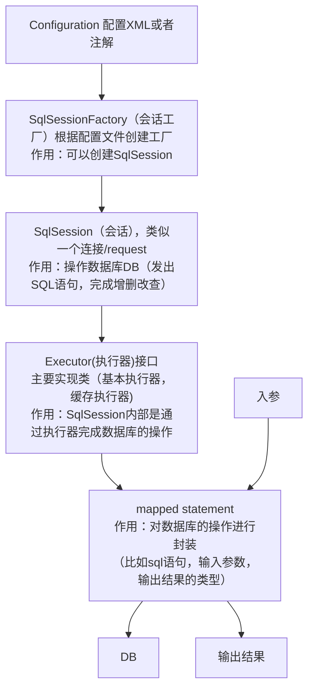

# 实现MyBatis的底层机制（一）

## MyBatis核心框架示意图



详情解读

1. mybatis的核心配置文件
   * mybatis-config.xml：进行全局配置，全局只能有一个这样的配置文件
   * XxxMapper.xml：配置多个SQL，可以有多个XxxMapper.xml配置文件
2. 通过mybatis-config.xml配置文件得到SqlSessionFactory
3. 通过SqiSessionFactory得到SqlSession，用SqlSession就可以操作数据
4. SqlSession底层是Executor（执行器），有2重要的实现类（BaseExecutor，CachingExecutor），有很多方法
5. MappedStatement是通过xxxMapper.xml中定义，生成的statement对象
6. 参数输入执行并输出结果集，无需手动判断参数类型和参数下标位置，且自动将结果集映射为Java对象


## 搭建开发环境

1. 创建新的Maven项目，在pom.xml文件配置必要的依赖

   ```xml
       <!--引入必要的依赖-->
       <dependencies>
           <!--引入DOM4J-->
           <dependency>
               <groupId>dom4j</groupId>
               <artifactId>dom4j</artifactId>
               <version>1.6.1</version>
           </dependency>
           <!--引入MySQL依赖-->
           <dependency>
               <groupId>mysql</groupId>
               <artifactId>mysql-connector-java</artifactId>
               <version>8.0.24</version>
           </dependency>
           <!--引入lombok，用于简化JavaBean-->4
           <dependency>
               <groupId>org.projectlombok</groupId>
               <artifactId>lombok</artifactId>
               <version>1.18.28</version>
           </dependency>
           <!--引入Junit依赖-->
           <dependency>
               <groupId>junit</groupId>
               <artifactId>junit</artifactId>
               <version>4.11</version>
           </dependency>
       </dependencies>
   ```

2. 创建数据库和表，和之前的区分开

   ```mysql
   CREATE DATABASE `mainbatis`;
   CREATE TABLE `station` (
       `id` INT NOT NULL AUTO_INCREMENT,
       `name` VARCHAR(10) NOT NULL,
       `code` INT NOT NULL,
       `cargo` TINYINT NOT NULL,#0表示不办理货运，1表示办理货运
       `openday` DATE DEFAULT NULL,
       `distance` DOUBLE NOT NULL,
       PRIMARY KEY (`id`)
   ) CHARSET=utf8;
   INSERT INTO `station` VALUES(NULL, '胶州', 17984, 1, '1901-4-8', 72.720)
   ```

   

## 完成读取配置文件、得到数据库连接

此处对数据库连接进行简化：采用Connection连接，不采用连接池技术

1. 新建配置文件 src/main/resources/MainBatisConfig.xml

   ```xml
   <?xml version="1.0" encoding="utf-8" ?>
   <database>
       <!--配置连接数据库的信息-->
       <property name="driverClassName" value="com.mysql.jdbc.Driver"/>
       <property name="url" value="jdbc:mysel://localhost:3306/mainbatis?useSSL=true&amp;useUnicode=true&amp;characterEncoding=UTF-8"/>
       <property name="username" value=MySQL用户名/>
       <property name="password" value=MySQL密码/>
   </database>
   ```

2. 新建java配置文件类 src/test/java/MainBatisTest.java

   ```java
   public class Configuration {
       //将类加载器作为私有属性
       private static ClassLoader loader = ClassLoader.getSystemClassLoader();
   
       //读取xml文件信息并处理
       public Connection build (String resource) {
           Connection connection = null;
           try {
               InputStream stream = loader.getResourceAsStream(resource);
               SAXReader reader = new SAXReader();
               Document document = reader.read(stream);
               Element root = document.getRootElement();
               connection = resolveDataSource(root);
           } catch (DocumentException e) {
               e.printStackTrace();
           }
           return connection;
       }
   
       //解析xml文件的信息，并返回数据库连接
       private Connection resolveDataSource(Element node) {
   
           if ("database".equals(node)) {
               throw new RuntimeException("root 节点应当是 <database>");
           }
           String driverClassName = null;
           String url = null;
           String username = null;
           String password = null;
   
           //遍历node下的子节点
           for (Object property : node.elements("property")) {
               Element item = (Element) property;
               String name = item.attributeValue("name");
               String value = item.attributeValue("value");
               if (name == null || value == null) {
                   throw new RuntimeException("property 节点应当设置 name 和 value 属性");
               }
               switch (name) {
                   case "driverClassName":
                       driverClassName = value;
                       break;
                   case "url":
                       url = value;
                       break;
                   case "username":
                       username = value;
                       break;
                   case "password":
                       password = value;
                       break;
                   default:
                       throw new RuntimeException("没有匹配到属性名");
               }
           }
           Connection connection = null;
           try {
               Class.forName(driverClassName);
               connection = DriverManager.getConnection(url, username, password);
           } catch (ClassNotFoundException e) {
               e.printStackTrace();
           } catch (SQLException e) {
               e.printStackTrace();
           }
           return connection;
       }
   }
   ```

3. 在switch方法中提示Incompatible types. Found: 'java.lang.String', required: 'byte, char, short or int'，原因是编译器版本过低。可在File→Compiler→Java Compiler查看当前编译器版本。解决方式是在pom.xml文件中，\<dependencies> 标签之前指定编译器版本

   ```xml
       <properties>
           <project.build.sourceEncoding>UTF-8</project.build.sourceEncoding>
           <maven.compiler.source>1.8</maven.compiler.source>
           <maven.compiler.target>1.8</maven.compiler.target>
           <java.version>1.8</java.version>
       </properties>
   ```

4. 新建测试类 src/test/java/MainBatisTest.java

   ```java
   public class MainBatisTest {
       @Test
       public void build() {
           Configuration configuration = new Configuration();
           Connection connection = configuration.build("MainBatisConfig.xml");
           System.out.println(connection);
       }
   }
   
   ```

   

## 编写执行器，完成数据库交互

我们把对数据库的操作，会封装到一套Executor机制中，程序具有更好的扩展性，结构更加清晰

用MyExecutor类，作用相当于MyBatis的基本执行器BaseExecutor类

1. 新建 src/main/java/exercise/entity/Station.java 类，通过lombok注解配置相关方法（另外可以用@Data注解替代Getter、Setter、toString、equals、hashCode方法，如果配置了带参构造器的方法，该注解的无参构造器将被覆盖），需要在IDEA中引入lombok插件

   ```java
   package exercise.entity;
   
   import lombok.*;
   
   import java.util.Date;
   
   @Getter
   @Setter
   @ToString
   @NoArgsConstructor
   @AllArgsConstructor
   public class Station {
       private Integer id;
       private String name;
       private Integer code;
       private Integer cargo;
       private Date openday;
       private double distance;
   }
   
   ```

2. 新建Executor接口 src/main/java/exercise/mainbatis/sqlsession/Executor.java

   ```java
   package exercise.mainbatis.sqlsession;
   
   public interface Executor {
       <T>T query(String statement, Object parameter);
   }
   
   ```

3. 新建 src/main/java/exercise/mainbatis/sqlsession/MyExecutor.java

   ```java
   
   public class MyExecutor implements Executor{
       private Configuration configuration = new Configuration();
   
       @Override
       public <T> T query(String sql, Object parameter) {
           Connection connection = getConnection();
           ResultSet resultSet = null;
           PreparedStatement preparedStatement = null;
           try {
               preparedStatement = connection.prepareStatement(sql);
               //设置参数：如果参数多，可以使用参数数组处理，此处做了简化
               preparedStatement.setString(1,parameter.toString());
               resultSet = preparedStatement.executeQuery();
   
               //将结果集中的数据封装到JavaBean对象
               //完善的写法是使用反射机制，此处做了简化
               Station station = new Station();
               while (resultSet.next()) {
                   station.setId(resultSet.getInt("id"));
                   station.setName(resultSet.getString("name"));
                   station.setCode(resultSet.getInt("code"));
                   station.setCargo(resultSet.getInt("cargo"));
                   station.setOpenday(resultSet.getDate("openday"));
                   station.setDistance(resultSet.getDouble("distance"));
               }
               return (T) station;
           } catch (SQLException e) {
               e.printStackTrace();
           } finally {
               try {
                   if (resultSet != null) {
                       resultSet.close();
                   }
                   if (preparedStatement != null) {
                       preparedStatement.close();
                   }
                   if (connection != null) {
                       connection.close();
                   }
               } catch (SQLException e) {
                   e.printStackTrace();
               }
           }
   
           return null;
       }
   
       //通过Configuration对象返回连接
       private Connection getConnection() {
           Connection connection = configuration.build("MainBatisConfig.xml");
           return connection;
       }
   }
   
   ```

4. 在 MainBatisTest 类进行测试

   ```java
       @Test
       public void query() {
           Executor executor = new MyExecutor();
           Station query = executor.query("SELECT * FROM `station` WHERE id = ?", 1);
           System.out.println("执行器 MyExecutor 查询结果：" + query);
       }
   ```

   