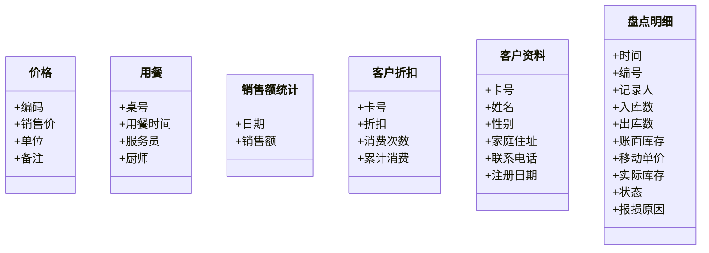

# 满汉楼管理系统需求分析

## 一、软件设计概要
1.设计目的
在餐饮业中主要有4大类信息：人事管理、销售统计、成本管理和库房管理。
人工处理这些信息不仅工作量繁重、复杂，而且容易产生错误和混乱。采用计算机进行信息的有效管理不但能实现管理的规范化，而且还可以避免错误，提高效率，本系统即针对餐饮业的信息管理而设计制作的。

2.性能需求
本系统容量小，运行速度快，界面美观，人性化，操作方便，易于使用：经理及主管可拥有所有的权限（能同时操作管理和收款界面），收款员只能操作收款界面，其他人员则不能进入。

3.环境需求
硬件环境：任何平台，1G以上内存
软件环境：WindoWs+MySQL+JDK8
开发环境：JAVA+MySQL

## 二、系统模块分析

为了编程的过程中，程序结构更加的简洁明了，本软件系统编制了以下几个系统模块：

1、画图面板类

作用：在各种面板加载背景和图片时调用，避免重复定义和类中过多的亢余代码

2、数据库连接类
作用：在各个类进行数据库连接时调用，避免重复定义和类申过多的允余代码

3、音乐控制类
在各个组件加载音效和加载背景音乐时调用，避免重复定义和类中过多的余代码

## 三、数据库分析

1、本系统拥有如下21个数据表

| 表名         | 介绍                                     |
| ------------ | ---------------------------------------- |
| 01临时库存   | 存放本次盘库的临时信息                   |
| 02人事资料   | 用于存放公司员工的详细信息               |
| 03价格       | 用于存放每种菜品的价格                   |
| 04出入库单   | 处入库单明细                             |
| 05单号流水   | 用于临时存放帐单的信息                   |
| 06客户折扣   | 用于存放客户的累计消费及折扣信息         |
| 07帐单流水   | 用于存放帐单的相关信息                   |
| 08客户资料   | 用于存放客户的相关信息，如姓名，联系电话 |
| 09成本名称   | 每项成本的名称及相关信息                 |
| 10成本登记   | 每项成本的初始库存及单价，现在库存及单价 |
| 11桌子状态   | 用于存放各个桌子的相关信息               |
| 12点菜       | 用于存放所点菜的详细信息                 |
| 13用餐       | 用于存放相关用餐信息                     |
| 14登录       | 用于存放可用此软件员工的姓名及密码       |
| 15盘点明细   | 盘点明细帐                               |
| 16盘点登记   | 盘点次数的登记，和盘点人                 |
| 17菜谱       | 用于存放各种菜及饮品的相关信息           |
| 18销售量统计 | 用于统计每天的各菜品的销售量情况         |
| 19销售额统计 | 用于统计每天的销售额情况                 |
| 20预定       | 用于保存预定位置的相关信息               |
| 21初始状态   | 存放成本录入的状态                       |

2、数据库和表的连接关系（SQL关系图连接）

## 四、功能模块概述

```Mermaid
classDiagram
	  闪屏 <|-- 登录
      登录 <|-- 操作管理界面
      登录 <|-- 收款界面
      class 操作管理界面{
          +人事管理
          +登录管理
          +菜谱价格
          +报表统计
          +成本控制
          +系统设置
          +系统帮助
      }
      class 收款界面{
          +预订位置
          +退订位置
          +点菜用餐
          +结账服务
          +客户服务
          +结账统计
      }

```

一、管理界面

1. 人事管理：新管理员或者经理或主管可以在这单进行注册，以获得注册帐号并获得软件的管理权限
2. 登录管理：已注册的用户可以在这里修改自己的密码，并核查已注册人员。
3. 菜谱价格：菜谱价格面板用于添加或者修改各种菜品并为其制定价格
4. 报表统计：报表统计面板主要用于显示每日或者每月或每年的销售额柱状图、曲线图，方便统计人员的直观查阅。
5. 成本控制：成本控制面板用于各个阶段销售额及成本的计算，统计和归总。
6. 系统设置：系统设置用于对系统的各种音乐进行选择或者设置音效。
7. 系统帮助：主要进行各种帮助文件的调用和选择

二、收款界面

1. 预定位置：用于完成位置的预定操作
2. 退订位置：用于完成位置的退定
3. 点菜系统：用于完成点菜的相关操作，可以采用下拉式菜单，也可直接输入菜名或编号
4. 结帐服务：用于完成结帐的相关操作
5. 客户服务：用于添加客户及查找客户信息等操作
6. 结帐统计：用于完成结帐统计及查找某个帐单的相关信息

## 五、具体模块分析

1）管理界面主界面
模块功能：调用各个模块函数，并加载各个模块的功能面板，显示数据库表格数据及销售额柱状图、曲线图。作为用户的使用桌面。

访问模块说明
主要包括7大功能模块，分别是：

* “人事资料”
* “员工登陆”
* “菜谱价格”
* “报表统计’
* “成本库房”
* “帮助’
* “系统设置

主界面功能说明：

点击主界面左功能按钮缩进纽后，左功能按钮区缩进，便于用户放大右区域的图标进行浏览查询。缩进后按钮变为功能面板弹出钮，点击后功能面板在左侧弹出。

主界面布局结构：一共有4个Jpanel，一个分屏面板，分屏面板加载了左侧的功能面板和右边的卡片式布局面板，然后下方框架CON加载了状态栏面板。

1、人事管理
模块功能：对员工的信息进行添加、修改、删除、查询、显示详细信息的操作。
访问数据表说明：表名“人事资料“
字段名及用途：
“员工编号“，存放员工的编号。（主键）
“姓名“，存放员工姓名。
“照片“，存放指定图片的路径。
“性别”存放员工的性别。
“住址“存放员工的家庭住址
“出生日期“存放员工的出生日期。
“身份证号“存放员工的身份证号。
“学历“存放员工的学历。
“职位“，存放员工现担任的职位。
“婚否“存放员工的婚姻状况
“联系电话1“存放员工的座机电话。
“联系电话2“存放员工的手机号码。
“邮箱“存放员工的电子邮箱。
“注册时间“存放此条记录写入的时间。
“备注“存放此员工的一些特殊说明。

人事管理界面功能说明：

添加功能：点击人事管理界面的添加，按钮，弹出新员工登记，对话框，填写此对话框的内容来说明员工信息，包括：姓名、性别、出生日期、身份证号、家庭住址、学历、婚否、联系电话、手机、职位、邮箱


“新员工登记“对话框填写要求及功能说明：姓名、身份证号和职位是必添项，其他为选添项，姓名、地址、邮箱、备注为文本域且均小于50个字符，身份证号为文本域只能填写数字且在16一18位之间，性别是单选按钮默认是“男“，婚否是单选按钮默认是“未婚“，学历是下拉菜单默认是“无“，职位是下拉菜单默认值是空白，手机和联系电话均为文本域，添加照片是由一个添加照片，按钮和一个Panel组成，点击“添加照片，按钮可弹出文件选择对话框，在对话框中的筛选器只能选择图片文件（JPG、BMP、GIF），选中指定文件按打开后，可以把选中的图片显示到Pane中去。取消按钮，可不保存当前填写的信息而返回人事管理界面。添加按钮，可以把当前的信息存入数据库中的“人事信息，表中，把选订的图片放到Image文件下，如果没有选择文件则按选择的性别分配款认图片文件，并根据身份证号码的后六位和此员工的职位信息直动产生一个编号为员工编号连同当前点击添加按钮的时间为注册时间一并显示在一个添出式对话活框中，让用户确定，确定后将此信息一并写入数据库。

修改功能：在选中人事管理界面中的表格的一行时，“修改，按钮会变为可选状态，如点击可修改这一行记录的信息，弹出“修改员工记录，对话框，填写此对话框的内容来修改所选中的已经添加过的员工基本信息。如选中一行是再点击人事管理界面的其他无按钮位置，“修改，按钮会变为不可选状态

“修改员工记录“对话框布局说明：采用空布局，共有15个JLabel、4个JRadioButton，5个JComboBox，6个JTextField，1个JTextArea，1个JScrollPane，3个JButton，1个JPanel组成。

“修改员工记录“对话框填写要求及功能说明：从数据库中调出此员工注册的信息分别填写到“修改员工记录“对话框的相应位置，从数据库中调出此员工的照片路径再从此位置把照片画到Panel中去，修改相应的要修改信息。其中：姓名、身份证号和职位是必添项，其他为选添项，姓名、地址、邮箱、备注为文本域且均小于50个字符，身份证号为文本域只能填写数字且在16一18位之间，性别是单选按钮默认是“男“，婚否是单选按钮默认是“未婚“，学历是下拉菜单默认是“无“，职位是下拉菜单默认值是空白，手机和联系电话均为文本域，添加照片是由一个“添加照片“按钮和一个Panel组成，点击修改照片，按钮可弹出文件选择对话框，在对话框中的筛选器只能选择图片文件（JPG、BMP、GIF），选中指定文件按打开后，可以把选中的图片显示到Panel中去。取消按钮，可不保存当前填写的信息而返回人事管理界面。修改按钮，可以把当前的信息替换数据库中“人事信息，表中的当前要修改行，把修改的照片放到Image文件夹下，并把以前旧的照片删除，如果没有修改照片则无照片操作，

删除功能：点击人事管理界面表格中要删除的记录，“删除“按钮会变为可选状态，点击“删除“按钮，弹出“删除员工，对话框，询问是否删除当前所选记录，选择“是，则删除数据表中的相应记录，人事管理界面表格中的相应记录，和image文件夹下的照片文件，如是默认图片则不做删除照片操作。
“删除员工，对话框布局说明：JOPtionPane中的Message选择框。

查询功能：在人事管理的上面有查询对话框，可以输入员工的姓名，员工号，和职位，均可以查到相应的信息。

详细信息功能：双击或点中一行按详细信息，都可以打开人事资料界面可以查看此人的详细信息。

二 收款界面主界面
模块功能：调用各个模块函数，可根据数据库的相关信感改变桌子的颜色，并且右边按钮的状态可根据左边桌子按钮的相关状态进行改变。而且右边标签内容可根据左边所按下的桌子按钮的相关信息，桌子用蓝色表示空，黄色表示预定，红色表示正在用餐

访问模块说明：
主要包括6大功能模块，分别是：
“预定位置”
“退定位置”
“点菜服务”
“结帐服务”
“客户服务”
“结帐服务”

1预订位置（BookTable）

* 模块功能：可以输入预定时间，预定人数，预定人姓名，联系电话，预定位置，接到电话时间是自动取系统当前时间填入，如按下确定，则将相关信息加入数据库预定表中，并将桌子状态表中此桌子的状态改为预定，然后将所预定的桌子颜色变为黄色，按取消则放弃。注意此界面支持键盘回车Enter键及方向键
* 界面结构：由六个标签及六个文本框和两个按钮构成

2退定位置（ExitTable）

模块功能：以画图的形式显示预定时间，预定人数，预定人姓名，联系电话，预定位置，接到电话时间，如按下确定，则将此桌子数据库预定表中相关信息删除，并将桌子状态表中此桌子的状态改为空，并将此退定桌子颜色变为蓝色，按取消则放弃。注意此界面支持键盘回车Enter键及方向键

3点菜服务（BookDish)

* 模块功能：完成点菜的相关操作，左边列表框显示菜的类别，其下面表格可根据列表框所选类别显示此类别的菜品，左边最下面两个列表框可选择服务员及厨师，双击左边表格中某行或选中后单击添加，可将相关信息加入到右边表格中，也可在石边表格的文本框中输入菜的名称或编码，按确定键直接将相关菜的信息加入到右边表格中。如果选中右边表格某行后，可按修改按钮修改所选菜品的数量，按删除将删除该行。按确定则将所选的菜的相关信息加入到单号流水表中，用餐表中，并将桌子状态表中此桌子的状态改为用餐中，并将此桌子颜色变为红色，按取消则放奔。
* 界面结构：由类别列表框，服务员列表框，厨师列表框，两个表格，输入名称的文本框，输入数量的文本框，确定按钮，删除按钮，修改按钮，添加按钮，退出按钮组成

4结帐服务（endBill）

* 模块功能：完成结帐的相关操作，左边表格显示所点的菜，右边总计中显示所点菜的总额，可在贵宾卡号中输入卡号，如果正确，连接数据库得到相应折扣信息，并计算出实际应交费用。结帐方式可选择三种，注意挂帐只能是经理，需要经理输入密码验证，如选择现金，则需在收款中输入所收款项，按结帐按钮，计算出应找的钱数，然后可选择是否打印帐单，如选择打印，则此界面消失，打印帐单，更改数据库的相关信息，并将此桌子颜色变为蓝色，按取消则放弃。
* 界面结构：由类别列表框，服务员列表框，厨师列表框，两个表格，输入名称的文本框，输入数量的文本框，确定按钮，删除按钮，修改按钮，添加按钮，退出按钮组成

5客户服务（cardSever）

* 模块功能：因为只有主管及经理才能进行添加客户，修改客户资料，删除客户资料，因此需主管验证
* 模块功能：客户服务主界面，可在查找眶中输入客户姓名，卡号，或者选择下拉列表中的数值按查找按钮进行查询操作。选则表格中的一行，启用修改，删除，详细资料按钮，按下相应按钮调用相应子界面。
* 模块功能：客户添加子界面，可输入姓名，性别，家庭住址，邮政编码，联系电话，注册日期及卡号自动生成。双击某行或选中后单击详细按钮，以画图的形式显示客户的详细信息

6结帐服务（BillSever）
模块功能：主要完成日结帐，月结帐，年结帐，及相关查找，在查找框中可输入帐单号，或日期，查找相关帐单，将其信息加入到表格中。按下日结帐，将连接数据库以画图的形式显示当天的销售额总计，并显示每钟结帐方式的销售额及每种类别菜的畅销菜的前五名，月结帐，年结帐同理。

## 六、人性化设计分析




出入库单、桌子状态、账单流水、单号流水、销售量统计、供应商统计

管理主界面、收款主界面、人事登记
预定位置、登陆管理、退定位置、菜谱价格
点菜
报表统计
结帐
成本控制
客户服务
动画帮助
结帐服务
系统设置


成本计算方法：移动加权平均法

```成本单价 = (库存数量*库存单价+入库数量*购买单价)/(库存数量+入库数量)```

## 七、总结


参考资料

[使用 Typora 画图（类图、流程图、时序图） - 知乎 (zhihu.com)](https://zhuanlan.zhihu.com/p/172635547)