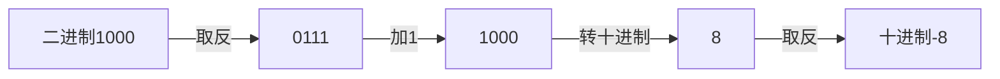

# 进制及数学运算


|                 | int类型的开头 | 取值范围                  |
| --------------- | ------------- | ------------------------- |
| 二进制（BIN）   | 0b或0B        | 0-1，满2进1               |
| 八进制（OCT）   | 0             | 0-7，满8进1               |
| 十进制（DEC）   | 普通数字      | 0-9，满10进1              |
| 十六进制（HEX） | 0x或0X        | 0-9及A(10)-F(15)，满16进1 |

```java
int a = 78;// 十进制DEC
int b = 0b1001110;//二进制BIN
int c = 0116;//八进制OCT
int d = 0x4e;//十六进制HEX
```


## 进制转换

其他转十进制

* 二进制转十进制：从最低位（右边）开始，将每个位上的数提取出来，乘以2的（位数-1）次方并求和。

  例：0b1011 =`1*1+1*2+0*4+1*8`=11

* 八进制转十进制：从最低位（右边）开始，将每个位上的数提取出来，乘以8的（位数-1）次方并求和。

  例：0234=`4*1+3*8+2*64`=156

* 十六进制转十进制：从最低位（右边）开始，将每个位上的数提取出来，乘以16的（位数-1）次方并求和。

  例：0x23A=`10*1+3*16+2*256`=570

十进制转其他

* 十进制转二进制：将该数不断除以2，直到商为0，然后将每步得到的余数倒过来，就是对应的二进制。例如34:0b00100010（一个字节有8位，需要用两个0填充高位）
* 十进制转八进制：将该数不断除以8，直到商为0，然后将每步得到的余数倒过来，就是对应的八进制。例如131:0203
* 十进制转十六进制：将该数不断除以16，直到商为0，然后将每步得到的余数倒过来，就是对应的十六进制。例如237:0xED

二进制转其他

* 二进制转八进制：从低位开始，将二进制每三位一组，转成对应的八进制。例如0b11010101：0325
* 二进制转十六进制：从低位开始，将二进制每四位一组，转成对应的十六进制。例如0b11010101：0xD5

其他转二进制

* 八进制转二进制：将八进制数每1位，转成对应的3位二进制数。例如0237=0b10011111（最左边的0可省略）
* 十六进制转二进制：将十六进制数每1位，转成对应的3位二进制数。例如0x23B=0b001000111011


## 计算机的数学运算

### 原码、反码、补码

* 反码的英文叫radix-minus-one，也就是基础减一
* 计算机使用补码运算的原因：将正数和负数统一起来

特点

1. 二进制的最高位是符号位：0表示正数，1表示负数
2. 正数的原码，反码，补码都一样（三码合一）
3. 负数的反码 = 它的原码符号位不变，其它位取反(0->1,1->0)
4. 负数的补码=它的反码+1，负数的反码=负数的补码-1
5. 0的反码，补码都是0
6. Java没有无符号数，换言之，java中的数都是有符号的
7. 在计算机运算的时候，都是以补码的方式来运算的
8. 当我们看运算结果的时候，要看他的原码

有符号二进制数：第1位用数字1表示

* 运算时看补码，负数的反码=它的原码符号位不变，其它位取反；负数的补码=反码+1；负数的反码=补码-1

* 十进制负数转二进制：①整体取反②减1后转二进制③整体取反
* 二进制负数转十进制：①整体取反②加1后转十进制③整体取反



```java
class BitOperation01{	//位运算
	public static void main(String[] args){
		int a = 2 & 3;		//按位与：两位全1，结果为1，否则为0
		//基本原理：原码以二进制表示，int为4个字节，正数原码和补码相同，因此通过计算得到：
		//2的原码/补码00000000 00000000 00000000 00000010
		//3的原码/补码00000000 00000000 00000000 00000011
		//通过补码计算得到按位与:00000000 00000000 00000000 00000010（运算后得到的补码）
		//运算后的补码是正数，补码和原码相同
		//转成十进制，得到2
		
		int b = 5 | 4;		//按位或：有1则1，否则为0
		//5的原码/补码 		00000000 00000000 00000000 00000101
		//4的原码/补码 		00000000 00000000 00000000 00000100
		//运算得到原码/补码	00000000 00000000 00000000 00000101
		//转成十进制，得到5

		int c = -3 ^ 3;		//按位异或：不同为1，相同为0
		//-3的原码 10000000 00000000 00000000 00000011
		//负数的反码=它的原码符号位不变，其它位取反
		//-3的反码 11111111 11111111 11111111 11111100
		//负数的补码=它的反码+1
		//-3的补码 11111111 11111111 11111111 11111101
		//3的补码  00000000 00000000 00000000 00000011
		//运算后补码11111111 11111111 11111111 11111110
		//负数的反码=负数的补码-1
		//运算后反码11111111 11111111 11111111 11111101
		//负数的原码=符号位不变，其他取反
		//运算后原码10000000 00000000 00000000 00000010
		//转十进制得到-2

		int d = ~ -2;		//按位取反
		//负数的原码第1位是1，其余和原码相同
		//-2的原码 10000000 00000000 00000000 00000010
		//(符号不变，其余取反)
		//-2的反码 11111111 11111111 11111111 11111101
		//（反码+1）
		//-2的补码 11111111 11111111 11111111 11111110
		//按位取反 00000000 00000000 00000000 00000001
		//运算后得到的补码是正数，对应的原码转换十进制为1

		int e = ~ 5;		//按位取反
		//得到5的原码，即补码		00000000 00000000 00000000 00000101
		//按位取反运算得到补码	11111111 11111111 11111111 11111010
		//（补码-1）
		//运算后的反码为			11111111 11111111 11111111 11111001
		//运算后的原码为			10000000 00000000 00000000 00000110
		//运算后原码转十进制为-6

		System.out.println("a=" + a);//2
		System.out.println("b=" + b);//5
		System.out.println("c=" + c);//-2
		System.out.println("d=" + d);//1
		System.out.println("e=" + e);//-6
		}
}

```


### 位运算

常见位运算

| 符号 | 含义       | 说明                                                         |
| ---- | ---------- | ------------------------------------------------------------ |
| \|   | 按位或     | 只要有1就是1                                                 |
| &    | 按位与     | 必须全1才能是1                                               |
| ^    | 按位异或   | 相同为0，不同为1                                             |
| <<   | 算数左移   | 符号位不变，低位补0（左移i位相当于乘以2的i次方，当符号位为1时变成负数） |
| >>   | 算数右移   | 低位溢出，符号位不变，用符号位填补溢出的高位（右移i位相当于除2的i次方） |
| >>>  | 无符号右移 | 低位溢出，高位补0（负数会因此变成正数）                      |
| ~    | 相反数     | 原数的二进制取反后+1（相当于十进制的取反）                   |

注意：

* |、&是位运算或、位运算与；||、&&是逻辑或、逻辑与，两者是有区别的
* 没有“<<<”符号
* 整数最小值的特殊性：其绝对值相反数仍是其本身（取反后+1，得到的二进制数保持不变）

```java
class BitOperation02{	//位运算
	public static void main(String[] args){
		int a = 1 >> 2;	//1算数右移2位，相当于运行两遍除以2
		//1的数字为0000000 00000000 00000000 00000001
		//最右边两位溢出并补0，得到的补码转换为十进制为0
		int b = -1 >> 2;
		//-1的原码	10000000 00000000 00000000 00000001
		//转反码		11111111 11111111 11111111 11111110
		//转补码+1	11111111 11111111 11111111 11111111
		//位运算得到 11111111 11111111 11111111 11111111
		//转补码-1	11111111 11111111 11111111 11111110
		//转反码		10000000 00000000 00000000 00000001
		//转十进制-1
		int c = 1 << 2;		//1算数左移两位，相当于运行两遍乘2
		//低位向左移动得到补码0000000 00000000 00000000 00000100
		//补码转换为十进制得到4
		int d = -1 << 2;
		//-1的原码	10000000 00000000 00000000 00000001
		//转反码		11111111 11111111 11111111 11111110
		//转补码+1	11111111 11111111 11111111 11111111
		//位运算得到 11111111 11111111 11111111 11111100
		//转补码-1	11111111 11111111 11111111 11111011
		//转反码		10000000 00000000 00000000 00000100
		//转十进制为4
		int e = 3 >>> 2;		//无符号右移
		//低位溢出，高位补0，转十进制得到0
		System.out.println("a=" + a);//0
		System.out.println("b=" + b);//-1
		System.out.println("c=" + c);//4
		System.out.println("d=" + d);//-1
		System.out.println("e=" + e);//0
		}
}

```


### 计算机的运算过程

十六进制：每位相当于4个二进制位。例如：0X4E相当于01001110

浮点数float在内存中的存储：第1位表符号S，8位表示指数E（科学计数法的数值+127），23位表示分数N

int有32位（4个byte字节），可以用这个方法输出各个二进制位的值

```java
	// 打印一个int类型的数字，32位进制的状态
	// 左侧是高位，右侧是低位
	public static void printBinary(int num) {
		for (int i = 31; i >= 0; i--) {
			// 下面这句写法，可以改成 :
			// System.out.print((a & (1 << i)) != 0 ? "1" : "0");
			// 但不可以改成 :
			// System.out.print((a & (1 << i)) == 1 ? "1" : "0");
			// 因为a如果第i位有1，那么(a & (1 << i))是2的i次方，而不一定是1
			// 比如，a = 0010011
			// a的第0位是1，第1位是1，第4位是1
			// (a & (1<<4)) == 16（不是1），说明a的第4位是1状态
			System.out.print((num & (1 << i)) == 0 ? "0" : "1");
		}
		System.out.println();
	}
```

说明：long是64位，在打印时需要写成 `num & (1L << 64)`

```java
	public static void main(String[] args) {
		// 非负数
		int a = 78;
		System.out.println(a);
		printBinary(a);
		System.out.println("===a===");
		// 负数
		int b = -6;
		System.out.println(b);
		printBinary(b);
		System.out.println("===b===");
		// 直接写二进制的形式定义变量
		int c = 0b1001110;
		System.out.println(c);
		printBinary(c);
		System.out.println("===c===");
		// 直接写十六进制的形式定义变量
		// 0100 -> 4
		// 1110 -> e
		// 0x4e -> 01001110
		int d = 0x4e;
		System.out.println(d);
		printBinary(d);
		System.out.println("===d===");
		// ~、相反数
		System.out.println(a);
		printBinary(a);
		printBinary(~a);
		int e = ~a + 1;
		System.out.println(e);
		printBinary(e);
		System.out.println("===e===");
		// int、long的最小值，取相反数、绝对值，都是自己
		int f = Integer.MIN_VALUE;
		System.out.println(f);
		printBinary(f);
		System.out.println(-f);
		printBinary(-f);
		System.out.println(~f + 1);
		printBinary(~f + 1);
		System.out.println("===f===");
		// | & ^
		int g = 0b0001010;
		int h = 0b0001100;
		printBinary(g | h);
		printBinary(g & h);
		printBinary(g ^ h);
		System.out.println("===g、h===");
		// 可以这么写 : int num = 3231 | 6434;
		// 可以这么写 : int num = 3231 & 6434;
		// 不能这么写 : int num = 3231 || 6434;
		// 不能这么写 : int num = 3231 && 6434;
		// 因为 ||、&& 是 逻辑或、逻辑与，只能连接boolean类型
		// 不仅如此，|、& 连接的两侧一定都会计算
		// 而 ||、&& 有穿透性的特点
		System.out.println("test1测试开始");
		boolean test1 = returnTrue() | returnFalse();
		System.out.println("test1结果，" + test1);
		System.out.println("test2测试开始");
		boolean test2 = returnTrue() || returnFalse();
		System.out.println("test2结果，" + test2);
		System.out.println("test3测试开始");
		boolean test3 = returnFalse() & returnTrue();
		System.out.println("test3结果，" + test3);
		System.out.println("test4测试开始");
		boolean test4 = returnFalse() && returnTrue();
		System.out.println("test4结果，" + test4);
		System.out.println("===|、&、||、&&===");
		// <<
		int i = 0b0011010;
		printBinary(i);
		printBinary(i << 1);
		printBinary(i << 2);
		printBinary(i << 3);
		System.out.println("===i << ===");
		// 非负数 >> >>>，效果一样
		printBinary(i);
		printBinary(i >> 2);
		printBinary(i >>> 2);
		System.out.println("===i >> >>>===");
		// 负数 >> >>>，效果不一样
		int j = 0b11110000000000000000000000000000;
		printBinary(j);
		printBinary(j >> 2);
		printBinary(j >>> 2);
		System.out.println("===j >> >>>===");
		// 非负数 << 1，等同于乘以2
		// 非负数 << 2，等同于乘以4
		// 非负数 << 3，等同于乘以8
		// 非负数 << i，等同于乘以2的i次方
		// ...
		// 非负数 >> 1，等同于除以2
		// 非负数 >> 2，等同于除以4
		// 非负数 >> 3，等同于除以8
		// 非负数 >> i，等同于除以2的i次方
		// 只有非负数符合这个特征，负数不要用
		int k = 10;
		System.out.println(k);
		System.out.println(k << 1);
		System.out.println(k << 2);
		System.out.println(k << 3);
		System.out.println(k >> 1);
		System.out.println(k >> 2);
		System.out.println(k >> 3);
		System.out.println("===k===");
	}

	public static boolean returnTrue() {
		System.out.println("进入了returnTrue函数");
		return true;
	}

	public static boolean returnFalse() {
		System.out.println("进入了returnFalse函数");
		return false;
	}

}
```


按位运算在算法题中的使用：[常用的位操作 | labuladong 的算法笔记](https://labuladong.github.io/algo/di-san-zha-24031/shu-xue-yu-659f1/chang-yong-13a76/)


说明：

* 按位运算存在穿透性，计算机不会进行检查位溢出，需要程序员保证

* 计算机只有位运算单元，减、乘、除都由加法拼凑

  


参考资料：

[算法讲解003【入门】二进制和位运算 哔哩哔哩 bilibili](https://www.bilibili.com/av361839002)

[3.3  数字编码 * - Hello 算法 (hello-algo.com)](https://www.hello-algo.com/chapter_data_structure/number_encoding/)
