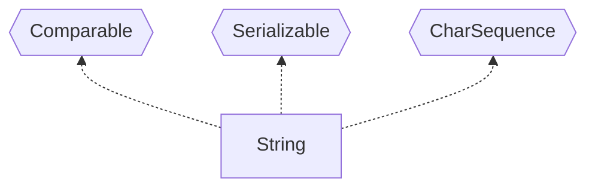

# String类


接口




实现 Serializable 接口表示可以串行化，即在网络传输
实现 Comparable 接口表示可以相互比较

（JDK17 中另外实现 ConstantDesc 和 Constable）


1）String对象用于保存字符串，也就是一组字符序列
2)字符串常量对象是用双引号括起的字符序列。例如："你好"、"12.97"、"boy"等
3）字符串的字符使用Unicode字符编码，一个字符（不区分字母还是汉字）占两个字节 (char 类的字符也是占用两个自己)

4）String和所有包装类都是final，不能被继承

5）String类有很多构造器（实现构造器重载），较常用构造方法：

```java
String s1 = new String();
String s2 = new String(String original);
String s3 = new String(char[] a);
String s4 = new String(char[] a,int startlndex,int count)
String s5 = new String(byte[] b)
```


两种创建String对象的区别
方式1：直接赋值   String s1 = "Tokyo";
先从常量池查看是否有"Tokyo"数据空间，如果有，直接指向；如果没有则重新创建，然后指向。s1 最终指向的是常量池的空间地址

方式2：调用构造器 String s2 = new String("Tokyo");
先在堆中创建空间，里面维护了 value 属性，指向常量池的"Tokyo"空间。如果常量池没有"Tokyo"，重新创建；
如果有，直接通过value指向。最终指向的是堆中的空间地址。

注意：常量池里面的本质也是对象，JDK1.8之后常量池也存储在Java堆里

解读；（1）b.intern方法最终返回的是常量池的地址（对象）：


### 字符串的特性

1）String是一个final类，代表不可变的字符序列（修改对象时会创建一个新的对象，原对象内容不会改变）
2）字符串是不可变的。一个字符串对象一旦被分配，其内容是不可变的

String 有属性 
理解：String对象一旦声明则不能轻易改变，如果要改变则需要先断开原有的对象引用，再开辟新的对象，之后再指向新的对象空间。

这个 value[] 用于存放字符串内容，不可以修改（不能指向其他内存空间，但是指向的内存空间内的数据可以修改
使用final修饰一个对象引用变量时，该变量指向的对象不能被改变，但是这并不意味着该对象的属性值不能被改变
其实就是fianl修饰的话，就是值不能修改，而value数组的值就是一组地址，指向字符数组中第一个值的地址，所以value的值（地址值）不可修改而已，而地址值里面指向的真实的值是可以被修改的
java是值传递。final后数组的值不能修改，但数组内的值可以。因为数组的值指的是地址。数组内的值是地址上的数据。final只是写死了数组对应的地址，但没有限制地址上的数据变化与否

类是final修饰的->类的内容不可改（限制继承和重写）；接收实例化对象的变量没有final->并不能限制String的引用对象，

引用对象可以随便乱指，final String s1="h";不能乱指。


### String类的常见方法

说明
String类是保存字符串常量的。每次更新都需要重新开辟空间，效率较低，因此java设计者还提供了StringBuilder和StringBuffer来增强String的功能，并提高效率。

| 方法                                                         | 作用                                                         |
| ------------------------------------------------------------ | ------------------------------------------------------------ |
| equals                                                       | 区分大小写，判断内容是否相等                                 |
| equalsIgnoreCase                                             | 忽略大小写的判断内容是否相等(可用于验证码)                   |
| length                                                       | 获取字符的个数，学符串的长度                                 |
| indexOf                                                      | 获取字符在字符串中第1次出现的索引,索引从0开始，如果找不到返回-1 |
| lastIndexOf                                                  | 获取字符在字符串中最后1次出现的索引,索引从0开始，如找不到，返回-1 |
| substring                                                    | 截取指定范围的子串                                           |
| trim                                                         | 去前后空格                                                   |
| charAt：获取某索引处的字符，注意不能使用Str[index]这种方式，因为value属性是private不可在外部类访问 |                                                              |
| toUpperCase                                                  |                                                              |
| toLowerCase                                                  |                                                              |
| concat                                                       |                                                              |
| replace                                                      | 替换字符串中的字符                                           |
| split                                                        | 分割字符串，对于某些分割字符，我们需要转义比如\| \\等。例如：古诗词的标点，文件路径 |
| compareTo                                                    | 比较两个字符串的大小（用于判断两次输入密码是否一致）         |
| toCharArray                                                  | 转换成字符数组                                               |
| format                                                       | 格式字符串，%s字符串 %c字符 %d整型 %.2f浮点型。案例，将一个人的信息格式化输出 |
| ActionEvent                                                  | 通常在按下按钮，或双击一个列表项或选中茶个菜单时发生。       |

# StringBuffer

java.lang.StringBuffer代表可变的字符序列，可以对字符串内容进行增删，final类无法继承
很多方法与String相同，但StringBuffer是可变长度的。
StringBuffer是一个容器。继承 AbstractStringBuilder，实现Serializable,Appendable,CharSequence(和StringBuilder一样)
父类有属性 char[] value 不是final，用于存放字符串内容

```java
//默认创建大小为 16 的 char[]，存放字符内容
StringBuffer stringBuffer1 = new StringBuffer();

//通过构造器指定 char[] 大小
StringBuffer stringBuffer2 = new StringBuffer(100);

//通过输入 String 创建 StringBuffer
StringBuffer stringBuffer3 = new StringBuffer("Hello");
```


参加算法类的比赛时为了减少运行时间经常用这个

String VS StringBuffer
1）String保存的是字符串常量，里面的值不能更改，每次String类的更新实际上就是更改地址，效率较低
//private final char value[];
2）StringBuffer保存的是字符串变量，里面的值可以更改，每次StringBuffer的更新实际上可以更新内容，不用每次更新地址，
效率较高//char[] value;//这个放在堆，不需要每次更换地址（创建新对象）

StringBuffer对象在创建时，就会分配一个大小为传入字符串+16的字符数组，所以后续修改的时候，在原数组上操作即可。
除非修改后的字符串大小超过字符数组的长度，这时才需要分配新的字符数组
	


​	
●StringBuffer类常见方法
1)增append
2)删delete(start,end)
3）改replace(start,end,string)//将start----end间的内容替换掉，不含end
4）查indexOf//查找子串在字符串第1次出现的索引如果找不到返回-1
5)插insert
6）获取长度length
​	

# StringBuilder类

1）一个可变的字符序列。此类提供一个与StringBuffer兼容的APl，但不保证同步。（存在多线程问题）
该类被设计用作StringBuffer的一个简易替换，用在字符串缓冲区被单个线程使用的时候。
如果可能，建议优先采用该类，因为在大多数实现中，它比StringBuffer要快。
2）在StringBuilder上的主要操作是append和insert方法，可重载这些方法以接受任意类型的数据

继承 AbstractStringBuilder，实现Serializable,Appendable,CharSequence(和StringBuffer一样)
均代表可变的字符序列，方法是一样的
特点：1.StringBuilder是 final 类，不能被继承
2.继承了 AbstractStringBuilder 属性char[] value，在堆中存放字符序列
3.实现了Serializable接口，可以串行化（网络传输和保存到文件）
4.各个方法没有做互斥的处理，即没有 synchronized 关键字，因此在单线程下使用


# String、StringBuffer和StringBuilder的比较

1）StringBuilder和StringBuffer非常类似，均代表可变的字符序列，而且方法也一样
2）String：不可变字符序列，效率低，但是复用率高。
//任意个String对象都可以指向常量池的同一个String ，即复用率高；但是因为是final的所以
每次更改内容都要创建一个新对象，改变String对象的指向，即效率低
3）StringBuffer：可变字符序列、效率较高（增删）、线程安全
4）StringBuilder：可变字符序列、效率最高、线程不安全
5）String使用注意说明：
strings="a";//创建了一个字符串
s+="b"；//实际上原来的"a"字符串对象已经丢弃了，现在又产生了一个字符串s+"b”（也就是"ab）。
如果多次执行这些改变串内容的操作，会导致大量副本字符串对象存留在内存中，降低效率。
如果这样的操作放到循环中，会极大影响程序的性能
=>结论：如果我们对String做大量修改，不要使用String

●使用的原则，结论
1.如果字符串存在大量的修改操作，一般使用StringBuffer或StringBuilder
2.如果字符串存在大量的修改操作，并在单线程的情况，使用StringBuilder
3.如果字符串存在大量的修改操作，并在多线程的情况，使用StringBuffer
4.如果我们字符串很少修改，被多个对象引用，使用String，比如配置信息等
	
