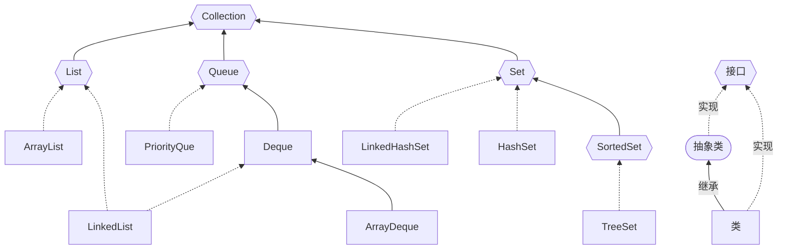

# Collection接口




* List列表：存取有序，可以存放重复的元素，可以用下标对元素进行操作。ArrayList动态数组，LinkedList双向链表
* Set集合：存取无序，不可以存放重复的元素，不可以用下标对元素进行操作。基于对应的 Map 实现，值由固定的 Object对象填充，
* Queue队列：遵循先进先出（FIFO）的原则，新元素插入到队列的尾部，访问元素返回队列的头部。ArrayDeque数组实现的双端队列，LinkedList链表实现的双端队列，PriorityQueue优先级队列


特点

1. Collection实现子类可以存放多个元素，每个元素可以是object
2. 有些Collection的实现类，可以存放重复的元素，有些不可以
3. 有些Collection的实现类，有些是有序的（List)，有些不是有序（Set）
4. Collection接口没有直接的实现子类，是通过它的子接口Set和List来实现的

```java
public interface Collection<E> extends Iterable<E> {

    int size();//返回集合元素数，超过Integer.MAX_VALUE时返回Integer.MAX_VALUE

    boolean isEmpty();//判断是否为空

    boolean contains(Object o);//查找是否存在

    Iterator<E> iterator();

    Object[] toArray();

    <T> T[] toArray(T[] a);

    boolean add(E e);//添加元素

    boolean remove(Object o);//删除元素

    boolean containsAll(Collection<?> c);//查找多个元素是否都存在

    boolean addAll(Collection<? extends E> c);//添加多个元素

    boolean removeAll(Collection<?> c);//删除多个元素

    default boolean removeIf(Predicate<? super E> filter) {
        Objects.requireNonNull(filter);
        boolean removed = false;
        final Iterator<E> each = iterator();
        while (each.hasNext()) {
            if (filter.test(each.next())) {
                each.remove();
                removed = true;
            }
        }
        return removed;
    }

    boolean retainAll(Collection<?> c);

    void clear();//清空

    boolean equals(Object o);

    int hashCode();

    @Override
    default Spliterator<E> spliterator() {
        return Spliterators.spliterator(this, 0);
    }

    default Stream<E> stream() {
        return StreamSupport.stream(spliterator(), false);
    }


    default Stream<E> parallelStream() {
        return StreamSupport.stream(spliterator(), true);
    }
}

```


参考资料

[Java集合框架：List、Set、Map、队列——全面解析 | 二哥的Java进阶之路 (javabetter.cn)](https://javabetter.cn/collection/gailan.html)
