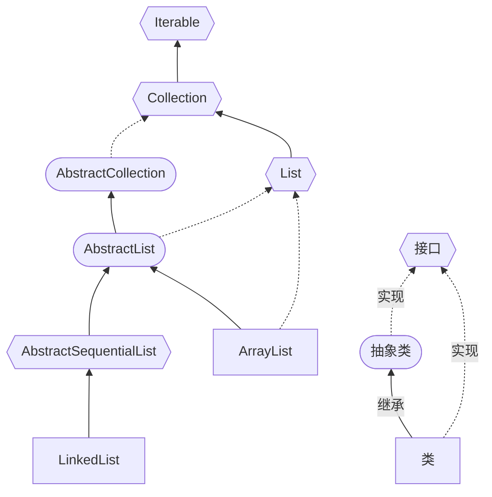

# List接口

基本介绍：Collection接口的子接口

1. List集合类中元素有序（即添加顺序和取出顺序一致）、且可重复
2. List集合中的每个元素都有其对应的顺序素引，即支持素引。
3. List容器中的元素都对应一个整数型的序号记载其在容器中的位置，可以根据序号存取容器中的元素
4. 主要的实现类包括 ArrayList，Vector，LinkedList

常用方法
 * add:添加单个元素，set在指定位置添加元素

    ```java
    boolean add(E e);//在列表末尾加入新元素，返回布尔值
    void add(int index, E element);//在具体位置加入新元素，在ArrayList和Vector中调用System.arraycopy()方法实现
    E set(int index, E element);
    ```

 * remove:删除指定元素

    ```java
    boolean remove(Object o);//传入对象删除，返回布尔值
    E remove(int index);//
    ```

 * size:获取元素个数

 * isEmpty:判断是否为空

 * clear:清空，removeAll：删除多个元素

    ```java
    void clear();
    boolean removeAll(Collection<?> c);//arrayList.removeAll(arrayList); 相当于清空
    ```

 * addAll:添加多个元素

    ```java
    boolean addAll(Collection<? extends E> c);
    ```

 * get根据下标获取元素，subList返回从fromIndex到toIndex位置的子集合

    ```java
    E get(int index);
    List<E> subList(int fromIndex, int toIndex);
    ```
    
 * indexOf获取元素下标，contains查询是否存在，containsAll:查找多个元素是否都存在

    ```java
    int indexOf(Object o);
    boolean contains(Object o);
    boolean containsAll(Collection<?> c);
    ```
    
    

列表的遍历

```java
import java.util.*;

public class Test {
    public static void main(String[] args) {
        List<String> list = new ArrayList<>();
        //List list = new Vector();
        //List list = new LinkedList();
        list.add("狐狸精");
        list.add("老鼠精");
        list.add("蜘蛛精");
        list.add("白骨精");

        //方式1：使用iterator（快捷键itit）
        Iterator iterator = list.iterator();
        while (iterator.hasNext()) {
            Object next =  iterator.next();
            System.out.println("iterator = " + next);
        }

        //方式2：增强for循环/for-each（快捷键iter）
        for (String str : list) {
            System.out.println("str = " + str);
        }

        //方式3：使用普通for
        for (int i = 0; i < list.size(); i++) {
            System.out.println("对象 = " + list.get(i));
        }
    }
}

```

迭代器的源码分析



* List 接口实现类通过内部类重写 Iterable 接口的 iterator 方法，得到了 `Iterator<E>` 对象，可以使用 for-each 这种方式来遍历
* 通过内部类的方式返回 Iterator 接口，而不是直接实现，原因是 List 存在多种迭代方式
* LinkedList 的父类 AbstractSequentialList 的 iterator 方法调用子类的 listIterator 方法，这个迭代器支持双向遍历，同时LinkedList 还提供了 descendingIterator 方法提供了逆序迭代器
* Map 没有实现 Iterable 接口，只有通过 `map.entrySet()`、`map.keySet()`、`map.values()` 这种返回一个 Collection 的方式才能 使用 for-each。

Java开发手册（黄山版）的“集合处理”章节第14条：不要在foreach循环里进行元素的remove / add操作。remove元素请使用iterator方式， 如果并发操作，需要对iterator对象加锁，并提供了正确案例

```java
List<String> list = new ArrayList<>();
list.add("1");
list.add("2");
Iterator<String> iterator = list.iterator();
while (iterator.hasNext()) {
    String item = iterator.next();
    if (删除元素的条件) {
    	iterator.remove();
    }
}
```

原因是增强for循环是基于迭代器实现的，而迭代器在遍历集合时会维护一个 expectedModCount 属性来记录集合被修改的次数。如果在 foreach 循环中执行删除操作会导致 expectedModCount 属性值与实际的 modCount 属性值不一致，从而导致迭代器的 hasNext() 和 next() 方法抛出 ConcurrentModificationException 异常。

而使用iterator提供的remove() 方法会更新ArrayList 的修改次数，不会出现集合自身的 remove() 方法导致的异常

在调用 iterator.next()方法之前必须要调用iterator.hasNext()进行检测。若不调用，且下一条记录无效，直接调用 iterator.next()会抛出NoSuchElementException异常


参考资料：

[Java迭代器Iterator和Iterable有什么区别？ | 二哥的Java进阶之路 (javabetter.cn)](https://javabetter.cn/collection/iterator-iterable.html)

[阿里Java开发规约：禁止在foreach里执行元素的删除操作 | 二哥的Java进阶之路 (javabetter.cn)](https://javabetter.cn/collection/fail-fast.html)

