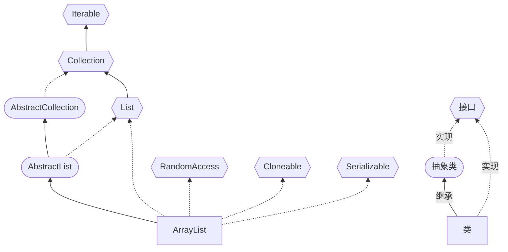

# ArrayList

继承关系图



ArrayList底层基于数组实现List接口，并且实现了动态扩容；RandomAccess 接口表示可以快速随机访问，通过下标索引直接获取内存地址；Cloneable 接口表示支持拷贝；Serializable 接口表示支持序列化，将对象转换成以字节序列的形式来表示，

注意事项

1. permits all elements,including null，ArrayList可以加入null,且多个
2. ArrayList是由数组来实现数据存储的
3. ArrayList基本等同于Vector，除了ArrayList是线程不安全，没有synchronized修饰（执行效率高）。在多线程情况下，不建议使用ArrayList

## 常用方法

构造器：`List<泛型> alist = new ArrayList<>(初始大小);`，如果不指定初始大小，默认的DEFAULT_CAPACITY为10

添加元素：

* `add(E e)`，向数组末尾添加元素。执行时调用 `ensureCapacityInternal(size + 1)` 方法，当容量不足时调用grow()方法扩容；
* `add(int index, E element)` 向指定位置添加元素，检查索引是否越界、容量是否足够后调用`System.arraycopy(elementData原数组, index复制起始位置, elementData目标数组, index + 1粘贴起始位置, size - index元素个数);`后将index位置替换为新增的元素

修改元素：`set(int index, E element)`，返回对应位置上原先的元素

删除元素：`remove(int index)` 方法用于删除指定下标位置上的元素，`remove(Object o)` 方法用于删除指定值的元素。删除完成后将数组末尾的元素置为 null

查询元素：如果要正序查找一个元素，可以使用 `indexOf()` 方法；如果要倒序查找一个元素，可以使用 `lastIndexOf()` 方法；`contains()` 方法可以判断 ArrayList 中是否包含某个元素，其内部通过 `indexOf()` 方法实现

## 底层机制

### 数组扩容

1. ArrayList 中维护了一个 `transient Object[] elementData`。表示该属性不会被序列化

2. 当创建 ArrayList 对象时，如果使用的是无参构造器，则初始 elementData 容量为0（jdk7是10）第1次添加后则扩容 elementData 为10；如需要再次扩容，则扩容 elementData 为1.5倍

3. 当添加元素时：先判断是否需要扩容，如果需要扩容，则调用grow方法，否则直接添加元素到合适位置

   //这些代码的作者是 Josh Bloch ava 集合框架创办人，Joshua Bloch 领导了很多 Java 平台特性的设计和实现，包括 JDK 5.0 语言增强以及屡获殊荣的 Java 集合框架。

4. 如果使用的是无参构造器，如果第一次添加，需要扩容的话，则扩容elementData为10。如果需要再次扩容的话，则扩容 elementData 为1.5倍

5. 如果使用的是指定容量capacity的构造器，则初始elementData容量为capacity

6. 如果使用的是指定容量capacity的构造器，如果需要扩容，则直接扩容elementData为1.5倍。

### 添加、按下标删除

进行rangeCheck检查是否越界，利用System.arraycopy 方法完成后面元素的移动；删除元素时会将数组末尾置空

### 按元素删除

通过遍历的方式找到要删除的元素，null 的时候使用 == 操作符判断，非 null 的时候使用 `equals()` 方法，然后调用 `fastRemove()` 方法。有相同元素时，只会删除第一个。

### 序列化

ArrayList 中的关键字段 elementData 使用了 transient 关键字修饰，让它修饰的字段不被序列化。原因是序列化时数组可能存在闲置空间，因此在私有方法 writeObject 和 readObject 中实际大小 size 而不是数组的长度（`elementData.length`）来作为元素的上限进行序列化


代码演示

```java
public class Studynote51_ArrayList {
    public static void main(String[] args) {

        //Idea 默认情况下，Debug 显示的数据是简化后的，如果希望看到完整的数据，需要做设置.
        //File -> Settings -> Build, Execution, Deployment -> Debugger -> Data Views -> Java
        //取消勾选 Enable alternative view for Collections classes

        //使用无参构造器创建ArrayList对象
        ArrayList list = new ArrayList();//创建一个空的 elementData 数组，调用源码 elementData = DEFAULTCAPACITY_EMPTY_ELEMENTDATA
        //ArrayList list = new ArrayList(8);//创建指定大小的数组，this.elementData = new Object[initialCapacity];
        //使用for给list集合添加 1-10数据
        for (int i = 1; i <= 10; i++) {
            list.add(i);//int 是基本类型数据 底层是个Object数组，此处会装箱
        }
        /*
        除8种基础数据类型 （byte，short ，int，long,float ,double,char,boolean）以外都是Object的子类，所以需要自动装箱
        你不能直接地向集合(Collections)中放入原始类型值，因为集合只接收对象（引用数据类型）。通常这种情况下你的做法是，
        将这些原始类型的值转换成对象，然后将这些转换的对象放入集合中。就是把基本类型数据转为object子类的对象，这样才能储存
         */
        /*
        list.add(i)的执行机制：
        1）先确定是否要扩容：
        向 ensureCapacityInternal 方法输入minCapacity 表示现在要想实现这个数组，该数组的最小长度，并不是真是的长度，其数值为 (当前对象内字段数 + 1)
        如果当前数组为空（elementData == DEFAULTCAPACITY_EMPTY_ELEMENTDATA），
        将DEFAULT_CAPACITY（10） 和(对象内字段数 + 1) 中的最大值赋给 minCapacity，然后执行 ensureExplicitCapacity(minCapacity)：

        ensureExplicitCapacity 方法：
        ①modCount++ 记录当前集合被修改次数（防止多个线程同时修改，）②如果 elementData 大小不够，调用 grow() 方法扩容：
        如果 minCapacity（需要的内存容量）大于数组的长度就说明这个数组不够长了 需要扩容

        grow() 方法扩容机制：
        ①判断 minCapacity 和 原数组长度+算术右移 oldCapacity + (oldCapacity >> 1)大小，将更大的值赋给 newCapacity
        ②判断 newCapacity 和 MAX_ARRAY_SIZE（2147483639） 的大小，决定是否调用hugeCapacity（仅在字符元素数过大时使用）
        ③执行 elementData = Arrays.copyOf(elementData, newCapacity)，完成扩容
        2）执行赋值
            elementData[size++] = e;
            return true;
        备注：
        JDK11移除了ensureCapacityInternal和ensureExplicitCapacity
        所谓的扩容，就是创建了新的Object数组，然后再拷贝过去，这样如果数据打那么也很需要时间的
         */
        //使用for给list集合添加 11-15数据
        for (int i = 11; i <= 15; i++) {
            list.add(i);
        }
        list.add(100);
        list.add(200);
        list.add(null);

    }
}
```


参考资料：

[深入探讨 Java ArrayList：从源码分析到实践应用](https://github.com/itwanger/toBeBetterJavaer/blob/master/docs/collection/arraylist.md)

[ArrayList和LinkedList的区别：如何选择？ | 二哥的Java进阶之路 (javabetter.cn)](https://javabetter.cn/collection/list-war-2.html)
