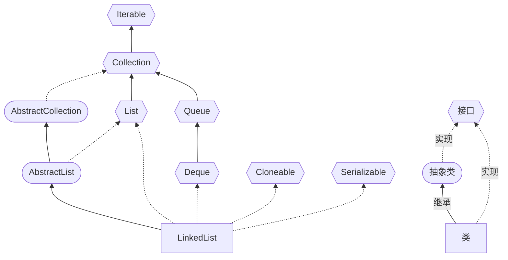

# LinkedList



*LinkedList*同时实现了*List*接口和*Deque*接口，也就是说它既可以看作一个顺序容器，又可以看作一个队列（*Queue*），同时又可以看作一个栈（*Stack*）。关于栈或队列，现在的首选是*ArrayDeque*，它有着比*LinkedList*（当作栈或队列使用时）有着更好的性能。

源码解读

```java
public class LinkedList<E>
    extends AbstractSequentialList<E>
    implements List<E>, Deque<E>, Cloneable, java.io.Serializable
{
    transient int size = 0; // 非序列化字段，表示链表中的节点个数
    transient Node<E> first; // 非序列化字段，指向链表中的第一个节点
    transient Node<E> last; // 非序列化字段，指向链表中的最后一个节点

    // ...
}

/**
 * 链表中的节点类。
 */
private static class Node<E> {
    E item; // 节点中存储的元素
    Node<E> next; // 指向下一个节点的指针
    Node<E> prev; // 指向上一个节点的指针

    /**
     * 构造一个新的节点。
     *
     * @param prev 前一个节点
     * @param element 节点中要存储的元素
     * @param next 后一个节点
     */
    Node(Node<E> prev, E element, Node<E> next) {
        this.item = element; // 存储元素
        this.next = next; // 设置下一个节点
        this.prev = prev; // 设置上一个节点
    }
}

```

* 实现了 Serializable 接口，但 `writeObject()` 方法在序列化的时候只保留了元素的内容 item，并没有保留元素的前后引用。
* 实现了 Cloneable 接口，这表明 LinkedList 是支持拷贝的。
*  没有实现 RandomAccess 接口，不支持随机访问

## LinkedList作为双向链表

常用方法

* 添加元素：

  * `add(E e)` 方法 / `addLast()` 方法：将元素添加到末尾。
  * `add(int index, E element)`，该方法是在指定下表处插入元素，需要先通过线性查找找到具体位置，然后修改相关引用完成插入操作。
  * `addFirst()` 方法将元素添加到第一位；

  ```java
  // 1. LinkedList linkedList = new LinkedList();
        public LinkedList() {}
     //这时 linkeList 的属性 first = null  last = null
  
  //   2. 执行 添加
         public boolean add(E e) {
              linkLast(e);
              return true;
          }
  //    3.将新的结点，加入到双向链表的最后
       void linkLast(E e) {
          final Node<E> l = last;
          final Node<E> newNode = new Node<>(l, e, null);
          last = newNode;
          if (l == null)
              first = newNode;
          else
              l.next = newNode;
          size++;
          modCount++;
      }
  /*  因为是双端队列，所以先用l 把左边的引用（last）保存下来，然后创建新结点，
      然后让当前结点的last指向新节点，接着判断是不是第一个结点，进行相应的引用处理
      last,初始为null，每一轮添加走完last就会指向上一个，然后将其给新进来的这个的l位置，也就是pre
      因为是在尾部插入，所以需要找到尾节点对象，放在创建的新对象的prev指向的对象*/
  ```

* 删除元素：

  * `remove()` / `removeFirst()`：删除第一个节点
  * `remove(int)`：删除指定位置的节点
  * `remove(Object)`：删除指定元素的节点，先遍历再删除
  * `removeLast()`：删除最后一个节点

  ```java
  //1. 执行 removeFirst，默认删除第一个节点
     public E remove() {
         return removeFirst();
     }
  
  //2. 执行
     public E removeFirst() {
         final Node<E> f = first;// 获取链表的第一个节点
         if (f == null)
             throw new NoSuchElementException();
         return unlinkFirst(f); // 调用 unlinkFirst 方法删除第一个节点并返回它的元素
     }
  
  //3. 执行 unlinkFirst, 将 f 指向的双向链表的第一个结点拿掉
     private E unlinkFirst(Node<E> f) {
         // assert f == first && f != null;
          final E element = f.item; // 获取要删除的节点的元素
          final Node<E> next = f.next; // 获取要删除的节点的下一个节点
          f.item = null; // 将要删除的节点的元素设置为 null
          f.next = null; // 将要删除的节点的下一个节点设置为 null
          first = next; // 将链表的头节点设置为要删除的节点的下一个节点
          if (next == null) // 如果链表只有一个节点
              last = null; // 将链表的尾节点设置为 null
          else
              next.prev = null; // 将要删除节点的下一个节点的前驱设置为 null
          size--; // 减少链表的大小
          return element; // 返回被删除节点的元素
     }
     //f的引用是在上一个方法中声明的，当方法结束时这个f的生命周期就结束了，这个时候被删除的对象就没有任何引用，就会被回收
  ```
  ```java
  public E remove(int index) {
      checkElementIndex(index); // 检查索引是否越界
      return unlink(node(index)); // 删除指定位置的节点，并返回节点的元素
  }
  
  E unlink(Node<E> x) {
      final E element = x.item; // 获取要删除节点的元素
      final Node<E> next = x.next; // 获取要删除节点的下一个节点
      final Node<E> prev = x.prev; // 获取要删除节点的上一个节点
  
      if (prev == null) { // 如果要删除节点是第一个节点
          first = next; // 将链表的头节点设置为要删除节点的下一个节点
      } else {
          prev.next = next; // 将要删除节点的上一个节点指向要删除节点的下一个节点
          x.prev = null; // 将要删除节点的上一个节点设置为空
      }
  
      if (next == null) { // 如果要删除节点是最后一个节点
          last = prev; // 将链表的尾节点设置为要删除节点的上一个节点
      } else {
          next.prev = prev; // 将要删除节点的下一个节点指向要删除节点的上一个节点
          x.next = null; // 将要删除节点的下一个节点设置为空
      }
  
      x.item = null; // 将要删除节点的元素设置为空
      size--; // 减少链表的元素个数
      return element; // 返回被删除节点的元素
  }
  ```

* 修改元素：

  * `set()` ：将链表中指定位置的元素替换为指定元素，并返回原来的元素
  
  ```java
  /**
   * 将链表中指定位置的元素替换为指定元素，并返回原来的元素。
   *
   * @param index 要替换元素的位置（从 0 开始）
   * @param element 要插入的元素
   * @return 替换前的元素
   * @throws IndexOutOfBoundsException 如果索引超出范围（index < 0 || index >= size()）
   */
  public E set(int index, E element) {
      checkElementIndex(index); // 检查索引是否超出范围
      Node<E> x = node(index); // 获取要替换的节点
      E oldVal = x.item; // 获取要替换节点的元素
      x.item = element; // 将要替换的节点的元素设置为指定元素
      return oldVal; // 返回替换前的元素
  }
  
  /**
   * 获取链表中指定位置的节点。
   *
   * @param index 节点的位置（从 0 开始）
   * @return 指定位置的节点
   * @throws IndexOutOfBoundsException 如果索引超出范围（index < 0 || index >= size()）
   */
  Node<E> node(int index) {
      if (index < (size >> 1)) { // 如果索引在链表的前半部分
          Node<E> x = first;
          for (int i = 0; i < index; i++) // 从头节点开始向后遍历链表，直到找到指定位置的节点
              x = x.next;
          return x; // 返回指定位置的节点
      } else { // 如果索引在链表的后半部分
          Node<E> x = last;
          for (int i = size - 1; i > index; i--) // 从尾节点开始向前遍历链表，直到找到指定位置的节点
              x = x.prev;
          return x; // 返回指定位置的节点
      }
  }
  ```
  
* 查询元素

  * indexOf(Object)：查找某个元素所在的位置，若找不到返回-1
  * get(int)：查找某个位置上的元素，调用`node(index)`方法
  * `getFirst()` 方法用于获取第一个元素；
  * `getLast()` 方法用于获取最后一个元素；
  * `poll()` 和 `pollFirst()` 方法用于删除并返回第一个元素（两个方法尽管名字不同，但方法体是完全相同的）；
  * `pollLast()` 方法用于删除并返回最后一个元素；
  * `peekFirst()` 方法用于返回但不删除第一个元素。

  

|            | 底层结构 | 增删的效率     | 改查的效率 |
| ---------- | -------- | -------------- | ---------- |
| ArrayList  | 动态数组 | 较低，数组扩容 | 较高       |
| LinkedList | 双向链表 | 较高，链表追加 | 较低       |

增删时，LinkedList需要遍历找到对应节点，因此仅在操作头部元素、及涉及到扩容时更具有优势；for 循环遍历的时候，ArrayList 花费的时间远小于 LinkedList；迭代器遍历的时候，两者性能差不多。


# LinkedList作为双端队列

|                   | LinkedList   | ArrayDeque   |
| ----------------- | ------------ | ------------ |
| 底层实现方式      | 链表         | 数组         |
| 随机访问/改查效率 | O(n)，效率低 | O(1)，效率低 |
| 增删效率          | 效率高       | 效率低       |
| 内存占用          | 内存占用大   | 内存占用小   |

如果需要在双向队列的两端进行频繁的插入和删除操作，并且需要随机访问元素，可以考虑使用 ArrayDeque；如果需要在队列中间进行频繁的插入和删除操作，可以考虑使用 LinkedList。

在使用 LinkedList 作为队列时，可以使用 `offer()` 方法将元素添加到队列的末尾，使用 `poll()` 方法从队列的头部删除元素，因为 add 方法和 remove 方法在失败后会抛出异常。另外可以使用peek方法获取但不删除首元素。

由于 LinkedList 是链表结构，不支持随机访问元素，因此不能使用下标访问元素，需要使用迭代器或者 poll() 方法依次遍历元素。

####  


参考资料

[深入探讨 Java LinkedList：从源码分析到实践应用 | 二哥的Java进阶之路 (javabetter.cn)](https://javabetter.cn/collection/linkedlist.html)

[ArrayList和LinkedList的区别：如何选择？ | 二哥的Java进阶之路 (javabetter.cn)](https://javabetter.cn/collection/list-war-2.html#_05、遍历元素时究竟谁快)
