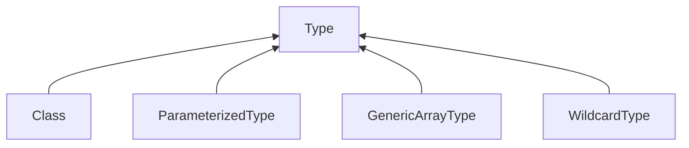

# 泛型

泛型的本质是**参数化类型**（Parameterizedtype），即给类型指定一个参数，然后在使用时再指定此参数具体的值，那样这个类型就可以在使用时决定了。这种参数类型可以用在类、接口和方法中，分别被称为泛型类、泛型接口、泛型方法。

使用传统方法的问题

* 缺少数据类型检查（运行时可能会抛出 ClassCastException 异常）
* 遍历时需要进行类型转换（数据量较大时影响效率）

泛型的好处

提供了编译期的**类型安全**，确保在泛型类型（通常为泛型集合）上只能使用正确类型的对象，避免了在运行时出现ClassCastException


```markdown
* 常见的泛型参数名称
* E： Element (在集合中使用，因为集合中存放的是元素)
* T： Type（Java 类）
* K： Key（键）
* V： Value（值）
* N： Number（数值类型）
* ？： 表示不确定的java类型
```

javac编译从高到低顺序：

| 顺序 | 代码块     | 说明                           |
| --- | -------------- | -------------------------------------------------------- |
| 1  | 导入语句    | 检查导入的包和类是否存在，是否有冲突           |
| 2  | 类级别的变量  | 检查类级别的变量声明和初始化               |
| 3  | 静态代码块   | 检查静态代码块中的语法和类型一致性            |
| 4  | 静态方法    | 检查静态方法的参数类型、返回值类型和方法体的语法和类型  |
| 5  | `main`方法   | 检查`main`方法的参数类型、返回值类型和方法体的语法和类型 |
| 6  | 实例变量    | 检查实例变量的声明和初始化                |
| 7  | 构造方法    | 检查构造方法的参数类型和方法体的语法和类型         |
| 8  | 实例方法    | 检查实例方法的参数类型、返回值类型和方法体的语法和类型  |


## 使用场景

### 自定义泛型类

```java
//基本语法
class 类名<T, R...> {
	//成员
}
```

注意细节

* 普通成员（属性、方法）可以使用泛型

* 静态属性、普通静态方法中不能使用类的泛型（泛型在类实例化时才传递类型参数，静态方法的加载先于类的实例化）

  ```java
  public T showNormal(T one){   
       return null;      
  } 
  //静态泛型方法不使用所在类的泛型，参数类型在执行方法时传入
  public static <T>T showGeneric(T one){   
       return null;      
  } 
  ```

* 继承泛型类时，如果不传入具体类型，子类也需要指定类型参数

* 使用泛型的数组，不能初始化Type parameter cannot be instantiated directly(类型擦除：运行时数组不能确定泛型类型，无法在内存开空间)

* 泛型类的类型，是在创建对象时确定的(因为创建对象时，需要指定确定类型）

* 创建实例对象时，等号右边可以不写实参的泛型类型，编译器会自行判断（推荐使用）java核心技术称这个写法为菱形写法

* 异常类Exception的子类不能定义为泛型类


### 自定义泛型接口

```java
//基本语法
interface 接口名<T, R...> {
}
```

注意细节

* 接口中，静态成员也不能使用泛型
* 泛型接口的类型，在继承接口或者实现接口时确定


### 自定义泛型方法

```java
//基本语法
修饰符 <T,R..> 返回类型 方法名(参数列表){
	//方法体
}
```

注意细节

* 泛型方法，可以定义在普通类中，也可以定义在泛型类中
* public void eat(E e){},修饰符后没有<T,R..> 这个方法不是泛型方法，而是使用了泛型的普通方法
* 方法参数有无\<?>的区别: 当存在返回集合时，如果没有\<?>将自动返回Object集合，加入<?>将返回 ? 类型的集合


## 通配符

### 有上界的通配符 <? extends T>

可以调用T类的方法，但是不能写入T类子类的参数

```java
public class Test {
	public static void fillNumberList(List<? extends Number> list) {
		list.add(new Integer(0));//编译错误
		list.add(new Float(1.0));//编译错误
	}
	public static void main(String[] args) {
		List<? extends Number> list=new ArrayList();
		list.add(new Integer(1));//编译错误
		list.add(new Float(1.0));//编译错误
	}
}
```


### 有下界的通配符 <? super T> 

```java
public class Test {
	public static void fillNumberList(List<? super Number> list) {
		list.add(new Integer(0));
		list.add(new Float(1.0));
	}
	public static void main(String[] args) {
		List<? super Number> list=new ArrayList(); 
		list.add(new Integer(1));
		list.add(new Float(1.1));
	}
}
```

泛型类型必须用限定内的类型来进行初始化，否则会导致编译错误。


### 无界通配符\<?>

无限定通配符`<?>`很少使用，可以用`<T>`替换，同时它是所有`<T>`类型的超类。

List\<Object>与List\<?>并不等同

* List\<Object>是List\<?>的子类
* 不能往List<?> list里添加任意对象，除了null。


### 其他说明

泛型类的继承

```java
List<String> list = new ArrayList<String>(); // 正确
ArrayList<Number> list = new ArrayList<Integer>(); // 错误
```


可以不用定义泛型类，也能让方法使用泛型

### 对比extends和super通配符

何时使用`extends`，何时使用`super`？为了便于记忆，我们可以用PECS原则：Producer Extends Consumer Super。

即：如果需要返回`T`，它是生产者（Producer），要使用`extends`通配符；如果需要写入`T`，它是消费者（Consumer），要使用`super`通配符。

Java标准库的`Collections`类定义的`copy()`方法：

```java
public class Collections {
    // 把src的每个元素复制到dest中:
    public static <T> void copy(List<? super T> dest, List<? extends T> src) {
        for (int i=0; i<src.size(); i++) {
            T t = src.get(i);// src是producer
            dest.add(t);// dest是consumer
        }
    }
}
```

它的作用是把一个`List`的每个元素依次添加到另一个`List`中。这个`copy()`方法的定义就完美地展示了`extends`和`super`的意图：

- `copy()`方法内部不会读取`dest`，因为不能调用`dest.get()`来获取`T`的引用；
- `copy()`方法内部也不会修改`src`，因为不能调用`src.add(T)`。

我们再回顾一下`extends`通配符。作为方法参数，`<? extends T>`类型和`<? super T>`类型的区别在于：

- `<? extends T>`允许调用读方法`T get()`获取`T`的引用，但不允许调用写方法`set(T)`传入`T`的引用（传入`null`除外）；
- `<? super T>`允许调用写方法`set(T)`传入`T`的引用，但不允许调用读方法`T get()`获取`T`的引用（获取`Object`除外）。

一个是允许读不允许写，另一个是允许写不允许读。


## 泛型的局限

编译擦除Type Erasure：泛型的正常工作是依赖编译器在编译源码的时候，先进行类型检查，然后进行 **类型擦除** 并且在类型参数出现的地方插入 **强制转换** 的相关指令实现的。

参考资料：[擦拭法 - 廖雪峰的官方网站 (liaoxuefeng.com)](https://www.liaoxuefeng.com/wiki/1252599548343744/1265104600263968)

* 类型参数要求是引用类型，不能是基本数据类型 Type argument cannot be of primitive type

* 无法获得带泛型的 Class 实例

* 无法判断某个具体对象的泛型类型

* 不能直接创建实例化的泛型对象

  * ```java
    public class Pair<T> {
        private T first;
        private T last;
        public Pair() {
            // Compile error编译报错
            first = new T();
            last = new T();
        }
    }
    ```

  * ```java
    public class Pair<T> {
        private T first;
        private T last;
        public Pair(Class<T> clazz) {
            //需要借助弹舌创建对象
            first = clazz.newInstance();
            last = clazz.newInstance();
        }
    }
    
    ```

* 定义方法名不能和Object类的方法重复：向上转型后相当于Object类出现两个相同方法，编译时会阻止这种重写


泛型数组： 如果在方法内部创建了泛型数组，最好不要将它返回给外部使用。


## 泛型相关类




[秒懂Java之类型系统（Type） - ShuSheng007](https://shusheng007.top/2021/09/09/038/)

继承泛型类的子类，可以获取到父类的泛型类型

```java
import java.lang.reflect.ParameterizedType;
import java.lang.reflect.Type;

public class Main {
    public static void main(String[] args) {
        Class<IntPair> clazz = IntPair.class;
        Type t = clazz.getGenericSuperclass();
        if (t instanceof ParameterizedType) {
            ParameterizedType pt = (ParameterizedType) t;
            Type[] types = pt.getActualTypeArguments(); // 可能有多个泛型类型
            Type firstType = types[0]; // 取第一个泛型类型
            Class<?> typeClass = (Class<?>) firstType;
            System.out.println(typeClass); // Integer
        }

    }
}

class Pair<T> {
    private T first;
    private T last;
    public Pair(T first, T last) {
        this.first = first;
        this.last = last;
    }
    public T getFirst() {
        return first;
    }
    public T getLast() {
        return last;
    }
}

class IntPair extends Pair<Integer> {
    public IntPair(Integer first, Integer last) {
        super(first, last);
    }
}
```


参考资料：

[秒懂Java之泛型 - ShuSheng007](https://shusheng007.top/2021/09/09/031-2/)

[Java泛型深入理解](https://blog.csdn.net/sunxianghuang/article/details/51982979#commentsedit)

[super通配符 - 廖雪峰的官方网站 (liaoxuefeng.com)](https://www.liaoxuefeng.com/wiki/1252599548343744/1265105920586976)
