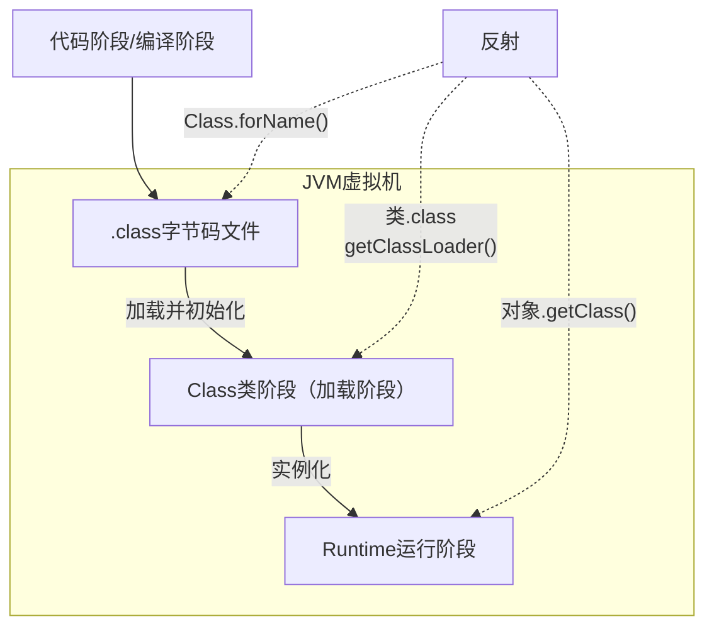

## 反射的使用




1. 反射机制允许程序在执行期借助于ReflectionAPI取得任何类的内部信息（比如成员变量，构造器，成员方法等等），并能操作对象的属性及方法。反射在设计模式和框架底层都会用到
2. .加载完类之后，在堆中就产生了一个class类型的对象（一个类只有一个Class对象），这个对象包含了类的完整结构信息。通过这个对象得到类的结构。这个对象就像一面镜子，透过这个镜子看到类的结构，所以，形象的称之为：反射

### 在不同阶段获取Class类对象的方式

动态绑定机制的底层逻辑，每个实例都是通过Class对象得来，而Class实例绑定不同的.class文件

加载阶段，每个类只有一个加载对象，而运行就是创建不同对象实例，每个实例的运行类型就是对应的加载类

```java
/*
无论是传统方式还是通过反射创建某个类对象，都会执行 ClassLoader 类的 loadClass 方法，源代码为
    public Class<?> loadClass(String name) throws ClassNotFoundException {
        return loadClass(name, false);
    }
创建类对象的四种方式
 */

//方式1：编译阶段:
//前提：已知一个类的全类名，且该类在当前类路径下（可能抛出 ClassNotFoundException 异常）
// 应用场景：多用于配置文件，读取类全路径，加载类。
Class c1 = Class.forName("全类名");

//方式2：加载阶段：方式最为安全可靠，程序性能最高
//注意：需要在加载阶段才能使用，也就是需要完成一次类加载后才能使用
//应用场景：多用于参数传递，比如通过反射得到对应构造器对象
Class c2 = 类名.class;

//方式3：运行阶段
//前提：已知某个类的实例
//应用场景：通过创建好的对象，获取Class对象
Class c3 = 类的对象.getClass();

//方式4：通过其他类的类加载器
ClassLoader classLoader = 类名.class.getClassLoader();//也可以通过 其他类实例.getClass().getClassLoader()得到
Class c4 = classLoader.loadClass("全类名"); 

//特殊的类：基本数据类型 int, char,boolean,float,double,byte,long,short 和对应的包装类
Class cls5 = 基本数据类型.class;
Class cls6 = 包装类.TYPE;
//说明：int.class和Integer.TYPE得到的两个对象hashCode相同，说明是相同对象
```

区别：Class.forName("全类名")会调用该类的静态方法，classLoader.loadClass("全类名") 不会调用静态方法（更加轻量级）

## 反射的作用

- 可以在运行时得到一个类的全部成分，然后操作
- 可以破坏封装性（很突出）
- 可以破坏泛型的约束性（很突出）
- 更重要的用途是适合：做 Java 高级框架
- 基本上主流框架都会基于反射设计一些通用技术功能

### 泛型擦除

需求：给你任意一个对象，在不清楚对象字段的情况下，可以把对象的字段名称和对应值存储到文件中去

定义一个方法，可以接收任意类的对象。每次收到一个对象后，需要解析这个对象的全部成员变量名称

这个对象可能是任意的，那么怎么样才可以知道这个对象的全部成员变量名称呢？

- 使用反射获取对象的 Class 类对象，然后获取全部成员变量信息
- 遍历成员变量信息，然后提取本成员变量在对象中的具体值
- 存入成员变量名称和值到文件中去即可

反射是作用在运行时的技术，此时集合的泛型将不能产生约束了，此时是可以为集合存入其他任意类型的元素

泛型只是在编译阶段可以约束集合只能操作某种数据类型，在编译成 Class 文件进入运行阶段的时候，其真实类型都是 ArrayList 了，泛型相当于被擦除了ArrayList&lt;String> 和 ArrayList&lt;Integer> 的类型都是 ArrayList

```java
import java.lang.reflect.Method;
import java.util.ArrayList;

class GenericErase {
    public static void main(String[] args) throws Exception {
        ArrayList<String> list = new ArrayList<>();
        list.add("你好");

// 方式一
        Class<? extends ArrayList> c = list.getClass();
        Method add = c.getDeclaredMethod("add", Object.class);
        add.invoke(list, true);
        System.out.println(list);

// 方式二
        ArrayList newList = list;
        newList.add(17.2);
        System.out.println(list);
    }
}
```

### 通过反射创建类实例

```java
/*
1.方式一：调用类中的public修饰的无参构造器
2.方式二：调用类中的指定构造器
*/

//演示通过反射机制创建类实例
class ReflecCreateInstance {
    public static void main(String[] args) throws ClassNotFoundException, IllegalAccessException, InstantiationException, NoSuchMethodException, InvocationTargetException {
        //1. 先获取到User类的Class对象
        Class<?> userClass = Class.forName("ReflectUser");

        //2. 通过public的无参构造器创建实例
        Object o = userClass.newInstance();
        System.out.println(o);

        //3. 通过public的有参构造器创建实例：不能直接传入参数
        //3.1 先得到对应构造器
        /*
            代码执行后得到的 constructor 对象就是
            public User(String name) {//public的有参构造器
                this.name = name;
            }
         其中：String.class就是获取String类型的class对象（万物皆对象）

         */
        Constructor<?> constructor = userClass.getConstructor(String.class);
        //3.2 创建实例，并传入实参
        Object hsp = constructor.newInstance("hsp");
        System.out.println("hsp=" + hsp);

        //4. 通过非public的有参构造器创建实例
        //4.1 得到private的构造器对象
        Constructor<?> constructor1 = userClass.getDeclaredConstructor(int.class, String.class);
        //4.2 创建实例
        //暴破【暴力破解】 , 使用反射可以访问private构造器/方法/属性, 反射面前，都是纸老虎
        constructor1.setAccessible(true);//此处如果不写这行代码，将抛出 IllegalAccessException 异常
        Object user2 = constructor1.newInstance(100, "张三丰");
        System.out.println("user2= " + user2);
    }
}

class ReflectUser { //User类
    private int age = 72;
    private String name = "姜子牙";

    public ReflectUser() {//无参 public
    }

    public ReflectUser(String name) {//public 有参构造器
        this.name = name;
    }

    private ReflectUser(int age, String name) {//private 有参构造器
        this.age = age;
        this.name = name;
    }

    public String toString() {
        return "User [age=" + age + ", name=" + name + "]";
    }
}
```

### 访问类中的成员

```java
class ReflecAccessMethod {
    public static void main(String[] args) throws ClassNotFoundException, NoSuchMethodException, IllegalAccessException, InstantiationException, InvocationTargetException {

        //1. 得到Boss类对应的Class对象
        Class<?> bossCls = Class.forName("ReflectBoss");
        //2. 创建对象
        Object o = bossCls.newInstance();
        //3. 调用public的hi方法
        //Method hi = bossCls.getMethod("hi", String.class);//OK
        //3.1 得到hi方法对象
        Method hi = bossCls.getDeclaredMethod("hi", String.class);//OK
        //3.2 调用
        hi.invoke(o, "喵喵喵~");

        //4. 调用private static 方法
        //4.1 得到 say 方法对象
        Method say = bossCls.getDeclaredMethod("say", int.class, String.class, char.class);
        //4.2 因为say方法是private, 所以需要暴破，原理和前面讲的构造器和属性一样
        say.setAccessible(true);
        System.out.println(say.invoke(o, 100, "张三", '男'));
        //4.3 因为say方法是static的，还可以这样调用 ，可以传入null
        System.out.println(say.invoke(null, 200, "李四", '女'));

        //5. 在反射中，如果方法有返回值，统一返回Object , 但是实际运行类型和方法定义的返回类型一致
        Object reVal = say.invoke(null, 300, "王五", '男');
        System.out.println("reVal 的运行类型=" + reVal.getClass());//String


        //在演示一个返回的案例
        Method m1 = bossCls.getDeclaredMethod("m1");
        Object reVal2 = m1.invoke(o);
        System.out.println("reVal2的运行类型=" + reVal2.getClass());//Monster


    }
}

class ReflectMonster {}
class ReflectBoss {//类
    public int age;
    private static String name;

    public ReflectBoss() {//构造器
    }

    public ReflectMonster m1() {
        return new ReflectMonster();
    }

    private static String say(int n, String s, char c) {//静态方法
        return n + " " + s + " " + c;
    }

    public void hi(String s) {//普通public方法
        System.out.println("hi " + s);
    }
}
```

## 反射的优缺点

1. 优点：可以动态的创建和便用对象（也是框架底层核心），便用灵活，没有反射机制，框架技术就失去底层支撑
2. 缺点：便用反射基本是解释执行，对执行速度有影响


