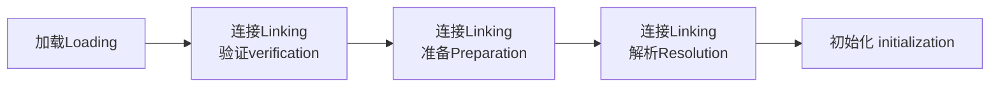

## 类加载（≠创建类对象/类实例化）

反射机制是Java实现动态语言的关键，也就是通过反射实现类动态加载

1.静态加载：编译时加载相关的类，如果没有则报错，依赖性强

2.动态加载：运行时加载需要的类，如果运行时不用该类，则不报错，降低了依赖性

类加载时机

| 类加载时机                                  | 初始化类型 |
| ------------------------------------------- | ---------- |
| 创建对象实例                                | 静态加载   |
| 子类被加载                                  | 静态加载   |
| 调用类中静态成员（除了final常量）和静态方法 | 静态加载   |
| 当虚拟机启动，先初始化main方法所在的类      | 静态加载   |
| 通过反射调用                                | 动态加载   |

不会导致该类被加载的情况：

* 调用类中的常量（static final字段）时
* 当通过子类引用父类的静态变量，不会导致子类初始化
* 通过数组定义类引用，不会触发此类的初始化

既然是JVM调用类加载器，那么编译期应该不会有实际加载行为，连堆空间都没有建立。它只是去检查对应路径的.class文件是否存在而已，算是帮助JVM预先做一部分检查工作。

### Java 程序在计算机中有三个阶段


* #### 类加载后的内存布局：

  * 方法区，生成字节码的二进制数据（元数据）

  * 堆区，生成字节码对应的数据结构（类的Class对象），和方法区中的数据建立反射机制

#### 代码阶段/编译阶段

将 .java 文件通过 javac 编译为 .class 字节码文件

#### Class 类阶段（加载阶段）

将 .class 字节码文件，通过类加载器 ClassLoader 的 loadClass() 方法（这个过程体现反射），在堆中新建 Class 类对象（数据结构）；同时在方法区中，得到类的字节码二进制数据（元数据）

Class 类对象的内部包括成员变量 Field[]，构造器 Constructor[]，成员方法 Method[]。Class对象获取类信息的方式，是通过操作方法区中记录的类信息

#### Runtime 运行阶段

执行创建类对象的代码，在堆中创建对象：同一个类的不同对象实例都对应同一个Class对象

通过堆中创建的类对象实例，可以反推 Class 对象，实现下列功能：

* 在运行时判断任意一个对象所属的类
* 在运行时构造任意一个类的对象
* 在运行时得到任意一个类所具有的成员变量和方法
* 在运行时调用任意一个对象的成员变量和方法
* 生成动态代理


### 类加载过程



注意：这里是针对类的加载阶段，并不是new的阶段，因此是针对静态成员。


#### 1、加载Loading（由类加载器完成）

JVM将字节码从不同的数据源（class文件、jar包、网络）转化为二进制字节流加载到内存中（方法区），并生成一个代表该类的java.lang.Class对象（堆）

#### 2、连接Linking：将类的二进制数据合并到JRE中

##### 1）验证verification：

* 目的：确保Class文件的字节流中包含的信息符合当前虚拟机的要求，并不会危害虚拟机自身的安全
* 包括：
  * 文件格式验证（是否以魔数 0xCAFEBABE 开头）
  * 元数据验证
  * 字节码验证
  * 符号引用验证
* 可以考虑使用 `-Xverify:none` 参数来关闭大部分的类验证措施，缩短虚拟机类加载的时间。

##### 2）准备Preparation

对 `static修饰的` 静态变量进行默认初始化（设置为默认初始值，如 0、0L、null、false 等），并在方法区分配内存空间

属性=成员变量=字段

```java
int n1 = 10; //实例属性，不是静态变量，准备阶段不分配内存
static int n2 = 20; //静态变量，分配内存，默认初始化为 0
final static n3 = 30; //常量和静态变量不一样，直接赋值为 30，
```

##### 3）解析Resolution

虚拟机将常量池中的符号引用替换为直接引用（逻辑地址 -> 物理地址）

符号引用就是一组符号来描述目标，可以是任何字面量；直接引用就是直接指向目标的指针、相对偏移量或一个间接定位到目标的句柄

解析动作主要针对类或接口、字段、类方法、接口方法、方法类型、方法句柄和调用点限定符这7类符号引用进行

#### 3、初始化 initialization：显式初始化（指定初始化），JVM负责对类（主要是静态成员）进行初始化

* 到初始化阶段，才真正开始执行类中定义的Java程序代码，此阶段是执行&lt;clinit>()方法的过程 -> clinit是class init的缩写
* &lt;clinit>()方法是由编译器按语句在源文件中出现的顺序，依次自动收集类中的所有静态变量的赋值动 作和静态代码块中的语句，并进行合并。（①和实例化无关②如果多次向同一静态变量赋值，执行最后一次赋值的数据）
* 虚拟机会保证一个类的&lt;clinit>()方法在多线程环境中被正确地加锁、同步，如果多个线程同时去初始化一个类，那么只会有一个线程去执行这个类的&lt;clinit>()方法，其他线程都需要阻塞等待，直到活动线程执行&lt;clinit>()方法完毕 -> 某个类在内存中, 只有一份Class对象

```java
protected Class<?> loadClass(String name, boolean resolve)
throws ClassNotFoundException {
    //拿到同步锁的线程才能进入锁住的代码块
    synchronized (getClassLoadingLock(name)) {
    //下面的方法保证其他线程就算拿到锁也不会创建的
    Class<?> c = findLoadedClass(name);
    }
}
```

