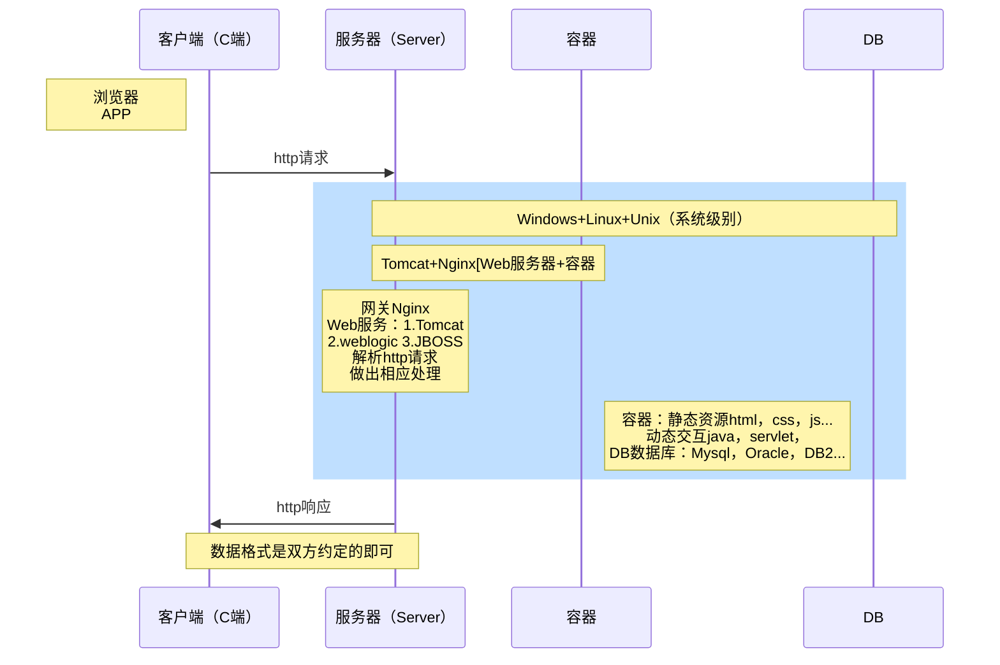

# Web开发基本概念

## 网页的组成

结构（HTML）：HTML是网页内容的载体。内容就是网页制作者放在页面上**想要让用户浏览的信息**，可以包含文字、图片、视频等。
表现（CSS）：CSS样式是布局，就像网页的外衣。比如，标题**字体、颜色变化**，或为标题加入**背景图片、边框**等。所有这些用来改变内容外观的东西称之为表现。
行为（JavaScript，JQuery）：JavaScript是用来实现网质上的特效效果。如：**鼠标滑过弹出下拉菜单**。或鼠标滑过表格的背景颜色改变。还有购物网站中**图片的轮换**。可以这么理解，有**动画**的，有交互的一般都是用JavaScript来实现的

火狐、谷歌浏览器调试页面Ctrl+Shift+I

在Edge浏览器中快捷键F12可进入DevTools

参考资料：

[计算机网络通讯的【系统性】扫盲——从“基本概念”到“OSI 模型” ](https://program-think.blogspot.com/2021/03/Computer-Networks-Overview.html)

[一篇文章带你详解 HTTP 协议（网络协议篇一） - 简书 (jianshu.com)](https://www.jianshu.com/p/6e9e4156ece3)

[一篇文章带你熟悉 TCP/IP 协议（网络协议篇二） - 简书 (jianshu.com)](https://www.jianshu.com/p/9f3e879a4c9c)

流程图绘制：

[流程图 - Mermaid教程 (iodraw.com)](https://www.iodraw.com/codechart/tutorial/zh/flowchart.html#flowchart-orientation)

[About Mermaid | Mermaid](http://mermaid.js.org/intro/)

[创建关系图 - GitHub 文档](https://docs.github.com/zh/get-started/writing-on-github/working-with-advanced-formatting/creating-diagrams)

## 技术栈

B/S技术栈的体系图分析

> 技术栈
>
> 前端技术栈
>
> > ①掌握基本使用②了解前端和后端的数据交互
> >
> > 前端开发工具html，css，javascript
> >
> > 高级开发框架VUE，bootstrap，jQuery
> >
> > 其他react，ajax
>
> 
>
> 后端技术栈-java体系
>
> > java技术，java基础[组件，框架，模块，组合等]
> >
> > servlet+javabean[接收用户请求]
> >
> > spring springmvc mybatis mybatis-plus ->ssm框架（对分布式微服务支撑不够，使用比较麻烦）
> >
> > springboot spring cloud, spring cloud alibaba ->常用的是springboot + vue + spring cloud
> >
> > [消息中间件]rabbitMQ, rocketMQ
> >
> > 
> >
> > 数据库 
> >
> > > 关系型数据库MySQL, Oracle, SQL Server
> > >
> > > 非关系型数据库Redis, Mogodb

ES6：全称ECMAScript6.0，是JavaScript的下一个版本标准，增加了新的语法特性，例如Promise（异步编程的一种解决方案，可以解决传统Ajax回调函数嵌套问题）

Node.js：仅需掌握npm功能（随同Node.js一起安装的包管理工具，类似Maven）

Vue：类似后端SpringMVC的前端框架

模块化编程：Javascript代码越来越庞大，Javascript引入模块化编程，开发者只需要实现核心的业务逻辑，其他都可以加载别人已经写好的模块

Axios：基于promise的Http库，通常和Vue一起使用，实现Ajax操作

|                          | 前端技术栈               | 后端技术栈                         |
| ------------------------ | ------------------------ | ---------------------------------- |
| 语言版本                 | JavaScript ES6，7，8 | Java8 OpenJDK21……               |
| 框架/库(前端)/组件(后端) | Jquery Vue React  | SSM SpringBoot SpringCloud |
| 开发工具                 | WebStrom VSCode      | Eclipse IDEA                   |
| 项目构建                 | WebPack                  | Maven Gradle                   |
| 包依赖管理               | NPM                      | Maven                              |

前端工具网站：

[axios中文文档 (javasoho.com)](https://javasoho.com/axios/index.html)

[Web前端导航 - 前端开发网址导航 (buging.cn)](https://no.buging.cn/)

