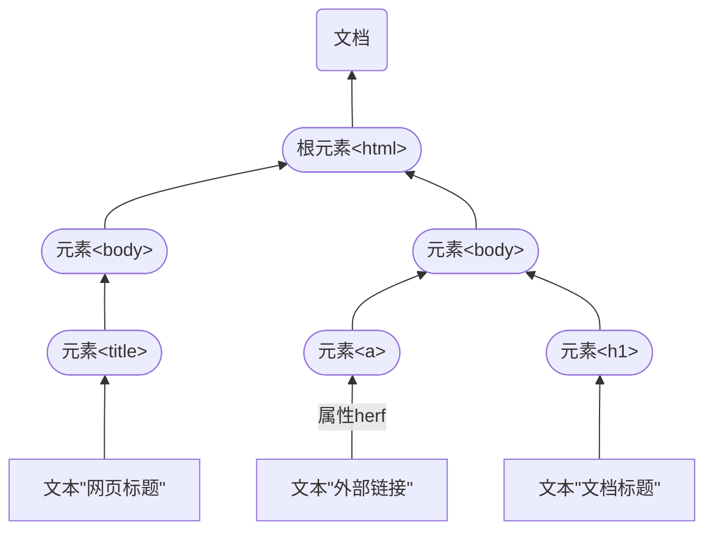

# JS HTML DOM

1. DOM 全称是 Document Object Model 文档对象模型；
2. 就是把文档中的标签，属性，文本，转换成为对象来管理；
3. 除了 HTML DOM，还有 CSS DOM， XML DOM。

HTML DOM




## document对象

document 说明

1. document是一种树结构的文档，管理了所有的HTML文档内容
2. 通过document可以访问所有的标签对象
3. 有层级关系在dom中把所有的标签都对象化


操作流程：通过id/标签名获取对应的dom对象，对dom对象进行操作

```html
<!DOCTYPE html>
<html lang="en">
<head>
    <meta charset="UTF-8">
    <title>getElementById的使用</title>

    <script type="text/javascript">
        //完成全选
        function selectAll() {
            //1.获取到 sport 这一组复选框，需要保证name相同，组成一个集合NodeList
            //2. 拿到[dom对象/集合]，遍历 sports修改【利用属性和方法api】
            var sports = document.getElementsByName("sport");
            for (var i = 0; i < sports.length; i++) {
                sports[i].checked = true;//选中
            }
        }
        //全不选
        function selectNone() {
            var sports = document.getElementsByName("sport");
            for (var i = 0; i < sports.length; i++) {
                sports[i].checked = false;//全部不选中
            }
        }
        //反选 selectReverse
        function selectReverse() {
            var sports = document.getElementsByName("sport");
            for (var i = 0; i < sports.length; i++) {
                // if(sports[i].checked) {//js true
                //     sports[i].checked = false;
                // } else {
                //     sports[i].checked = true;//选中
                // }
                //利用解释型语言的特点，直接取反
                sports[i].checked = !sports[i].checked;
            }
        }

        function changeImgs() {
            //获取到的 imgs 是 HTMLCollections
            var imgs = document.getElementsByTagName("img");
            var switchlight = document.getElementById("switchlight");
            if(switchlight.value == "开灯"){
                //无论img元素有多少个，第一个肯定是灯泡的图片
                imgs[0].src = './img/eg_bulbon.gif';//js字符串可以用单引号
                switchlight.value = '关灯';
            } else {
                imgs[0].src = './img/eg_bulboff.gif';
                switchlight.value = '开灯';
            }
        }
        function addImg() {
            //创建一个警示标志图片展示在页面，文件来自阿里图标库
            //1. 生成的img是一个HTMLImageElement
            var img = document.createElement("img");
            //alert(img);//?
            img.src = "./img/caution.png";
            //调整显示大小
            img.width = "100";
            //2. 展示图片, 添加到 doucment.body
            document.body.appendChild(img);
        }

        window.onload = function () {
            //动态绑定的方法，需要写在这个方法体内，否则无法初始化
            //1. 获取 myHeader的dom对象
            var myHeader = document.getElementById("myHeader");
            //2. 给myHeader绑定 onclick的事件
            myHeader.onclick = function () {
                //innerText：得到dom对象标签之间的文本
                //innerHTML：得到dom对象标签之间的文本和HTML元素标签
                alert(myHeader.innerText);
                alert(myHeader.innerHTML);
            }

            //也可以直接用函数赋值
            document.getElementById("btn03").onclick = function () {
                var sports = document.getElementsByName("sport");//NodeList
                for (var i = 0; i < sports.length; i++) {
                    //过滤
                    if (sports[i].checked) {
                        alert("你选中了 " + sports[i].value);
                    }
                }
            }
        }

    </script>
</head>
<body>
<!-- 静态绑定一个点击事件 -->
<h1 id="myHeader"><div>Click on the header to alert its value</div></h1>
<p>第一次展示innerText，第二次展示innerHTML</p>
你会的运动项目：
<input type="checkbox" name="sport" value="zq" checked="checked">足球
<input type="checkbox" name="sport" value="tq">台球
<input type="checkbox" name="sport" value="ppq">乒乓球 <br/><br/>
<button onclick="selectAll()">全选</button>
<button onclick="selectNone()">全不选</button>
<button onclick="selectReverse()">反选</button>
<button id="btn03">查看已选中的节点</button>
<br/><br/>


<input type="button" onclick="changeImgs()" value="开灯" id="switchlight"/><br/><br/>

<input type="button" onclick="addImg()" value="点击增加一个警示标"/><br/>
</body>
</html>

```


## HTML DOM节点

在HTML DOM（文档对象模型）中，每个部分都是节点：

* 文档本身是文档节点
* 所有 HTML 元素是元素节点
* 所有 HTML 属性是属性节点
* HTML 元素内的文本是文本节点
* 注释是注释节点

节点的属性和方法可在w3school查询

[HTML DOM Element 对象 (w3school.com.cn)](https://www.w3school.com.cn/jsref/dom_obj_all.asp)

[HTML DOM Document 对象 (w3school.com.cn)](https://www.w3school.com.cn/jsref/dom_obj_document.asp)

节点常用方法

1. 通过具体的元素节点调用getElementsByTagName()方法，获取当前节点的指定标签名孩子节点
2. appendchild(ochildNode)方法，可以添加一个子节点，ochildNode是要添加的

节点常用属性

1.  childNodes属性，获取当前节点的所有子节点
2. firstChild属性，获取当前节点的第一个子节点
3. lastChild属性，获取当前节点的最后一个子节点
4. parentNode属性，获取当前节点的父节点
5. nextSibling属性，获取当前节点的下一个节点
6. previousSibling属性，获取当前节点的上一个节点
7. className用于获取或设置标签的class属性值
8. innerHTML属性，表示获取/设置起始标签和结束标签中的内容
9. innerText属性，表示获取/设置起始标签和结束标签中的文本

```html
<!DOCTYPE html>
<html lang="en">
<head>
    <meta charset="UTF-8">
    <title>演示DOM节点方法</title>
    <script type="text/javascript">
        //小技巧: ctrl+home 直接到页面最上面 ctrl + end 页面最下
    window.onload = function () {
        //获取下拉框的所有子节点
        document.getElementById("btn01").onclick = function (){
            /*这个方法获取的是option节点，而不是所有子节点
            var list = document.getElementById("area").getElementsByTagName("option");
            for(i = 0; i < list.length; i ++){
                alert(list[i].innerText)
            }
            */
            var childNodes = document.getElementById("area").childNodes;
            for (var i = 0; i < childNodes.length; i++) {
                alert(i + " " + childNodes[i]);//不加innerText，输出的是元素类型
            }
            /*说明：换行也被看做是文本
                1.如果使用 document.getElementById("sel01").childNodes，获取的是
                object Text（innerText是undefined） 和 object HTMLOptionElement
                2.如果不希望得到text 对象，需要将所有的内容放在一行
             */
        }
        //查找当前选择项
        document.getElementById("btn03").onclick = function (){

            var childNodes = document.getElementById("area").childNodes;
            for (var i = 0; i < childNodes.length; i++) {
                if (childNodes[i].selected) {
                    alert(i + " " + childNodes[i].innerText);
                }
            }
        }

        //获取下标为1的选项
        document.getElementById("btn05").onclick = function (){
            var sel = document.getElementById("area");
            //area 是 HtmlSelectElement => 本身就有集合特点
            alert(sel[1]);
            alert(sel[1].innerText)
        }
        //查找第一个子节点
        document.getElementById("btn07").onclick = function () {
            var language = document.getElementById("area");
            //获取子节点可以使用childNodes方法
            //此处展现firstChild和lastChild方法返回的结果
            alert(language.firstChild.innerText);//得到的是.childNodes 方法的第一个子节点 object Text
            alert(language[0].innerText);//得到的是第一个option节点 object HTMLOptionElement
        }
        //查看列表所有项目
        document.getElementById("btn02").onclick = function (){
            var list = document.getElementById("language").getElementsByTagName("li");
            for(i = 0; i < list.length; i ++){
                alert(list[i].innerText)//<li>xxx</li>需要用innerXXXX获取，<input value="xx"/>用value获取
            }
        }
        //得到id=js的父节点
        document.getElementById("btn04").onclick = function (){
            var js = document.getElementById("js");
            //alert(js.parentNode);//object HTMLUListElement
            alert(js.parentNode.innerHTML);//得到父节点代码块内包含的HTML元素
            //alert(js.parentNode.childNodes.length);//得到父节点的所有子节点数量
        }
        //得到id=js的上一个节点
        document.getElementById("btn06").onclick = function (){
            var js = document.getElementById("js");
            //演示nextSibling和previousSibling方法的使用
            alert(js.previousSibling.innerText);//不是无序列表中的元素，而是换行对应的文本节点
            alert(js.previousSibling.previousSibling.innerText);//不是无序列表中的元素，而是换行对应的文本节点
        }
        //更新文本框内容
        document.getElementById("btn09").onclick = function (){
            var intro = document.getElementById("person");
            intro.innerText = "文本框已更新";
        }
    }
    </script>
</head>
<body>
<select id="area">
    <option>--选择地区--</option>
    <option>山河四省</option>
    <option>西南五省</option>
    <option>东南六省</option>
</select>
<div>
    <button id="btn01">获取下拉框的所有子节点</button>
    <button id="btn03">查找当前选择项</button>
    <br>
    <button id="btn05">获取下标为1的选项</button>
    <button id="btn07">查找第一个子节点</button>
</div>

<ul id="language">前端技术栈
    <li>html</li>
    <li>css</li>
    <li id="js">Javascript</li>
    <li>vue</li>
</ul>
<div>
    <button id="btn02">查看列表所有项目</button>
    <button id="btn04">得到id=js的父节点</button>
    <br>
    <button id="btn06">得到id=js的上一个节点</button>
</div>
<p>
    个人介绍:
</p>
<textarea id="person">请输入内容</textarea>
<button id="btn09">更新文本框内容</button>
</body>
</html>
```

