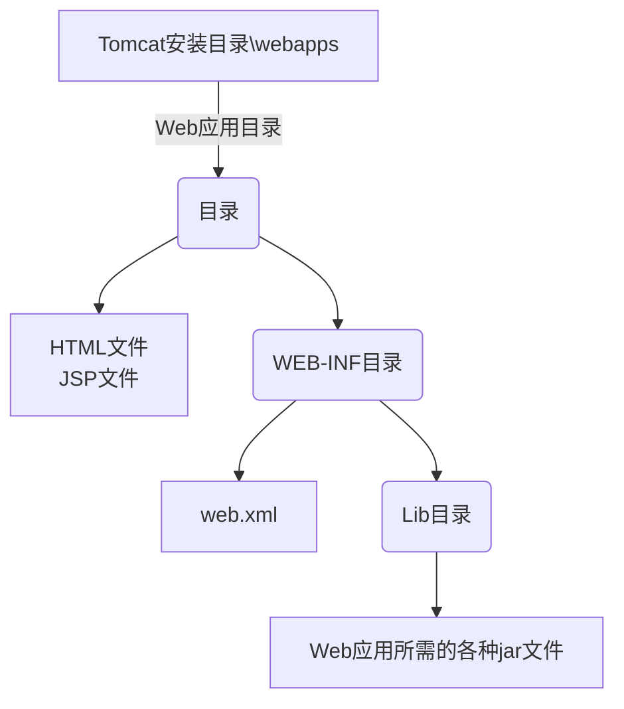
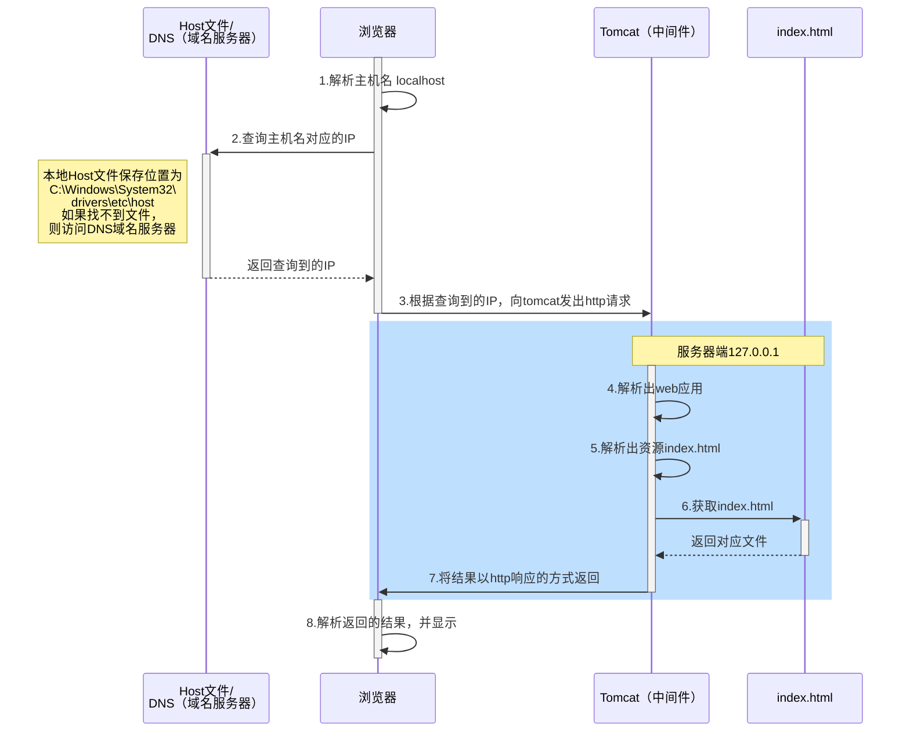

# Tomcat

Tomcat官方站点：http://tomcat.apache.org/

获取Tomcat安装程序包

* tar.gz文件是Linux操作系统下的安装版本
* zip文件是windows系统下的压缩版本

Tomcat本质就是一个Java程序（需要jdk），但是这个Java程序可以处理来自浏览器的HTTP请求。常和JSP+EL搭配使用

## 程序的开启和关闭

### 启动

方法一：双击 bin 目录下的 startup.bat 文件

方法二：进入bin目录下，命令行执行 ```catalina run``` 指令

默认配置下，Tomcat启动成功后，输入 http://localhost:8080/ 会显示欢迎页面。

### 关闭

方法一：直接关闭tomcat服务窗口

方法二：双击 bin 目录下的 shutdown.bat 文件（推荐）。此程序在8009端口发送关闭指令，Tomcat监听到指令后自动退出

### 故障排除

1. 双击 startup.bat 文件，出现一个小黑窗口然后就没了，原因是因为没有配置好 JAVA_HOME 环境变量
2. JAVA_HOME 必须全大写，中间必须是下划线
3. AVA_HOME 配置的路径只需要配置到 jdk 的安装自录即可。不需要带上 bin 目录
4. 端口8080被占用「管理员权限的命令行中输入netstat -anb 查看端口]
5. 如果其它服务程序占用了8080端口，可以关闭该服务，或者修改 Tomcat 服务的默认端口 8080

在开发中，通过管理员权限的cmd查看哪些端口在监听

```
netstat -anb
```

## 目录结构

| 文件夹  | 内容                                                         |
| ------- | ------------------------------------------------------------ |
| bin     | 存放启动和关闭Tomcat的脚本文件                               |
| conf    | 存放Tomcat服务器的各种配置文件                               |
| lib     | 存放Tomcat服务器的支撑jar包                                  |
| logs    | 存放Tomcat的日志文件                                         |
| temp    | 存放Tomcat运行时产生的临时文件                               |
| webapps | web应用所在目录，即供外界访问的web资源的存放目录，后面要详细讲 |
| work    | Tomcat的工作目录                                             |

conf文件夹：

1. server.xml用于配置tomcat的基本设置（启动端口，关闭端口，主机名），可修改监听的端口号
2. wex.xml用于指定tomcat运行时配置（比如servlet等.）


### 部署Web服务



部署方式1：将web工程的目录拷贝到Tomcat的webapps目录下

1. news Web工程（目前都是静态资源html，图片）
2. 将该 news目录/文件夹 拷贝到Tomcat的webapps目录下
3. 浏览器输入：```http://ip[域名]:port/news/子目录../文件名```

部署方式2：通过配置文件来部署

1.在Tomcat下的 conf目录\Catalina\localhost\ 下，配置文件，比如testapp.xml。

```xml
<?xml version="1.0" encoding="utf-8"?>
<！--Context表示一个工程上下文path表示工程的访问路径：/testapp docBase表示web工程目录在哪里-->
<Context path="/testapp" docBase="D:\album" />
```

2.建立web应用和指定磁盘目录的映射，可以解决磁盘空间分配的问题。浏览器输入```http://ip[域名]:port/testapp/index.html``` 就表示访问 D:\album目录下的index.html

其他：默认访问的地址

浏览器输入```http://ip[域名]:port/``` 没有Web工程/应用名时，默认访问的是ROOT

浏览器输入```http://ip[域名]:port/工程名/``` 没有资源名时，默认访问的是 index.jsp 页面

## 浏览器访问web服务器文件的流程分析

对浏览器访问web服务器资源（html,css，图片，js）做详解：当浏览器中输入 http://localhost:8080/testapp/index.html 时，过程如下



说明：

* http://locahhost 对应的是本机IP地址默认访问的是80端口
* 域名解析服务器DNS负责把域名翻译成对应的IP，如果在DNS也找不到域名对应的IP，则返回DNS_PROBE_FINISHED_NXDOMAIN
* ```powershell
  #查看域名对应的IP地址
  nslookup localhost
  ```
* 
