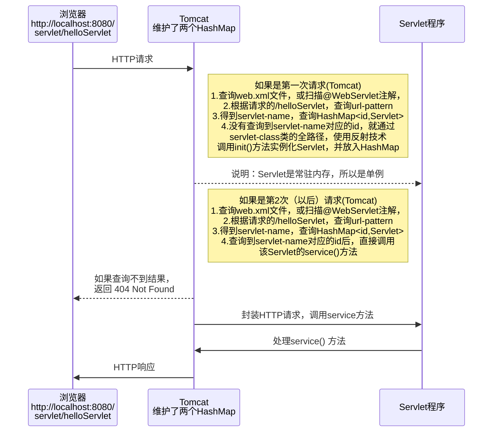
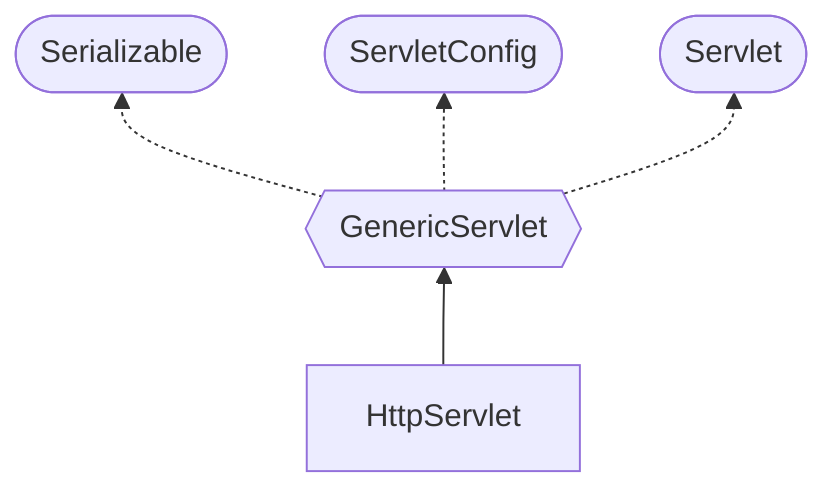

# Servlet：动态Web开发核心

## 简介

动态页面的作用：完成用户交互。Servlet是SpringMVC的基础，[官方文档](https://tomcat.apache.org/tomcat-8.0-doc/servletapi/index.html)

Servlet和Tomcat的关系：一句话，Tomcat支持Servlet

Servlet(java服务器小程序），它的特点：

1. 由服务器端调用和执行的（Tomcat解析和执行）
2. 用Java语言编写的，本质就是Java类
3. 按照Servlet接口规范开发（除了Tomcat，weblogic也可以）
4. 功能强大，可以完成几乎所有的网站功能

##　开发方式

servlet3.0前使用web.xml，servlet3.0版本以后（包括3.0）支持注解，同时支持web.xml配置。

说明：原生的Servlet在项目中使用很少


讲解springBoot时，我们用注解方式

## 手动开发Servlet

快速入门-手动开发Servlet

需求说明

1. 开发一个HelloServlet
2. 当浏览器访问http://localhost:8080/web应用名/helloServlet时，后台输出"hiHelloServelt"

实现步骤：

1. 编写类去实现 Servlet 接口（从Tomcat的lib目录获取servlet-api.jar并配置），重写5个方法
2. 修改web.xml文件，配置 servlet程序的外部访问地址。修改完成后需要Redeploy


## 浏览器访问Servlet的流程分析



## Servlet生命周期

|       阶段       | 次数 |    时机    |                                                |
| :--------------: | :--: | :--------: | ---------------------------------------------- |
|     创建 new     | 1 次 | 第一次请求 |                                                |
|   初始化 init    | 1 次 | 实例化之后 |                                                |
| 执行服务 service | 多次 |  每次请求  | 服务器创建新线程处理并封装HTTP请求，调用该方法 |
|   销毁 destroy   | 1 次 |  停止服务  | 重启tomcat，或是redeploy web应用时，调用该方法 |

init()方法只会调用一次，Servlet容器在下面的情况装载Servlet：

1. Servlet容器启动时自动装载某些servlet，实现这个需要在web.xml文件的&lt;servlet>项目中添加 ```
   <load-on-startup>装载顺序</load-on-startup>``` 代码，装载顺序采用数字表示，从1开始编号
2. 在Servlet容器启动后，浏览器首次向Servlet发送请求
3. Servlet重新装载时（比如redeploy重新发布，销毁原有servlet实例后），浏览器再向Servlet发送请求的第1次


## GET和POST请求的分发处理

开发 Servlet 时，通常编写 doGet、doPost 方法。来对表单的 get 和 post 请求进行分发处理。

由于 ServletRequest 类没有得到提交方式的方法，因此向下转型为子接口 HttpServletRequest，调用其 getMethod() 方法，根据得到的结果调用 doGet、doPost 分别处理

### 通过继承HttpServlet开发Servlet



注意：需要配置 web.xml 文件，设置域名映射。

方法一：新建类，实现接口并重写方法

方法二：鼠标右键->New->Create New Servlet，在 Name 中配置新建类的名字，取消勾选"Create Jave EE 6 annotated class"。这个方法没有配置域名映射，需要在 servlet-mapping 自行设置


## 注意事项和细节

1. Servlet 是一个供其他 Java 程序（servlet 引擎）调用的 java 类，不能独立运行
2. 针对浏览器的多次 Servlet 请求，通常情况下，服务器只会创建一个 Servlet 实例对象，也就是说 Servlet 实例对象一旦创建，它就会驻留在内存中，为后续的其它请求服务，直至web容器退出/或者 redeploy 该 web 应用，servlet 实例对象才会销毁
3. 在 Servlet 的整个生命周期内，init 方法只被调用一次。而每次请求都导致 Servlet 引擎调用一次 servlet 的 service 方法。
4. 对于每次访问请求，Servlet 引擎都会创建一个新的 HttpServletRequest 请求对象和一个新的 HttpServletResponse 响应对象，然后将这两个对象作为参数传递给它调用的 Servlet 的 service() 方法，service 方法再根据请求方式分别调用 doxxx 方法
5. 如果在 &lt;servlet> 元素中配置了一个 &lt;load-on-startup> 元素，那么 WEB 应用程序在启动时，就会装载并创建 Servlet 的实例对象、以及调用 Servlet 实例对象的 init 方法（案例：定时发送邮件，自动写日志）

```xml
<servlet>
<servlet-name>invoker</servlet-name>
<servlet-class>
org.apache.catalina.servlets.InvokerServlet
</servlet-class>
<load-on-startup>2</load-on-startup>
</servlet>
```

## 通过注解方式配置

通过@WebServlet注解，和web.xml配置Servlet的流程机制一样

精确匹配

* 配置路径：@WebServlet(urlPatterns="/ok/zs")
* 访问servlet：localhost:8080/servlet/ok/zs

目录匹配，支持任意域名和多级目录

* 配置路径：@WebServlet(urlPatterns="/ok/*")
* 访问servlet：localhost:8080/servlet/ok/输入任意均

扩展名匹配，不可带"/"号否则Tomcat会报错

* 配置路径：@WebServlet(urlPatterns="*.action")
* 访问servlet：localhost:8080/servlet/输入任意名.action

任意匹配，会匹配所有的请求，比较麻烦

* 配置路径：@WebServlet(urlPatterns="/") 或 @WebServlet(urlPatterns="/*") 
* 访问servlet：localhost:8080/servlet/输入任意名

```java
@WebServlet(
    name = "servlet",                          // 指定 Servlet 名称,等价于 web.xml 中的 servlet-name, 如果省略, 则为 Servlet 的完整类名
    urlPatterns = {"/servlet.do","/s.do"},     // Servlet 的访问 URL, 支持多个, 等价于 web.xml 中的 urlPatterns
    loadOnStartup = 6,                         // 自启动 Servlet, 指定 Servlet 的加载顺序, 等价于 web.xml 中的 load-on-startup
    initParams = {                             // 给 servletConfig 初始化, 设置初始化参数, 等价于 web.xml 中的 init-param
        @WebInitParam(name = "brand", value = "ASUS"),
        @WebInitParam(name = "screen", value = "三星")
    }
)

@WebFilter(
        urlPatterns = {"/myServlet1.do"},  // Filter 过滤 Servlet 的 URL, 支持多个
        // 指定过滤器将应用于哪些 Servlet, 支持多个
        // 取值是 @WebServlet 中的 name 属性的取值, 或者是 web.xml 中 <servlet-name> 的取值
        servletNames = {"myServlet1"},
        initParams = {                     // 给 filterConfig 初始化
            @WebInitParam(name = "realName", value = "张三"),
            @WebInitParam(name = "charset", value = "utf-8")
        }
)

// 任何资源都要过滤, 包括 JSP
@WebFilter(urlPatterns = "/*")

```


### 注意事项

1、当Servlet配置了"/"，会覆盖Tomcat的DefaultServlet，当其他的utl-pattern都匹配不上时，都会走这个Servlet，这样可以拦截到其它静态资源

2、建议不要使用“/”和“/*”，尽量使用精确匹配

3、优先级遵守：精确路径 > 目录路径 > 扩展名路径 > `/*` > `/`


参考资料

[Servlet入门 - 廖雪峰的官方网站 (liaoxuefeng.com)](https://www.liaoxuefeng.com/wiki/1252599548343744/1304265949708322)
