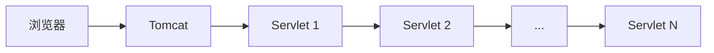
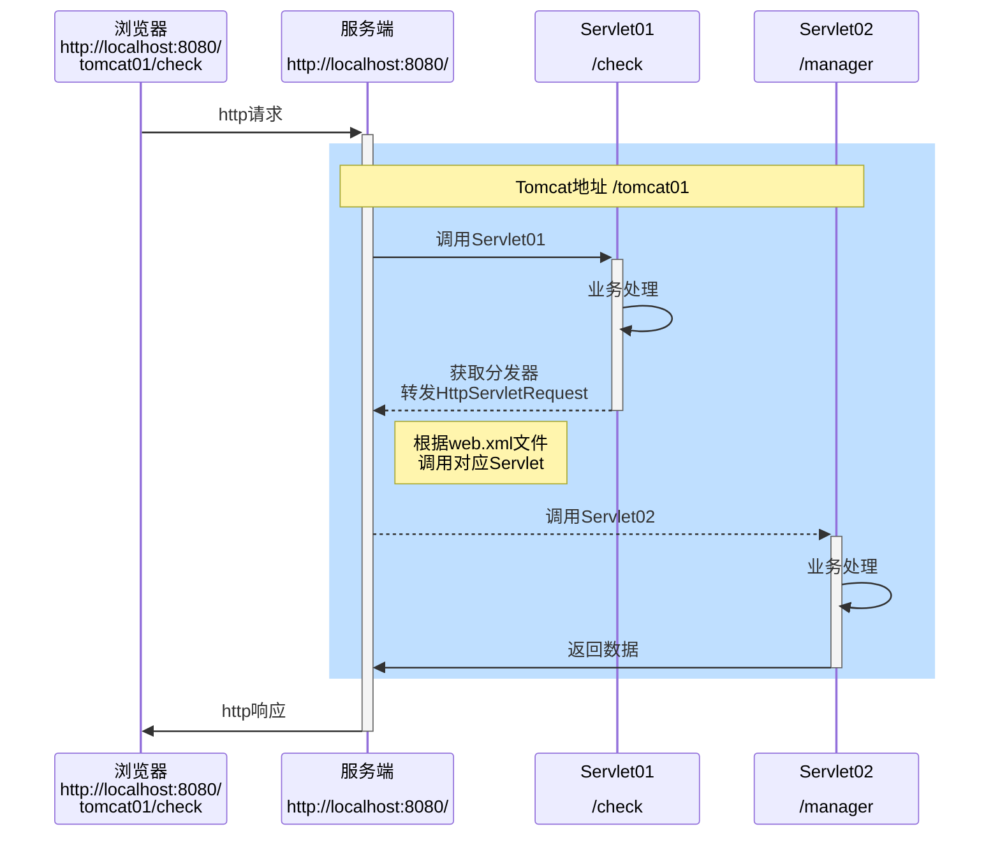
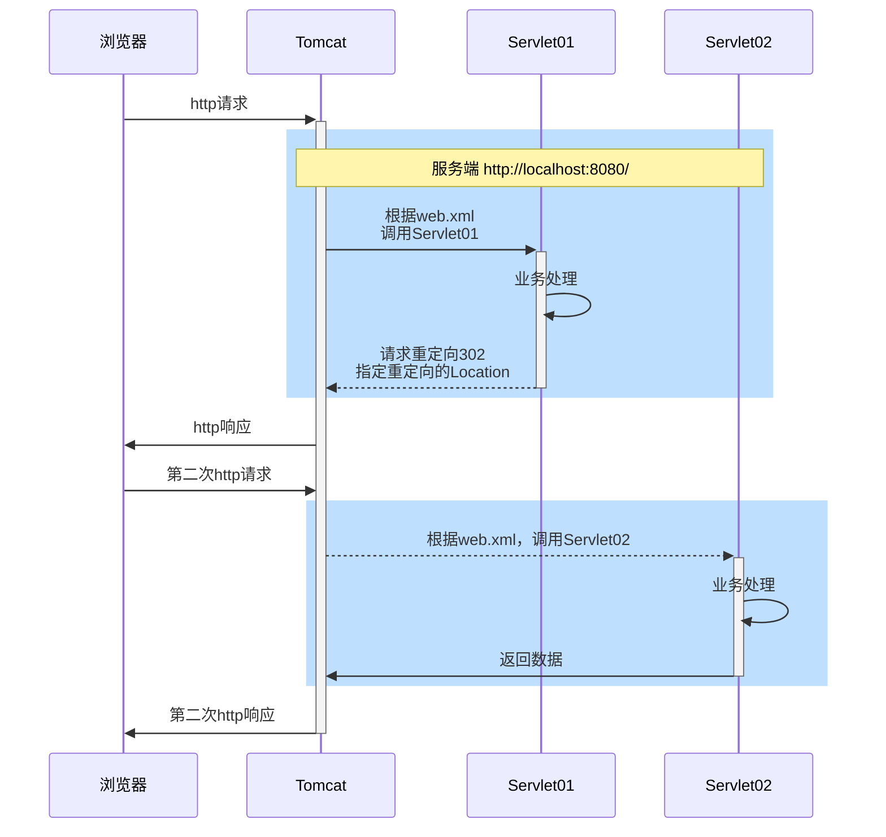

# 请求转发和重定向


| 区别     | 请求转发               | 重定向               |
| -------- | ---------------------- | -------------------- |
| 地址栏   | 没有改变               | 发生改变             |
| 浏览器   | 发出一次请求           | 发出两次请求         |
| 服务器   | 只有一对请求和响应对象 | 有两对请求和相应对象 |
| 发生位置 | 服务器                 | 浏览器               |


## 请求转发

在实际开发中，往往业务比较复杂，需要在一次请求中，使用到多个Servlet完成一个任务（Servlet链，流水作业）




1. 实现请求转发：请求转发指一个web资源收到客户端请求后，通知服务器去调用另外一个web资源进行处理
2. HttpServletRequest对象（也叫Request对象）提供了一个getRequestDispatcher方法，该方法返回一个ReguestDispatcher对象，调用这个对象的forward方法可以实现请求转发
3. request对象同时也是一个域对象，开发人员通过request对象在实现转发时，把数据通过request对象带给其它web资源处理
   * setAttribute方法
   * getAttribute方法
   * removeAttribute方法
   * getAttributeNames方法

### 请求转发的示意图

演示文件：SignIn.html、CheckServlet.java和ManagerServlet.java



### 注意事项

1. 浏览器地址不会变化（地址会保留在第一个Servlet的url）
2. 在同一次HTTP请求中，进行多次转发，仍然是一次HTTP请求
3. 在同一次HTTP请求中，多个Servlet可以共享request域/对象的数据，因为操作的是同一个request对象
4. 可以转发到WEB-INF目录下（该目录外部不能直接访问）
5. 不能访间当前WEB工程外的资源
6. 因为浏览器地址栏会停止在第一个servlet，此时刷新页面会再次发出请求（并且会带数据）所以在支付页情况下，不要使用请求转发，否则会造成重复支付【解决方式：重定向/调用数据库查询】

## 请求重定向

一个web资源收到客户端请求后，通知客户端去访问另外一个web资源，这称之为请求重定向



浏览器解析重定向时，会被重定向到：主机地址+sendRedirect()中的字符串；如果是转发，地址是：主机地址+Tomcat地址+forward()中的字符串

### 请求重定向注意事项和细节

1. 最佳应用场景：网站迁移，域名变更，但是百度抓取的还是原网址
2. 浏览器地址会发生变化，本质是两次http请求（不同线程）
3. 不能共享Request域中的数据，本质是两次http请求，会生成两个HttpServletRequest对象
4. 不能重定向到/WEB-INF下的资源
5. 可以重定向到Web工程以外的资源，比如到`www.baidu.com`
6. 重定向有两种方式，推荐使用第1种，

### 重定向的方式

方法1：

```java
response.sendRedirect("Tomcat域名/监听地址");
```

方法2：

```java
//设置响应状态码302表示重定向
response.setStatus(302);
//在响应头中设置新的地址
response.setHeader("Location","Tomcat域名/监听地址");
```

# 动态获取到Application Context的方法

```java
String contextPath = getServletContext().getContextPath();
```

