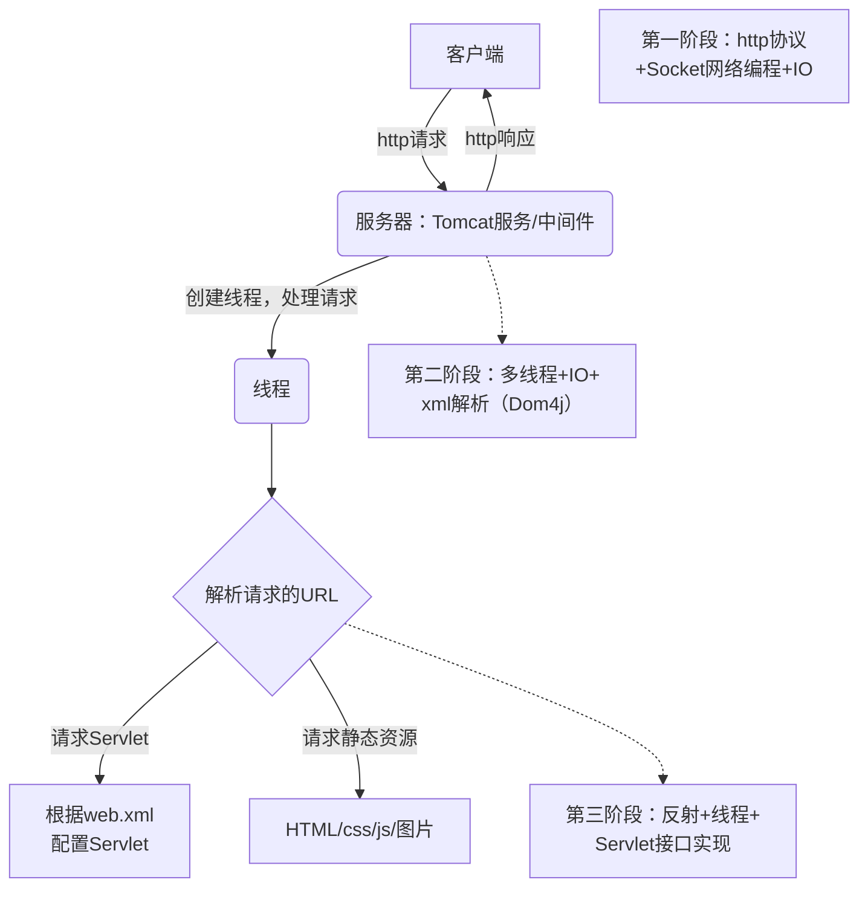
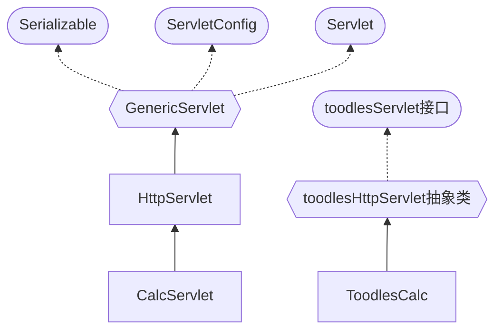

# 模拟Tomcat底层实现

Tomcat有三种运行模式（BIO,NIC,APR），因为老师核心讲解的是Tomcat如何接收客户端请求，解析请求，调用Servlet，并返回结果的机制流程，采用BIO线程模型来模拟

## Tomcat BIO多线程模型



### 实现Tomcat相关功能

```java
package com.javaweb.tomcat.toodlescat1;

import com.javaweb.utils.WebUtils;

import javax.servlet.ServletException;
import javax.servlet.http.HttpServlet;
import javax.servlet.http.HttpServletRequest;
import javax.servlet.http.HttpServletResponse;
import java.io.IOException;
import java.io.PrintWriter;

public class CalcServlet extends HttpServlet {
    //演示原生Servlet的使用
    protected void doPost(HttpServletRequest request, HttpServletResponse response) throws ServletException, IOException {
        String strNum1 = request.getParameter("num1");
        String strNum2 = request.getParameter("num2");

        //将接收到的字符串转成数字
        int num1 = WebUtils.parseInt(strNum1, 0);
        int num2 = WebUtils.parseInt(strNum2, 0);

        //设置返回数据
        response.setContentType("text/html;charset=utf-8");
        PrintWriter writer = response.getWriter();
        writer.printf("<h1>%d + %d = %d</h1>",num1,num2,(num1+num2));
        writer.flush();
        writer.close();
    }

    protected void doGet(HttpServletRequest request, HttpServletResponse response) throws ServletException, IOException {
        doPost(request,response);
    }
}
```


#### 实现任务阶段1：编写toodlescat1，能给浏览器返回数据

技术实现：http协议+Socket网络编程+IO

* 浏览器访问两次的原因：第一次请求的是域名链接，第二次请求 favicon.ico 图片
* 如果响应头和响应体间没有空行，浏览器将无法识别

功能缺陷：直接由创建的 ToodlesCat V1 返回数据，没有使用BIO线程模型，没有实现多线程，性能差

#### 实现任务阶段2：使用BIO线程模型，支持多线程

技术实现：多线程+IO+xml解析（Dom4j）

BIO线程模型的基本介绍

方式1：创建 Thread 完成任务，方式2：从线程池分配 Thread 完成任务

此阶段 ToodlesCat V2 仅负责分发数据，http响应任务交由创建的 myRequestHandler 线程完成

功能缺陷：ToodlesCat V2 只是简单返回结果，没有和 Servlet、web.xml 关联

#### 实现任务阶段3：处理Servlet

技术实现：反射+线程+Servlet接口实现

##### Servlet的生命周期

* 实例化servlet
* init()方法进行初始化（一些准备工作或者资源预加载）
* 当收到客户端请求时，调用 service 方法处理客户端请求，service 方法会根据不同的请求类型，调用不同的方法
* 销毁（servlet容器关闭时，实例也随之要销毁）

##### 实现Servlet的过程



新建一个Servlet可以发现，其除了继承HttpServlet外，还在重写的 doGet 和 doPost 方法接收 HttpServletRequest 和 HttpServletResponse 对象

因此 ToodlesCat V3 对浏览器发来的请求头进行处理，封装成 myHttpRequest 交给自己写的toodlesServlet 处理，用输出流返回 myHttpResponse 给客户端

代码编写过程：

①myHttpRequest 类和myHttpResponse编写读取和返回的基础代码

②ToodlesCat V3 主类构建监听端口，将socket传入 toodlesRequestHandler 类，线程类编写业务逻辑代码，创建输入输出流供提供给上面两个类调用

③toodlesServlet 接口规定了生命周期的方法，toodlesHttpServlet 类使用模板设计模式在 service 方法动态绑定具体工作任务

④ToodlesCalc 类继承 toodlesHttpServlet 类，重写业务方法。toodlesRequestHandler 类（线程类）通过创建新的 ToodlesCalc 类对象，完成 http 响应

##### 通过xml+反射初始化容器

通过反射机制调用 ToodlesCalc 类的方法：读取xml文件，使用 HashMap 或 ConcurrentHashMap存放数据，一个集合（servletMapping）存放 ServletName-实例，另一个集合（uriPatternMapping）存放uri-ServletName

读取xml文件使用dom4j技术，相关细节：

* 自己写的类没有实现真正的Servlet接口，web.xml检查报红，可以直接忽略
* 项目的工作路径和代码编写路径不一致。运行时文件是从target目录发起访问（代码在src目录编写）
* 需要在target\classes目录手动拷贝一份web.xml，或者在src目录下新建resource文件存放xml信息【默认是自动拷贝】

```xml
<web-app>
  <display-name>Archetype Created Web Application</display-name>
    <servlet>
        <servlet-name>ToodlesCalc</servlet-name>
        <servlet-class>com.javaweb.tomcat.toodlescat3.CalcToodlesCalc</servlet-class>
    </servlet>
    <servlet-mapping>
        <servlet-name>ToodlesCalc</servlet-name>
        <url-pattern>/calc</url-pattern>
    </servlet-mapping>
</web-app>

```

##### 浏览器访问静态资源时，直接返回对应数据

判断uri请求的资源类型：如果是静态资源，就按照路径读取，并返回文件类型以便浏览器渲染

因为目前不是标准的web项目，先把读取的静态页面Calc.html放到target/classes/目录

判断uri类型的代码，封装在WebUtils.java文件中


### 总结

1、ConcurrentHashMap的get()方法传入null时，抛出空指针异常；HashMap不会报异常。因此在使用线程安全的ConcurrentHashMap时，需要检查传入参数是否为空

2、return就是返回方法的结果值，如果方法返回类型为 void，那么就是不再执行下面的代码。在线程的run()方法使用return，就是跳出方法不执行下面的语句

3、Tomcat底层维护了servletMapping、uriPatternMapping、sessionMapping的ConcurrentHashMap容器

**Toodles Galore**是《猫和老鼠》系列中的白色母猫