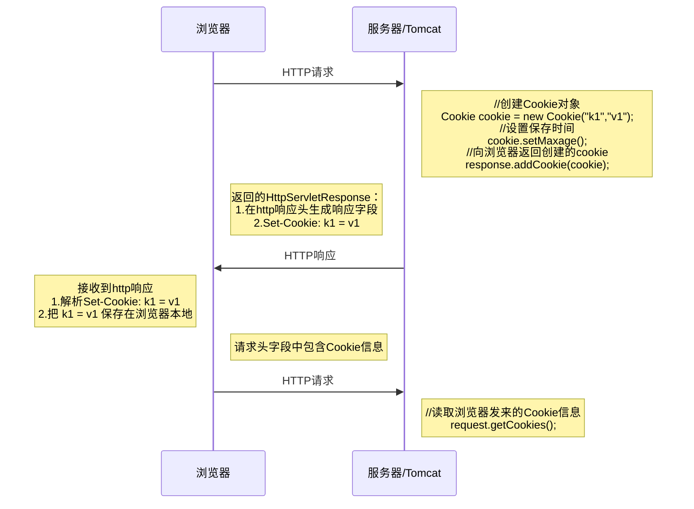

# Cookie

[实战中学习浏览器工作原理 — HTML 解析与 CSS 计算 | 三钻 Benny X Guo](https://blog.bennyxguo.com/post/ca7c828cb91c2471a064cf04f7381420)

## Web开发会话技术

会话：用户开一个浏览器，点击多个超链接，访问服务器多个web资源，然后关闭浏览器，整个过程称之为一个会话。

会话过程中要解决的问题：

* 每个用户在使用浏览器与服务器进行会话的过程中，不可避免各自会产生一些数据，服务器要想办法为每个用户保存这些数据
* 例如：多个用户点击超链接通过一个servlet各自购买了一个商品，服务器应该想办法把每一个用户购买的商品保存在各自的地方，以便于这些用户点结帐servlet时，结帐servlet可以得到用户各自购买的商品为用户结帐。

## Cookie的使用

Cookie（小甜饼）是客户端技术，服务器把每个用户的数据以cookie的形式写给用户各自的浏览器。当用户使用浏览器再去访问服务器中的web资源时，就会带着各自的数据去。这样，web资源处理的就是用户各自的数据了。

Cookie第一列是name，第二列是value，数据类型都是String，类似一个表（K-V）



特点

1. 服务器创建，存储在浏览器
2. 只能存储字符串，单个大小不超过4KB
3. 数据不太安全
4. 服务器端在需要的时候可以从客户端读取（http协议）

浏览器每次访问（创建会话），服务器会返回不同的JSESSIONID，之后浏览器每次访问都会带有此ID，这个值可以用来区分不同的会话

常用于会话管理：比如登录名、浏览历史等，保存上次登录时间、保存用户名使得一段时间内不用重新登录、定制个性化风格


### 常用方法

服务器端创建cookie

```java
//1.创建cookie
Cookie cookie = new Cookie("carriage", "sleeper");
//2.将cookie发送给浏览器
response.addCookie(cookie);
```

读取浏览器发来的cookie

```java
//1.通过 HttpServletRequest 对象读取所有cookie
Cookie[] cookies = request.getCookies();
//2.遍历cookie
if (cookies != null && cookies.length != 0) {
	for (Cookie cookie : cookies) {
		System.out.printf("\ncookie名：%s，值：%s",cookie.getName(),cookie.getValue());
	}
}
```

修改cookie

方法一：创建一个同名的新cookie，并覆盖既有值

```java
Cookie cookie = new Cookie("carriage", "hard_seat");
response.addCookie(cookie);
```

方法二：

1、先查找到需要修改的Cookie对象
2、调用setValue()方法赋于新的Cookie值。
3、调用response.addCookie()通知客户端保存修改

### 生命周期

1. Cookie的生命周期指的是如何管理Cookie什么时候被销毁（删除）
2. setMaxAge() 方法：设置cookie的最大生存时间，以秒为单位
   * 正数，表示在指定的秒数后过期
   * 负数，表示浏览器关闭，Cookie就会被删除（默认值是-1）
   * 0，表示马上删除Cookie

cookie是否有效（在生命周期内），由浏览器进行判断。如果该cookie无效，浏览器在发出http请求时不再携带该cookie（未将此cookie删除）

注意事项：每次配置完cookie的变化，都需要使用addCookie方法加入到返回给浏览器的HttpServletResponse 对象中

### 有效路径

cookie默认的path是 “/工程路径”，可以通过

Cookie的path属性可以有效的过滤哪些Cookie可以发送给服务器。哪些不发。path属性是通过请求的地
来进行有效的过滤
对于下面这段代码：

```java
//如果创建cookie时没有设置路径，默认就是“/工程路径”
cookie1.setPath(request.getContextPath());//工程路径
cookie2.setPath(request.getContextPath() + "/aaa");//"工程路径/aaa"
```

请求地址：http&#58;//ip:端口/工程路径/login
cookie1会发给服务器
cookie2不会发给服务器

请求地址：http&#58;//ip:端口/工程路径/aaa/资源
cookie1会发给服务器
cookie2会发给服务器

### 使用案例

完成自动填写登录账户应用案例，如果用户登录成功，则下次登录自动填写登录账户

功能要求：

1）如果用户名是QDK，密码是18089，则认为该用户合法，登录成功，否则登录失败
2）要求实现如果登录成功，则该用户，在3天内登录，可以自动填写其登录名
3）html页面无法动态获取信息，因此采用Servlet返回

实现过程：

1、新建一个监听uri的类CookieLogin，将html页面的内容复制成字符串，通过输出流返回给浏览器

2、新建处理提交数据的类CookieAccept，当登录成功时返回Cookie

3、利用工具类CookieUtils，当浏览器传来带特定Cookie的请求时，返回已经填入用户名的页面

### Cookie的中文信息

当Cookie的value是中文字符时，浏览器访问会提示HTTP Status 500 - Control character in cookie value or attribute.

解决方式：通过URL编码和解码进行处理，需要传入编码方式并处理异常

```java
//url编码
String utf_Expression = URLEncoder.encode("😅","utf-8");
//url解码
String expression_Utf = URLDecoder.decode("%F0%9F%A4%A3","utf-8")
```


### 注意事项和细节

1.一个Cookie只能标识一种信息，它至少含有一个标识该信息的名称（NAME）和设置值（VALUE)。
2.一个WEB站点可以给一个浏览器发送多个Cookie，一个浏览器也可以存储多个WEB站点提供的Cookie。
3.Cookie的总数量没有限制，但是每个域名的Cookie数量和每个Cookie的大小是有限制的（不同的浏览器限制不同），Cookie不适合存放数据量大的信息。
4.注意，删除Cookie时，path必须一致，否则不会删除
5.Cookie如果存放中文，默认会报错，不建议存放中文Cookie信息

