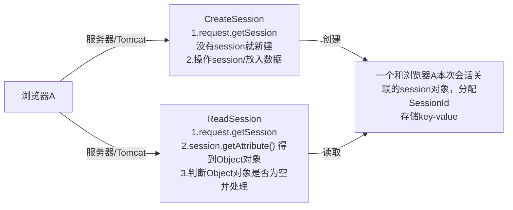
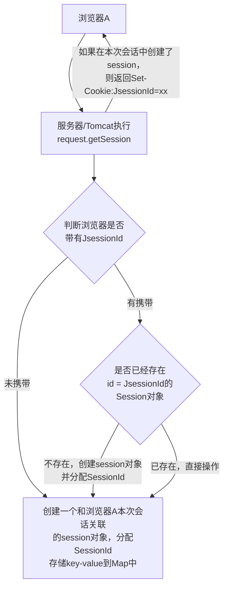
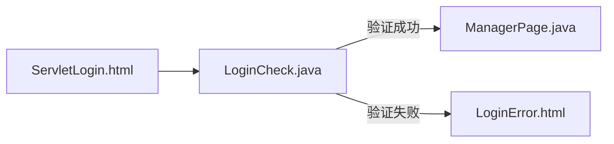

# Session

1. Session是服务器端技术，服务器在运行时为每一个用户的浏览器创建一个其独享的session对象
2. 由于session为各个用户浏览器独享，所以用户在访问服务器的不同页面时，可以从各自的session中读取/添加数据，从而完成相应任务
3. 这个session对象也可看做是一个容器/集合，session对象默认存在时间为30min，也可在“Tomcat安装目录/conf/web.xml”文件修改 &lt;session-config> 中的 &lt;session-timeout>

特点：

* 存储在服务器
* 存储类型任意（Object类型）
* 存储大小和数量没有限制
* 存储相对安全

用途

1. 网上商城中的购物车
2. 保存登录用户的信息
3. 用户在访问不同页面时，实现跨页面访问数据
4. 防止用户非法登录到某个页面
5. ....

可以把session看作是一容器，类似HashMap，有两列（K-V），每一行就是session的一个属性。

每个属性包含有两个部分，一个是该属性的名字（String)，另外一个是它的值（Object）


## HttpSession接口

javax.servlet.http

Interface HttpSession

常用方法

```java
//1.创建和获取Session，API一样
HttpSession hs=request.getSession();//第1次调用是创建Session会话，之后调用是获取创建好的Session对象

//2.向session添加属性
hs.setAttribute(String name,Object val);

//3.从session得到某个属性
Object obj = hs.getAttribute(String name);

//4.从session删除调某个属性：
hs.removeAttribute(String name);

//5.判断是不是刚创建出来的Session
isNew()；
    
//6.得到Session的会话id值，每个Session都有1个唯一标识Id值。
session.getId()
    
//7.让Session会话立即超时
invalidate();
```


## Session底层机制分析图

底层机制一



底层机制二



## Session 生命周期

1. public void setMaxInactiveInterval(int interval) 设置Session的超时时间（以秒为单位），超过指定的时长，Session就会被销毁。
2. 值为正数的时候，设定Session的超时时长。
3. 负数表示永不超时
4. public int getMaxInactiveInterval() 获取Session的超时时间
5. public void invalidate() 让当前Session会话立即无效
6. 如果没有调用setMaxInactiveInterval()来指定Session的生命时长，Tomcat会以Session默认时长为准，Session默认的超时为30分钟，可以在tomcat的web.xml设置
7. Session的生命周期指的是：客户端同一个会话两次请求最大间隔时长，而不是累积时长。即session没有过期的情况下，当客户端访问了自己的session，session的生命周期将从0开始重新计算。
8. session是否过期，是由服务器来维护和管理。调用invalidate() 方法会直接让session过期，删除session对象的某个具体属性，使用remove()方法
9. 底层：Tomcat用一个线程来轮询会话状态，如果某个会话的空闲时间超过设定的最大值，则将该会话销毁

## 应用案例

防止普通用户登录管理页面，逻辑结构



要求：

1. 用户名不限制，只要密码为95306，我们认为就是登录成功
2. 如果验证成功，则进入管理页面ManageServelt.java，否则进入error.html
3. 如果用户直接访问ManageServet.java，直接转发到login.html

功能实现：

如果验证通过，LoginCheck向用户返回的数据中加入验证相关的Session，当 ManagerPage 监听的URL被访问时，检查是否存在Session

