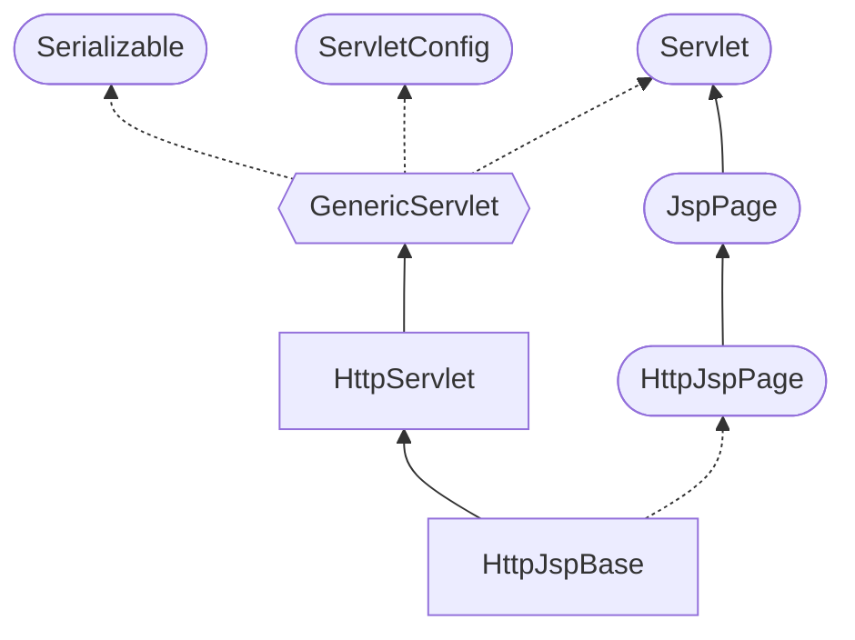
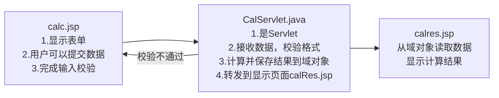

# JSP

## 基本介绍

在Java EE中：javax.servlet.jsp，javax.servlet.jsp.el，javax.servlet.jsp.tagext

1. JSP全称是Java Server Pages，Java的服务器页面，就是服务器端染技术
2. JSP这门技术的最大的特点在于，写JSP就像在写HTML
   * 相比html而言，html只能为用户提供静态数据，而JSP技术允许在页面中嵌套java代码，为用户提供动态数据
   * 相比Servlet而言，Servlet很难对数据进行排版，而JSP除了可以用java代码产生动态数据的同时，也很容
     易对数据进行排版。

3. jsp技术基于Servlet，你可以理解成JSP就是对Servlet的包装，可以理解成jsp就是Servlet
4. 会使用JSP的程序员，再使用thymeleaf是非常容易的事情，几乎是无缝接轨

jsp=html+java片段+标签+javascript+css

### 服务器渲染技术

1. 目前主流的技术是前后端分离（比如：SpringBoot+Vue/React）
2. JSP技术使用在逐遂渐减少，但并非没有使用，一些老项目和中小公司还在使用JSP

## JSP快速入门

web/WEB-INF目录中新建lib文件夹，拷贝jsp-api.jar和servlet.jar文件并设为项目library。JSP本质是一种页面，因此在web目录下新建。

1.jsp页面不能像HTML页面，直接用浏览器运行。只能通过浏览器访问Tomcat来访问jsp页面

2.设置jsp模板，可在File->Settings->Editor->File and Code Templates->Other->Jsp files中修改对应文件

### JSP运行原理

1.jsp页面本质是一个Servlet程序（java程序），其性能是和java关联的，只是代码较乱（在服务器端渲染，没实现前后端分离）

2.第1次访问jsp页面的时候。Tomcat服务器会把jsp页面解析成为一个java源文件。并且对它进行编译成为.class字节码程序。

当Tomcat启动时，会提示一个CATALINA_BASE目录，可找到对应的java文件“jsp文件名\_jsp.java”和字节码文件“jsp文件名_jsp.class”，引入了jasper.jar的HttpJspBase类



用于演示的sum_jsp继承了HttpJspBase类，根据类图，sum_jsp本质是Servlet，而且功能更强

### page指令（常用的）

```jsp
<%@ page contentType="text/html;charset=utf-8" language="java" %>
<%@ page import="java.io.PrintWriter" %>
```

1.language表示jsp翻译后是什么语言文件，只支持java

2.contentType表示jsp返回的数据类型，对应源码中response.setContentType()参数值

3.pageEncoding属性表示当前jsp页面文件本身的字符集

4.import属性跟ava源代码中一样。用于导包，导类


### JSP三种常用脚本

#### 声明脚本

基本语法

```jsp
<%! 声明java代码 %>
```

作用：定义jsp的需要属性、方法、静态代码块和内部类等

statement.jsp

#### 表达式脚本

基本语法

```jsp
<%= 表达式 %>
```

表达式脚本的作用是：在jsp页面上输出数据
脚本中的表达式不能以分号结束。

应用实例

从java代码中获取、从浏览器动态获取、或是直接定义常量

expression.jsp


#### 代码脚本

基本语法

```jsp
<% java代码 %>
```

代码脚本的作用是：可以在jsp页面中工编写我们需要的功能（使用java）

可以由多个代码脚本块组合完成一个完整的java语句。

代码脚本还可以和表达式脚本一起组合使用，在jsp页面上输出数据

应用实例

Station.java和code.jsp

entity,bean,pojo,domain代表实体对象


## JSP注释

```jsp
<%-- jsp注释 --%>
<!-- html注释 -->
<%
	//java代码
	/*
		java注释
	*/
%>
```


## JSP内置对象

### 基本介绍

1、JSP内置对象（已经创建好的inbuild对象，可以直接使用），是指Tomcat在翻译jsp页面成为Servlet后，内部提供的九大对象，叫内置对象

2、内置对象，可以直接使用，不需要手动定义

### JSP九大内置对象

| JSP九大内置对象 | 对应的Servlet类     | 备注                                                      |
| --------------- | ------------------- | --------------------------------------------------------- |
| out             | JspWriter           | 向客户端输出数据，常用方法out.println("");                |
| request         | HttpServletRequest  | 域对象，客户端的http请求，存放的数据在一次request请求有效 |
| response        | HttpServletResponse | 响应对象                                                  |
| session         | HttpSession         | 域对象，存放的数据在一次会话有效                          |
| application     | ServletContext      | 域对象，存放的数据在整个web应用运行期间有效               |
| pageContext     | PageContext         | 域对象，可以setAttribue()，存放的数据只能在当前页面使用   |
| exception       | Exception           | 异常对象，getMessage()                                    |
| page            | this                | 代表jsp这个实例本身                                       |
| config          | ServletConfig       |                                                           |


学技术的思路：只要去学某个类，建议熟练该类的继承关系

可以将 inbuiild.jsp 和 InbuildObject.java 对照学习，方便理解


### 域对象

作用：在某个作用范围读取或存储数据

* pageContext只能在当前页面使用，不能请求转发或重定向
* request在一次http请求有效，可以请求转发，不能重定向
* session在一次会话的多次http请求有效，可以请求转发和重定向
* application在整个web应用运行期间有效，在tomcat中创建被多个会话共享的ServletContext对象，只要tomcat没有重启或重新发布，不管是请求转发还是重定向都可以

案例演示：scopethis.jsp 和 scopeanother.jsp

1.域对象是可以像Map一样存取数据的对象。四个域对象功能一样。不同的是它们对数据的存储范围
2.从存储范围（作用域范围看）pageContext < request < session < application

## JSP标签

jsp提供了很多标签，因为不是重点，此处仅详解常用的请求转发标签

### 请求转发标签

```jsp
<jsp:forward page="/bb.jsp"></jsp:forward>
```

说明：该链接在服务器端进行解析，等价于在servlet中的java代码

```java
request.getRequestDispatcher("/bb.jsp").forward(request, response);
```


## JSP实现计算器

需求分析：使用jsp完成一个简单的计算器，在新页面显示计算结果

* 要求在前端页面对输入的num1和num2进行校验（提示：正则表达式），必须是整数
* 验证成功，提交数据给服务器，能够显示结果
* 点击超链接，可以返回界面
* 其它完整考虑



项目代码文件

calc.jsp，CalServlet.java，calres.jsp


参考资料：[Java 面试题解析（Java Web） | Eurkon](https://blog.eurkon.com/post/d24a315e.html)
