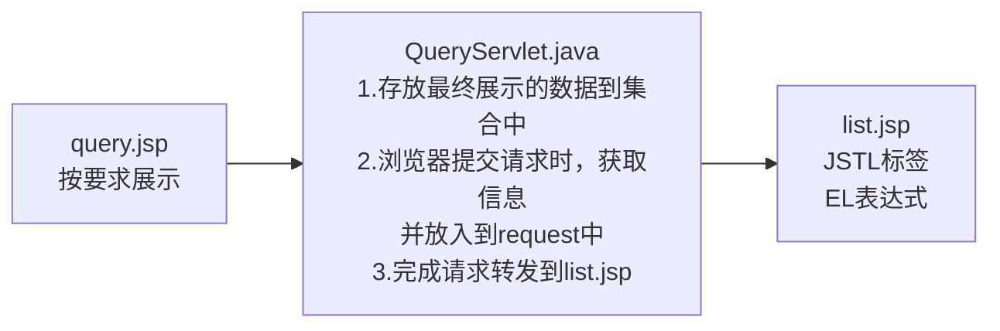

# JSP语法糖

## EL表达式

1. EL表达式全称：Expressionr Language，是表达式语言
2. EL表达式主要是代替jsp页面的表达式脚本
3. EL表达式输出数据的时，比jsp的表达式脚本简洁
4. EL表达式基本语法：${key1}，可以理解为一个语法糖

和表达式脚本的区别：

* EL表达式在输出null时，输出的是""
* jsp表达式脚本输出null时，输出的是"null"字符串

应用实例：el_expression.jsp

### 输出形式

EL表达式常用输出形式：Bean的普通属性、数组属性、List集合属性和map集合属性

EL常用输出应用实例 el_output.jsp

### EL运算操作

基本格式 ${运算内容}

关系运算符

| 关系运算符 | 说明     | 范例                       | 结果  |
| ---------- | -------- | -------------------------- | ----- |
| == 或 eq   | 等于     | ```${5==5}```或${5 eq 5}   | true  |
| != 或 ne   | 不等于   | ```${5！=5}```或${5 ne 5}  | false |
| < 或 lt    | 小于     | ```${3<5}``` 或 ${3 lt 5}  | true  |
| > 或 gt    | 大于     | ```${3>5}``` 或 ${3 gt 5}  | false |
| <= 或 le   | 小于等于 | ```${3<=5}``` 或 ${3 le 5} | true  |
| >= 或 ge   | 大于等于 | ```${3>=5}```或 ${3 ge 5}  | false |

逻辑运算符

| 逻辑运算符 | 说明     | 范例                                                 | 结果  |
| ---------- | -------- | ---------------------------------------------------- | ----- |
| && 或 and  | 与运算   | ```${12  == 12 && 12<11} ```或 ${12 == 12 and 12<11} | false |
| \|\| 或 or | 或运算   | ```${12  == 12 || 12<11}``` 或 ${12 == 12 or 12<11}  | true  |
| ! 或 not   | 取反运算 | ```${!true}```  或 ${not true}                       | false |

算数运算符：+，-，*，/或div，%或mod

应用实例：el_expression.jsp

### empty运算

1.empty运算可以判断一个数据是否为空，如果为空，返回true，否则返回false
2.以下几种情况为空

* 值为null
* 值为空串
* 值是Object类型数组，长度为零
* list集合，元素个数为零
* map集合，元素个数为零

应用实例：el_empty.jsp

### EL的三元运算

```jsp
${表达式1 ? 表达式2 : 表达式3}
```

如果表达式1的值为真，返回表达式2的值，反之，返回表达式3的值

应用实例：el_expression.jsp

### EL的11个隐含对象，可以直接使用

| 变量             | 类型                   | 说明                                           |
| ---------------- | ---------------------- | ---------------------------------------------- |
| pageContext      | PageContextlmpl        | 获取jsp中的九大内置对象                        |
| pageScope        | Map<String,  Object>   | 获取pageContext域中的数据                      |
| requestScope     | Map<String,  Object>   | 获取Request域中的数据                          |
| sessionScope     | Map<String,  Object>   | 获取Session域中的数据                          |
| applicationScope | Map<String,  Object>   | 获取ServletContext域中的数据                   |
| param            | Map<String,  String>   | 获取请求参数的值                               |
| paramValues      | Map<String,  String[]> | 获取多个值                                     |
| header           | Map<String,  String>   | 获取请求头的信息                               |
| headerValues     | Map<String,  String[]> | 获取请求头的多个信息                           |
| cookie           | Map<String,  Cookie>   | 获取当前请求的Cookie信息                       |
| initParam        | Map<String,  String>   | 获取在web.xml中配置的<context-param>上下文参数 |

EL获取四个特定域中的属性，如果名称相同，则默认获取的是pageContext域中的值：el_scope.jsp


### pageContext对象的使用

我们可以通过el表达式的 pageContext.request.xx 来获取和http协议相关的信息，相当于替代java表达式的 request.getMethod()

应用实例：el_pageContext.jsp


## JSTL标签库

1. JSTL标签库是指 JSP Standard Tag Library，JSP标准标签库
2. EL表达式是为了替换jsp中的表达式脚本，JSTL是为了替换代码脚本<% %>。这样jsp页面变得更加简洁
3. JSTL由五个标签库组成

| 功能范围         | URI                                    | 前级 |
| ---------------- | -------------------------------------- | ---- |
| 核心标签库-重点  | http://java.sun.com/jsp/jstl/core      | c    |
| 格式化           | http://java.sun.com/jsp/jstl/fmt       | fmt  |
| 函数             | http://java.sun.com/jsp/jstl/functions | fn   |
| 数据库（不使用） | http://java.sun.com/jsp/jstl/sal       | sql  |
| XML（不使用）    | http://java.sun.com/jsp/jstl/xml       | x    |

4. 使用JSTL，需要导入相关的jar包，并且将标签放在jsp文件的第一行

taglibs-standard-impl-1.2.1.jar
taglibs-standard-spec-1.2.1.jar

注意细节

* taglib引入标签，要放在行首
* 导入jstl jar包后，要重新发布web工程，否则不识别jstl

### core核心库

#### <c:set />

<c:set /> set标签可以往域中保存数据

1. 等价 域对象.setAttribute(key, value);
2. scope属性设置保存到哪个域
   * page表示PageContext域（默认值）
   * request表示Request域
   * session表示Session域
   * application表示ServletContext域

3. var属性设置key是什么

4. value属性设置值

应用实例：cset.jsp

#### &lt;c:if>&lt;/c:if>

```jsp
<c:if test="${判断条件}">条件为真时输出的内容</c:if>
```

if标签用来做if判断，test属性表示判断条件（用EL表达式输出）

应用实例：cif.jsp

#### &lt;c:choose>

多路判断，类似switch...case...default

| java语句 | JSTL标签                          |
| -------- | --------------------------------- |
| switch   | &lt;c:choose>&lt;/c:choose>       |
| case     | &lt;c:when>&lt;/c:when>           |
| default  | &lt;c:otherwise>&lt;/c:otherwise> |

应用实例：cchoose.jsp

#### <c:forEach />

用来遍历输出，主要有4种形式

* 普通遍历输出i到j
* 遍历数组
* 遍历Map
* 遍历List

将集合中的数据遍历到var中，从var获取具体的属性值（本质是映射了get方法）

应用实例cforeach.jsp

## EL和JSTL的使用

查询页面，需求：

1）点击超链接，可以显示所有的车站信息

2）要求显示的数据在Servlet准备，并放入到request域对象

3）扩展：如果要求增加根据车站中心里程过滤，怎么处理？



应用实例：query.jsp，QueryServlet.java，list.jsp
