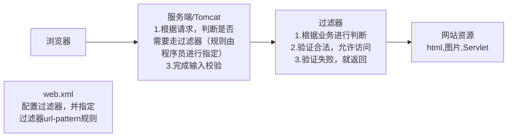
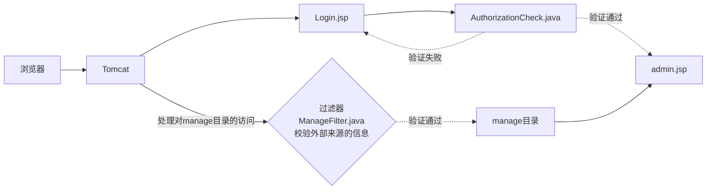
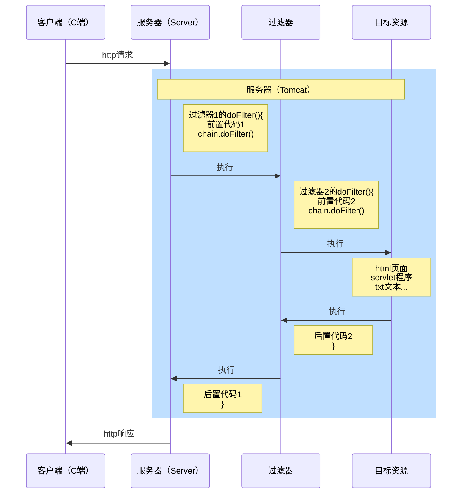
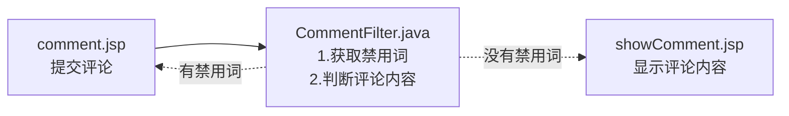

# 过滤器Filter

## 主要接口

javax.servlet.Filter

javax.servlet.FilterChain

javax.servlet.FilterConfig

## 简介

传统方式在login页面验证并登录成功后，会记录用户session，当用户访问后续流程中的页面时，会获取用户session并验证是否有登录权限。这种方式造成代码冗余、功能重复，使用过滤器可以统一进行身份、权限、事务、日志等验证

Filter过滤器作用是：拦截请求，过滤响应。

应用场景：权限检查、日记操作、事务管理



### Tomcat底层源码

Tomcat处理filter的机制：维护和过滤器相关的Map，调用servlet之前，先匹配filter

1. 根据request对象封装的uri，到 filterUrlMapping 去匹配
2. 如果匹配上就调用 filterMapping 对应 filer 对象的 doFilter 方法
3. 如果没有匹配上，直接执行后面的 servlet/jsp/html。

在调用过滤器前，Tomcat已经封装了ServletRequest对象，因此可以从中获取到访问的url，参数，session等信息，用来做事务管理、数据获取、日志管理等

## 应用实例

需求：在web工程下，有后台管理目录manage，要求该目录下所有文件需要用户登录后才能访问



完成模块的流程：①先完成正确流程②加入其它功能③完善功能

过滤器在web.xml文件中的配置

```xml
    <!--filter一般写在其他Servlet的前面-->
    <filter>
        <filter-name>ManageFilter</filter-name>
        <filter-class>com.javaweb.filter.ManageFilter</filter-class>
    </filter>
    <filter-mapping>
        <filter-name>ManageFilter</filter-name>
        <url-pattern>/filter/manage/*</url-pattern>
    </filter-mapping>
```

说明：由于AuthorizationCheck通过请求转发的方式访问admin.jsp，因此不需要过滤器的拦截

## 过滤器的url-pattern

1. url-pattern：Filter的拦截路径，即浏览器在请求什么位置的资源时，过滤器会进行拦截过滤
2. 精确匹配```<url-pattern>/a.jsp</url-pattern>```对应的请求地址```http://ip[域名]:port/工程路径/a.jsp```会拦截
3. 目录匹配```<url-pattern>/manage/*</url-pattern>```对应的请求地址```http://ip[域名]:port/工程路径/manage/xx```，即web工程manage目录下所有资源会拦截
4. 后缀名匹配```<url-pattern>*.jsp</url-pattern>```后缀名可变，比如```*.action，*.do```等等对应的请求地址```http://ip[域名]:port/工程路径/xx.jsp```，后缀名为.jsp请求会拦截
5. Filter过滤器它只关心请求的地址是否匹配，不关心请求的资源是否存在

## 过滤器的生命周期

```java
public class ManageFilter implements Filter {
    @Override
    public void init(FilterConfig filterConfig) throws ServletException {
        //在web工程启动时，Tomcat会调用 Filter 的无参构造器，并调用init() 方法进行初始化
        //创建 Filter 实例时，还会创建一个FilterConfig对象，通过init方法传入
		//通过FilterConfig对象可以获得该filter的相关配置信息
        //调用这个方法不需要访问过滤的链接
    }

    @Override
    public void doFilter(ServletRequest servletRequest, ServletResponse servletResponse, FilterChain filterChain) throws IOException, ServletException {
        //当http请求和该Filter的url-pattern匹配时，都会调用此方法
        //调用doFilter方法时，tomcat会创建ServletRequest，ServletResponse和FilterChain对象并传入
        //如果后面请求的目标资源（jsp，Servlet）使用到request，response，那么会继续传递
        
        //请求转发和HttpServletRequest类似
        servletRequest.getRequestDispatcher("目标地址").forward(servletRequest, servletResponse);
        //如果允许放行链接，需要使用下面这行代码
        filterChain.doFilter(servletRequest,servletResponse);
    }

    @Override
    public void destroy() {
        //停止webfilter被销毁时，调用该方法
    }
}

```

## FilterConfig

1. Filterconfig是Filter过滤器的配置类
2. Tomcat每次创建Filter的时候，也会创建一个FilterConfig对象，这里包含了Filter配置文件的配置信息。
3. FilterConfig对象作用是获取filter过滤器的配置内容

```java
//接口中的方法
getFilterName()
getServletContext()//可用于多个Servlet间的数据交换
getInitParameter(String)
getInitParameterNames()//获取所有的参数名
```

应用实例：如果访问者的ip在被封杀的网段内，那么将访问重定向至登录页面（MyFilterConfig.java）


## FilterChain过滤器链

在处理某些复杂业务时，一个过滤器不够，可以设计多个过滤器共同完成过滤任务，形成过滤器链

在调用多个过滤器时，先执行前置代码和chain的doFilter方法，依次运行到最后一个过滤器，再反顺序执行后置代码（栈操作）。多个过滤器的运行顺序和在web.xml文件中配置的顺序一致



注意事项和细节

1. 多个filter和目标资源在一次http请求，在同一个线程中，使用同一个request对象
2. 当一个请求url和filter的url-pattern匹配时，才会被执行，如果有多个匹配上，就会顺序执行，形成一个filter调用链（链表的数据结构）
3. 多个filter执行顺序，和web.xml配置顺序保持一致，
4. chain.doFilter(req, resp)方法将执行下一个过滤器的doFilter方法，如果后面没有过滤器，则执行目标资源。
5. 小结：执行过滤器链时，顺序是

Http请求->A过滤器dofilter(）->A过滤器前置代码->A过滤器chain.doFilter()->B过滤器dofilter()->B过滤器前置代码->B过滤器chain.doFilter()->目标文件->B过滤器后置代码->A过滤器后置代码->返回给浏览器页面/数据

需要注意顺序调用和递归调用的区别，虽然都是doFilter方法，但是执行的是链表中下一个元素的方法


## 应用实例

需求分析：使用过滤器，完成如下要求，需求

* 点击发表评论页面 comment.jsp ，可以在 showComment.jsp 显示评论内容
* 如果发表的评论内容，有关键字比如"苹果“香蕉"，就返回 comment.jsp，并提示有禁用词
* 要求发表评论到 showComment.jsp 时，经过过滤器的处理
* 禁用词，配置在过滤器，在启动项目时动态的获取，注意处理中文



总结：通过setCharacterEncoding("UTF-8")方式解决jsp提交中文乱码问题

相关文件：comment.jsp，CommentFilter，showComment.jsp
