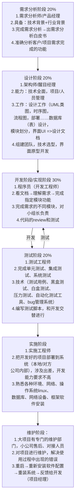
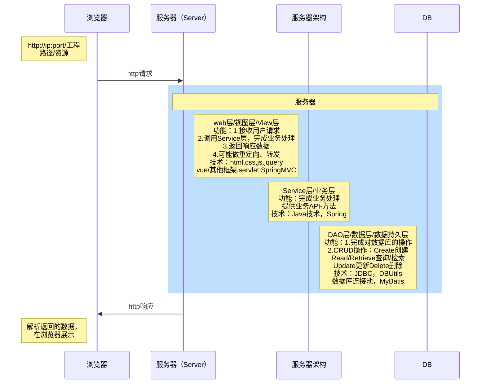
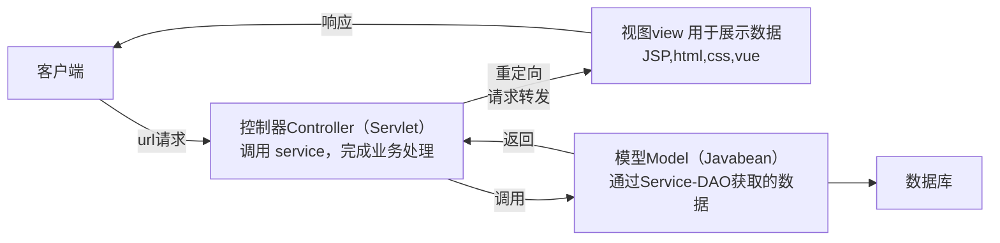

## 软件项目开发阶段

## 项目的设计

分层的目的是为了解耦，降低代码的耦合度，有利项目的维护和升级

### 经典的JavaEE三层架构（示意图）

项目具体分层

| 分层           | 对应包                               | 说明                      |
| -------------- | ------------------------------------ | ------------------------- |
| web层          | furns.web/servlet/controller/handler | 接收用户请求，调用service |
| service层      | furns.service                        | Service接口包             |
|                | furns.service.impl                   | Service接口实现类         |
| dao持久层      | furns.dao                            | Dao接口包                 |
|                | furns.dao.impl                       | Dao接口实现类             |
| 实体 bean 对象 | furns.pojo/entity/domain/bean        | JavaBean类                |
| 工具类         | furns.utils                          | 工具类                    |
| 测试包         | furns.test                           | 完成对dao/service测试     |

在业务逻辑复杂时，有的操作需要在service层同时操作多个DAO，因此service层不可省略

### MVC设计模式

1、什么是MVC

MVC 全称∶ Model 模型、View 视图、Controller 控制器。

MVC 最早出现在JavaEE 三层中的Web 层，它可以有效的指导WEB 层的代码如何有效分离，单独工作。

View 视图∶只负责数据和界面的显示，不接受任何与显示数据无关的代码，便于程序员和美工的分工合(Vue/JSP/Thymeleaf/HTML)

Controller 控制器∶只负责接收请求，调用业务层的代码处理请求，然后派发页面，是一个"调度者"的角色(Servlet), 这个概念会贯穿javaee

Model 模型∶将与业务逻辑相关的数据封装为具体的JavaBean 类，其中不掺杂任何与数据处理相关的代码(JavaBean/Domain/Pojo)

2、MVC 是一种思想

MVC 的理念是将软件代码拆分成为组件，单独开发，组合使用（目的是为了解耦合）, 也有很多落地的框架比如SpringMVC

MVC是一种思想，体现的是数据显示、数据处理和业务调用的分离、解耦，SpringMVC就是MVC的落地体现

1. model 最早期就是javabean, 就是早期的jsp+servlet+javabean
2. 后面业务复杂度越来越高, model 逐渐分层/组件化(service + dao)
3. 后面有出现了持久成技术(service + dao + 持久化技术(hibernate / mybatis / mybatis-plus))
4. 还是原来的mvc ，但是变的更加强大了
