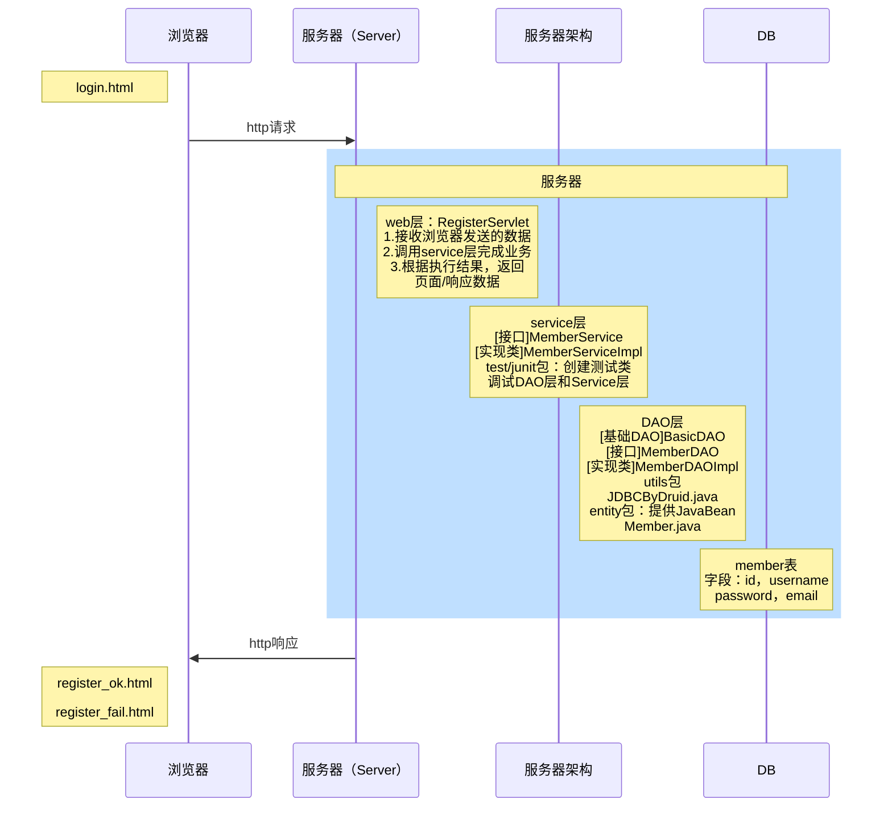

# 网上家具商城项目（架构设计）

此处使用 `原生Servlet/过滤器` 实现，后台是经典的分层结构 WEB-Service-DAO-Entity

## 需求一：用户注册

1）前端页面

1. 验证用户名：必须字母，数字下划线组成，并且长度为6到10位正则表达式
2. 验证密码：必须由字母，数字下划线组成，并且长度为6到10位
3. 邮箱格式验证：常规验证即可
4. 验证码：后面实现

思路分析：jQuery+正则表达式。绑定事件按要求验证，如果有错误，给出提示信息（不要用弹窗）

在前端页面 /views/member/login.html 实现上述功能

2）后端验证

1. 前端验证完成后提交给服务器，如果用户名在数据库中已经存在，后台给出提示信息，并返回重新注册
2. 如果用户名没有在数据库中，完成注册，并返回注册成功的页面

程序框架图



从DB层开始，反向编写代码

```mysql
-- 创建家居网购项目需要的数据库
DROP DATABASE IF EXISTS furniture_mall;
CREATE DATABASE furniture_mall;

-- 创建会员表，注意字段需要避免和默认字段冲突
USE furniture_mall;
CREATE TABLE `member`(
`id` INT PRIMARY KEY AUTO_INCREMENT,
`username` VARCHAR(32) NOT NULL UNIQUE,
`password` VARCHAR(32) NOT NULL,
`email` VARCHAR(64)
);#默认CHARSET utf8 ENGINE INNODB

-- 测试数据
INSERT INTO `member`(`username`,`password`,`email`)
VALUES('admin',MD5('admin'),'postmaster@outlook.com');

SELECT * FROM member
```

新建JavaBean：entity/Member.java，注意需要提供无参构造器，以便反射调用

dao层：

* BasicDAO 和 JDBCByDruid 复用之前项目的文件，注意修改 druid.properties 配置的数据库名，并导入德鲁伊的 jar 包

* 新建 MemberDAO 接口和实现类 MemberDAOImpl，调用的SQL语句可以现在 Navicat 进行测试，提高开发效率
* 新建 TestJdbcByDruid 和 TestJdbcByDruid 用于调试代码编写是否正确

service层：新建接口 MemberService，实现类 MemberServiceImpl。编写 TestMemberService 进行调试

web层：RegisterServlet.java

接收前端发来的用户信息，调用 service 层完成注册步骤，用户名已存在时返回原页面；用户名不存在时完成数据库操作，将请求转发到 register_fail.html 或 register_ok.html

## 需求二：用户登录

前端页面输入用户名、密码后提交，后端服务器判断用户是否存在，当用户输入信息有误时返回并要求重新登录

说明：

* 为了保证扩展性，在 Servlet 中根据用户名和密码构建一个 JavaBean 对象传入数据库，根据返回的结果判断该用户信息是否正确
* 前端页面的表格在提交时，如果用户没有输入信息，那么后端接收到的是空字符串""

### 重新登录页面的处理

如果用户验证失败，将错误信息和登录会员名放入到 request 域

将 login.html 改成动态页面的 login.jsp，使用el表达式来显示 LoginServlet 设置的 request 域信息

1）后端设置转发信息

方法1：请求转发，将错误原因和用户名设置为request的属性

方法2：重定向，将错误原因和用户名放入session中

2）修改文件名，联动修改引用，并修改文件头

```jsp
<%--<!DOCTYPE html>注释掉原有的html文件头--%>
<%--<base href="http://localhost:8080/furniture_mall/">注释掉原有的base标签--%>

<%@ page contentType="text/html;charset=UTF-8" language="java" %>
<base href="<%=request.getContextPath() + "/"%>">
```

* 注意脚本表达式获取到的链接末尾没有斜杠，因此base标签如果不加斜杠，访问会出现问题
* 此时在IDEA查看页面结构，会提示有JSP，HTML，Java三个不同的部分

3）后端使用EL表达式获取，并设置样式

```jsp
<span style="font-size: 18pt;font-weight: bold;float: right;color: gainsboro">
    ${requestScope.msg}
</span>
```

## 需求三：Web层Servlet简化

1. 一个请求对应一个 servlet，会造成 Servlet 太多，不利于管理
2. 在项目开发中，同一个业务（模块），一般对应一个Servlet即可，比如 LoginServlet和 RegisterServlet 都是在处理和会员相关的业务，应当合并，

### 解决方案1

1.给 login 和 regiter 表单增加 hidden 元素，分别表示注册和登录

```jsp
<%--在表单中增加隐藏域--%>
<input type="hidden" name="action" value="register">
```

2.当信息提交到 MemberServlet 后，获取 action 参数值

3.再根据不同的值来调用对应的方法即可

缺点：判断语句过多

### 解决方法2

反射+模板设计模式+动态绑定

构建抽象父类（模板），在 doPost 方法中通过反射+动态绑定机制调用子类的方法，简化了多个 if-else 分支结构

说明：前端 action 的值需要和后端方法名一致


 
