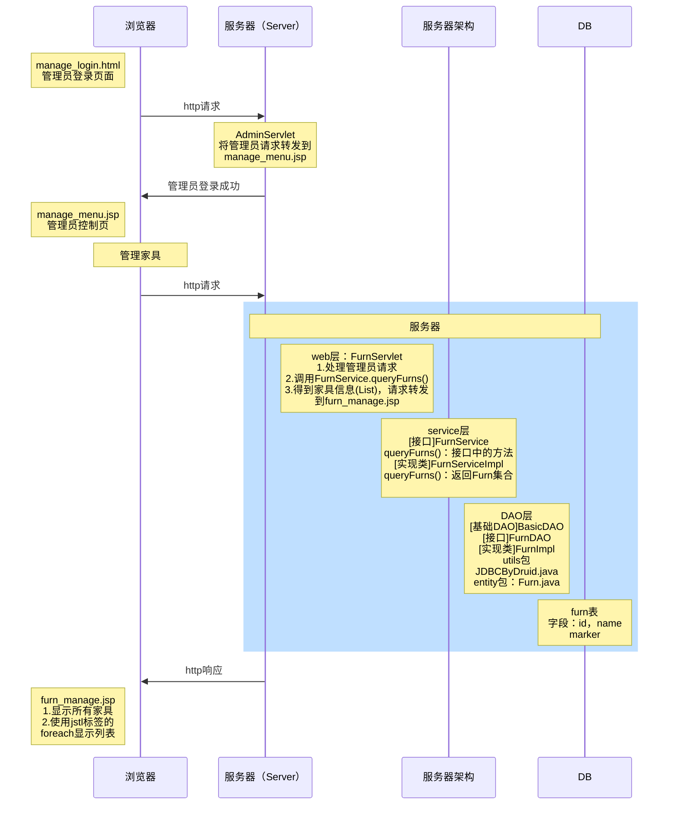

# 网上家具商城项目（家具管理）

## 后台管理

### 实现功能

1. 给后台管理提供独立登录页面
2. 管理员登录成功后，显示管理菜单页面
3. 管理员点击家居管理，显示所有家居信息




### 从数据库获取家具信息并显示

数据库编写

```mysql
#有时会看到INT(11)，此处11表示显示宽度，包含了负号的占位。不够长的数字会自动补零，不影响存放的数据范围
CREATE TABLE `furn`(
`id` INT UNSIGNED PRIMARY KEY AUTO_INCREMENT,#无符号UNSIGNWS可以去掉负数
`name` VARCHAR(64) NOT NULL,#家具名
`maker` VARCHAR(64) NOT NULL,#制造商
`price` DECIMAL(11,2)NOT NULL,#价格：使用定点数，控制数据的精度
`sales` INT UNSIGNED NOT NULL,#销量
`stock` INT UNSIGNED NOT NULL,#库存
`img_path` VARCHAR(256) NOT NULL#图片存放路径
) CHARSET utf8 ENGINE INNODB;

-- 测试数据
INSERT INTO furn(`id` , `name` , `maker` , `price` , `sales` , `stock` , `img_path`) 
VALUES(NULL , '北欧风格小桌子' , '熊猫家居' , 180 , 666 , 7 , 'assets/images/product-image/6.jpg');
 
INSERT INTO furn(`id` , `name` , `maker` , `price` , `sales` , `stock` , `img_path`) 
VALUES(NULL , '简约风格小椅子' , '熊猫家居' , 180 , 666 , 7 , 'assets/images/product-image/4.jpg');
 
INSERT INTO furn(`id` , `name` , `maker` , `price` , `sales` , `stock` , `img_path`) 
VALUES(NULL , '典雅风格小台灯' , '蚂蚁家居' , 180 , 666 , 7 , 'assets/images/product-image/14.jpg');
 
INSERT INTO furn(`id` , `name` , `maker` , `price` , `sales` , `stock` , `img_path`) 
VALUES(NULL , '温馨风格盆景架' , '蚂蚁家居' , 180 , 666 , 7 , 'assets/images/product-image/16.jpg');
```

编写 entity 类 Furn.java，dao 层 FurnDAO 和 FurnDAOImpl，service 层 FurnService 和 FurnServiceImpl，test 类 TestFurnDAO 和 TestFurnService，web 层 FurnServlet

* 当数据库字段名和 JavaBean 参数名不一致时，可以在查询语句中加入需要命成的名称
* 配置 url 时，FurnServlet 配置在 /manage/furnServlet，方便后期过滤器对请求来源进行权限控制

前端编写 furn_manage.jsp 页面，用于动态展示后端提供的 List\<Furn> 表单数据，使用 JSTL 标签头

```jsp
<%@ taglib prefix="c" uri="http://java.sun.com/jsp/jstl/core" %>
```

因为jsp页面的内容需要从后端获取，Servlet中也提供了对应的访问方法，因此调试时需要通过连接 /manage/furnServlet?action=list 完成代码校验

### 管理员登录页面

管理员登录业务设计

* 方案一：登录的请求发给 MemberServlet，根据业务逻辑，最终需要将数据存储到 member 表，需要在表中添加 `TINYINT` 类型的 `role` 字段存储用户权限。

* 方案二：将管理员登录的业务拆分，登录请求发到 AdminServlet
* 如果鉴权模式相同，采用方案一；鉴权模式不相同，采用方案二（此项目按方案二进行设计）

```mysql
CREATE TABLE `admin`(
`id` INT PRIMARY key AUTO_INCREMENT,
`name` VARCHAR(32) UNIQUE NOT NULL,
`password` VARCHAR(32) NOT NULL,
`role` TINYINT NOT NULL);

INSERT INTO `admin` (`name`,`password`,`role`) VALUES ('root',MD5('root'), 1);
```

根据继承原则，AdminServlet和 MemberServlet 的 login 方法可以重名

为了保证向服务器提交带参数的数据，以便调用方法，需要在表单中增加隐藏域

## 后台管理：添加家具

前端编写 furn_add.jsp，用于添加产品名、厂商名、价格、销量，调用 FurnServlet 的 add 方法，从数据库读取当前库存信息，向前端返回 furn_manage.jsp 页面

* 当前步骤暂不实现产品图片上传功能
* 编写后端代码时，需要和前端页面统一字段名称，并在前端编写隐藏域
* 在 furn_manage.jsp 添加超链接，以便快速访问到添加家具的页面

### 异常处理

* 字符乱码问题：在 BasicServlet 的 doPost 方法解决

```java
req.setCharacterEncoding("utf-8");
```

* 表单重复提交问题：浏览器会记录用户上一次请求的全部信息。如果在显示家具的页面刷新，会再次向后台提交添加数据的请求。解决方式：将请求转发改为重定向

* 数值填写格式校验：

  * 在前端页面添加 js 验证，通过正则表达式检查提交的格式，未通过验证不予提交

  * 客户端通过 POSTMAN、浏览器修改源码的方式提交数据，可以绕过前端验证。在后端可以①使用正则表达式校验，②在 try-catch 语句中使用 parseInt 方法③捕获添加 Furn 对象时的异常（这样不能准确提示错误原因），通过上述方式对未通过校验内容 setAttribute 并将请求转发到 furn_add.jsp ，前端读取 requestScope 获取属性值

  * ```javascript
    //前端页面捕获后端的错误信息
    ${requestScope.errorMsg}
    //注意在后端页面的 catch 代码块内需要有 return; 语句，否则程序会继续执行下方代码
    ```

  * 使用 Ajax 可以完成局部内容修改，不需要对整个页面进行请求转发

  * 使用 SpringMVC，专门用于数据校验的规则框架 JSR303 Hibernate Validator

### 自动封装 JavaBean

使用工具类 DataUtils（底层使用BeanUtils）实现功能

* BeanUtils工具类，可以一次性的把所有请求的参数注入到JavaBean中，经常用于把Map中的值注入到JavaBean中，或者是对象属性值的拷贝操作
* BeanUtils不是Jdk的类，需要导入需要的jar包：commons-beanutils-1.8.0.jar 和 commons-logging-1.1.1.jar
* populate方法，底层使用反射实现自动封装数据，表单中的字段名需要和JavaBean的属性名保持一致，并且需要捕获异常
* 当前尚未实现上传功能，因此imgPath属性值为空，在向SQL传入数据时会抛出异常。解决方式：在 Furn 类给 imgPath 属性赋默认值，并修改有参构造器和 set 方法
* 将上述方法封装到 utils 目录下的 DataUtils.java 中

## 后台管理：删除家具

点击删除家具链接，弹出确认窗口，点击”确认“删除，点击”取消“放弃删除

后端业务逻辑：

* 从DAO层、service层、web层的顺序、编写代码，通过 deleteFurnById 方法实现删除操作

* web层从前端获取需要删除的id号，利用工具类判断是否属于数字类型，成功后重定向到新的家具显示页面。

前端页面处理：

* 给删除家具的超链接配置 class 属性，方便 jQuery 选择器定位。
* 通过删除家具超链接所在的td单元格，获取 id 值和产品名
* 弹出复选框，如果取消删除操作，通过 return false 语句阻止向后端发送请求

```jsp
    <%--引入jQuery--%>
    <script type="text/javascript" src="script/jquery-3.6.0.min.js"></script>
    <script type="text/javascript">
        $(function () {
            //获取到要删除的家具名：按钮的父辈是td，祖辈是tr，找到tr中第二个td的文字内容
            $("a.deleteFurn").click(function (){
                var name = $(this).parent().parent().find("td:eq(1)").text();
                return confirm("请确认是否删除【" + name +"】");
            })
        })
    </script>
```

## 后台管理：修改家具

业务要求：

1. 管理员进入到家居管理页面，点击修改家居链接，回显该家居信息。
2. 填写新的信息，点击修改家居按钮，修改成功后，重新刷新显示家居列表

代码实现：

前端新增 furn_update.jsp 页面，用于查询要修改的单条商品信息

后端编写方法，实现①查询单条家具信息②更新单条家具信息，将前端提交的信息封装成 Furn 对象并更新到数据库，重定向完成页面刷新

* 因为采用 POST 方法提交数据，而且需要提交商品 id，因此需要在隐藏域中添加 action 和 id 参数

