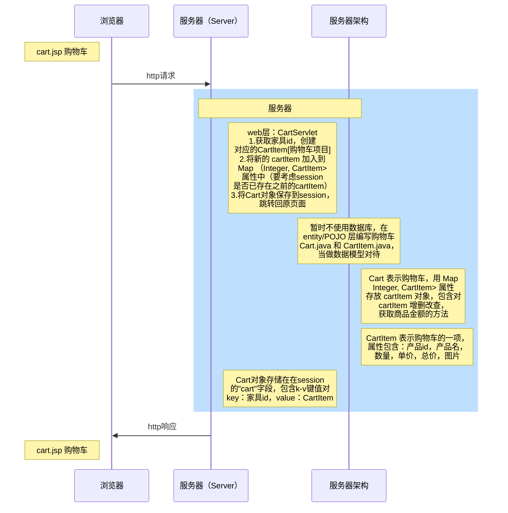

# 网上家具商城项目（购物车）

## 添加家具

1. 点击商品页面的Add to Cart，可以添加家具到购物车
2. 每添加一个家具，购物车的数量+1，并显示
3. 对于未登录用户，在购物车页面下单时需要先登录

实现逻辑：




* 暂时不使用数据库，在 entity/POJO 层编写购物车的 Cart.java 和 CartItem.java 文件，当做数据模型对待；web 层编写 CartServlet，处理前端发来的业务请求。Cart 作为 session 对象在用户端保存

* CartItem 表示购物车的一项，属性包含：产品id（用于显示图片），产品名，数量，单价，总价数据

* Cart 表示购物车，用 Map<Integer, CartItem> 属性存放 cartItem 对象，包含对 cartItem 增删改查，获取商品金额的方法

* CartServlet 的处理流程：①获取家具id，创建id对应的Cartltem[购物车项目]，②将新的 cartltem 加入到 Map<Integer, CartItem>属性中（要考虑session中是否已存在之前的cartItem），③将Cart对象保存到session，跳转回原页面

  * ```java
    //保证前端页面点击添加按钮后不跳转到空白页的方法：重定向到原地址
    //考虑到购物车可能分页，重定向不设置具体的固定地址
    String referer = req.getHeader("Referer");
    resp.sendRedirect(referer);
    ```
    
  * jQuery 可以通过 ${sessionScope.cart.amount} 调用后端的 getAmount 方法，amount 可以不在属性中声明，直接用该方法返回数值即可

* 前端引入jQuery，给 Add to Cart 按钮绑定事件

  * ```jsp
    <%--给按钮添加属性furnId，便于jQuery读取--%>
    <button title="Add To Cart" furnId="${furn.id}" class="add-to-cart">Add To Cart</button>
    ```

  * ```jsp
    <!--引入jQuery-->
    <script type="text/javascript" src="script/jquery-3.6.0.min.js"></script>
    <script type="text/javascript">
        $(function () {
            //给按钮绑定单击事件
            $("button.add-to-cart").click(function () {
                //获取到所在项的商品编号
                var furnId = $(this).attr("furnId");
                //向后端发出请求
                location.href = "cartServlet?action=addItem&id=" + furnId;
            })
        })
    </script>
    ```

  * 

注意事项：

* 添加新数据前，需要确认是否存在同类型的现有数据
* Furn类型的数据格式和CartItem不一样，因此不能直接向Cart的Map表中加入Furn数据
* BigDecimal类不能直接加减乘除，需要调用方法并进行转型


## 显示购物车

1：查看购物车，可以显示如下信息
2：选中了哪些家居，名称，数量，金额
3.统计购物车共多少商品，总价多少

在 index.jsp 页面设置跳转，新建页面 cart.jsp 用于显示购物车，从 session 中取出商品对象，使用 forEach 标签显示

```jsp
<%--注意从HashMap中取出的是k-v键值对，因此cartItem对象需要靠entry.value获得--%>
<c:if test="${not empty sessionScope.cart.items}">
    <c:forEach items="${sessionScope.cart.items}" var="entry">
        <tr...>
    </c:forEach>
</c:if>
```

后端对于 BigDecimal 格式的处理：add 方法不会直接作用到原对象，因此需要重新指向

```java
//返回商品总金额
public BigDecimal getSubtotal() {
    BigDecimal subtotal = new BigDecimal(0);
    Set<Integer> cartById = items.keySet();
    for (Integer id : cartById) {
        CartItem cartItem = items.get(id);
        subtotal = subtotal.add(cartItem.getTotal());
    }
    return subtotal;
}
```


## 修改商品数量

1. 进入购物车，可以修改购买数量
2. 更新该商品项的金额
3. 更新购物车商品数量和总金额

后端向 Cart 类增加 updateAmount 方法

注意事项：

虽然要使用set方法更新数量，但在计算总价时应当通过cartItem对象的get方法获取数量。原因是在set方法会对数据二次处理，导致传入的参数和运行后的实际参数不一致


前端对于购物车数量修改的单元格定义代码如下，为方便调用id，在input中新增相关属性：

```jsp
<td class="product-quantity">
    <div class="cart-plus-minus">
        <input class="cart-plus-minus-box" type="text" name="qtybutton" furnId=${entry.value.id}
               value="${entry.value.count}"/>
    </div>
</td>
```

可以判断在 div 层给购物车数量选框绑定了事件，通过 Find in Path（快捷键Ctrl+Shift+F）发现 main.js 方法写了事件处理过程

```js
/*----------------------------
    Cart Plus Minus Button
------------------------------ */
var CartPlusMinus = $(".cart-plus-minus");
CartPlusMinus.prepend('<div class="dec qtybutton">-</div>');
CartPlusMinus.append('<div class="inc qtybutton">+</div>');
$(".qtybutton").on("click", function() {
    var $button = $(this);
    var oldValue = $button.parent().find("input").val();
    if ($button.text() === "+") {
        var newVal = parseFloat(oldValue) + 1;
    } else {
        // Don't allow decrementing below zero
        if (oldValue > 1) {
            var newVal = parseFloat(oldValue) - 1;
        } else {
            newVal = 1;
        }
    }
    $button.parent().find("input").val(newVal);
});
```

将这段代码复制到 cart.jsp，并注销 main.js 方法中的这段代码（否则点一次按钮会产生两次效果），然后在代码的末尾添加后端交互的内容

```js
//向后端发出修改请求
//此处无法通过 $(this).attr("furnId") 获取input的值
location.href = "cartServlet?action=updateAmount&count=" + newVal + "&id=" + $(this).attr("furnId");
```


### 删除商品

1. 进入购物车，可以删除某商品
2. 可以清空购物车
3. 给出适当的确认信息

后端向 Cart 类增加 deleteItem() 和 clear() 方法，供 CartServlet调用

前端使用 confirm 对话框，在用户确认后再跳转到后端执行操作的方法


