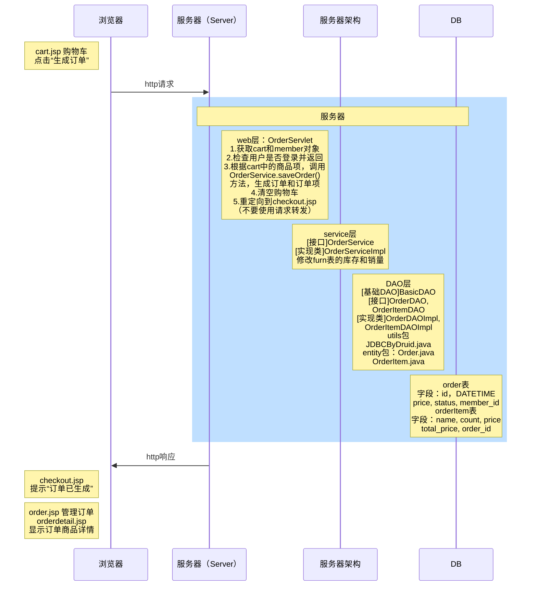

# 网上家具商城项目（生成订单）

1. 点击购物车结账，生成订单和订单项
2. 如果没有登录，要求先进入登录页面后再结账



参考用户界面，编写数据库中的表

```mysql
#字段类型应当和其他表相关字段保持一致
#每个字段应使用NOT NULL 约束
#外键从DB层保证数据一致性，但是降低效率
#MySQL中，表示当前时间使用NOW()函数
CREATE TABLE `order` ( #订单表
`id` VARCHAR(64) PRIMARY KEY, -- 订单号
`create_time` DATETIME NOT NULL, -- 订单生成时间
`price` DECIMAL(11,2) NOT NULL, -- 金额（和furn表一致）
`status` TINYINT NOT NULL, -- 状态：0未发货，1已发货，2已结账
`member_id` INT NOT NULL -- 订单所属的会员id（格式应当和member表一致）
#由于外键会影响效率，可以仅在程序业务逻辑中保持一致性，不需要再次校验
#FOREIGN KEY(`member_id`) REFERENCES `member`(`id`)
)CHARSET utf8 ENGINE INNODB;

CREATE TABLE `order_item` ( #订单项目表
`id` INT PRIMARY KEY auto_increment, -- 订单项中的编号
`name` VARCHAR(64) NOT NULL, -- 家具名（和furn表一致）
`price` DECIMAL(11,2) NOT NULL, -- 单价（和furn表一致）
`count` INT NOT NULL, -- 数量
`total_price` DECIMAL(11,2) NOT NULL, -- 总价
`order_id` VARCHAR(64) NOT NULL -- 所在订单的编号
)CHARSET utf8 ENGINE INNODB;
```

编写 JavaBean 类：OrderItem.java 和 Order.java，用于反射数据库中的对象

编写 DAO 层的接口和实现类，以及测试方法

编写 Service 层的接口和实现类：

* 实现功能：根据当前购物车中的项目，创建订单、订单详情对象，同步修改家具表中的销量和库存，清空用户的购物车。
* 返回类型：因为会在前端展示生成的订单号，因此该方法执行后，会生成String类型的订单数据并返回
* 传入参数：购物车（web层获取session中的cart对象）、用户id

因为生成订单会操作多表，涉及到多表事务的问题，涉及到ThreadLocal+MySQL事务机制+过滤器

编写web层的OrderServlet类：

* 接收前端访问时Session包含的member参数和cart参数，
* 如果当前购物车为空，请求转发到首页；如果用户未登录，请求转发到登录页面
* 调用Service层生成订单，将得到的订单号放进session，重定向到生成成功的页面

注意：HashMap的clear方法，并没有将所在的HashMap置空，而是将size设置为0。因此用户提交完订单后，购物车清空，但是session中的cart对象依然存在。因此需要给Cart类提供 isEmpty() 方法，以便web层调用

## 添加购物车按钮动态处理（待实现）

1.如某家居库存为o，前台的”add to cart”按钮显示为"暂时缺货”
2后台也加上校验，只有在库存>0时，才能添加到购物车


## 完成订单管理页面（待实现）

在order.jsp中，点击查看详情按钮，跳转到order_detail.jsp并显示订单详细信息


