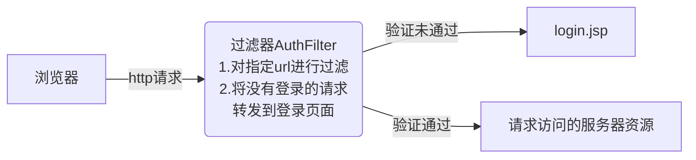

# 网上家具商城项目（过滤器）

## 拦截非法访问




在filter-mapping的url-pattern配置需要拦截的url，对于要拦截目录中某些要放行的资源，通过init-param配置。在web.xml文件中配置的内容如下：

```xml
<filter>
    <filter-name>AuthFilter</filter-name>
    <filter-class>practice.project.mall.filter.AuthFilter</filter-class>
    <init-param>
        <!--这里配置的放行链接，需要在过滤器中处理-->
        <param-name>excludedUrls</param-name>
        <param-value>/views/manage/manage_login.jsp,/views/customer/index.jsp</param-value>
    </init-param>
</filter>
<filter-mapping>
    <filter-name>AuthFilter</filter-name>
    <url-pattern>/views/customer/*</url-pattern>
    <url-pattern>/views/manage/*</url-pattern>
    <url-pattern>/views/member/*</url-pattern>
    <url-pattern>/views/order/*</url-pattern>
    <!--servlet对应的url-->
    <url-pattern>/cartServlet</url-pattern>
    <url-pattern>/manage/furnServlet</url-pattern>
    <url-pattern>/orderServlet</url-pattern>
</filter-mapping>
```

如果在后端执行请求转发，则访问链接不受过滤器的影响

```java
/**
 * 用于权限验证的过滤器，对指定的url进行验证
 */
public class AuthFilter implements Filter {
    //存储需要放行的url
    private List<String> excludedUrls;
    public void init(FilterConfig config) throws ServletException {
        //获取到配置中的参数
        String[] url = config.getInitParameter("excludedUrls").split(",");
        excludedUrls = Arrays.asList(url);
    }

    public void doFilter(ServletRequest servletRequest, ServletResponse servletResponse, FilterChain chain) throws ServletException, IOException {
        HttpServletRequest request  = (HttpServletRequest) servletRequest;

        //得到请求的url
        String url = request.getServletPath();
        System.out.println(url);//测试后注销

        //对于不在放行列表中的链接，执行请求转发
        if (!excludedUrls.contains(url)) {
            if (url.contains("/manage/")){
            	//执行业务逻辑
            	return;//注意此处需要return，否则继续执行下方代码
            }
        }
        //继续判断其他条件……
        chain.doFilter(servletRequest, servletResponse);
    }
    public void destroy() {
    }
}

```

管理员页面的访问逻辑和普通会员页面的逻辑不同，除了完全新建一套web-service-dao的结构外，还需要在过滤器中加入对访问地址的判断

## 事务管理

下订单时，调用OrderServlet的saveOrder方法，在Service层中，该方法调用了OrderDAO，OrderItemDAO，FurnDAO操作三张表。如果对某张数据库表的操作失败，会造成数据不一致的问题

根本原因：在BasicDAO通过update方法各自是独立事务，在操作数据库时，try方法每次从连接池中取出的数据库交互Connection，不能保证是同一个

解决方式：使用Filter+ThreadLocal进行事务管理，保证在一次http请求中，Servlet-Service-DAO的调用过程是同一个线程，确保数据一致性

在web层之前加入TransactionFilter事务过滤器，在doFilter方法收到后方执行完的结果后，再执行后置代码commit()方法进行提交，当出现数据库操作异常时执行rollback() 方法；改写JdbcByDruid类的getConnection方法，将连接设置为手动提交

实现过程：在JdbcByDruid新建ThreadLocal属性

```java
public class JdbcByDruid {

    private static DataSource ds;
    //定义属性ThreadLocal，存放Connection属性
    private static ThreadLocal<Connection> threadLocal = new ThreadLocal<>();
    //……有关数据库连接的方法
}
```

修改getConnection方法

```java
//原先的 getConnection() 方法
public static Connection getConnection() throws SQLException {
    return ds.getConnection();
}

//修改后的 getConnection() 方法
public static Connection getConnection() {
    Connection connection = threadLocal.get();
    if (connection == null) { //当前线程没有连接
        //从数据库连接池中，取出一个连接放入此线程
        try {
            connection = ds.getConnection();
            connection.setAutoCommit(false);//设置手动提交
        } catch (SQLException e) {
            e.printStackTrace();
        }
        threadLocal.set(connection);
    }
    return connection;
}
```

新增commit方法和rollback方法

```java
public static void commit() {
    Connection connection = threadLocal.get();
    if (connection != null) {//确保连接正确
        try {
            connection.commit();
        } catch (SQLException e) {
            throw new RuntimeException("事务提交失败");
        } finally {
            try {
                connection.close();//关闭连接
            } catch (SQLException e) {
                e.printStackTrace();
            }
        }
    }
    //Tomcat底层使用线程池技术
    //若不清除connection，连接会被长期占用
    threadLocal.remove();
}

//回滚/撤销和connection关联的DML语句
public static void rollback() {
    Connection connection = threadLocal.get();
    if (connection != null) {//确保连接正确
        try {
            connection.rollback();
        } catch (SQLException e) {
            e.printStackTrace();
        } finally {
            try {
                connection.close();
            } catch (SQLException e) {
                e.printStackTrace();
            }
        }
    }
    threadLocal.remove();
}
```

由于连接的关闭时间由事务过滤器决定，因此BasicDAO中不再需要执行finally代码块中的JdbcByDruid.close方法

### 在单一方法中提交事务

xxxxxxxxxx /** * 抽取重复的代码，编写一个方法 * @param url Ajax请求的资源 * @param data Ajax请求携带的数据（可以不传值） */function get(url,data) {    return new Promise((resolve, reject) => {        $.ajax({            url: url,            data: data,            success(resultData) {                resolve (resultData);            },            error(err) {                reject(err);            }        })    })}//需求：先获取building.json，再获取building_detail_1.jsonget("data/building.json").then(resultData => {    //第一次Ajax请求成功后的处理代码    console.log("promise 第1次ajax请求返回值：", resultData);    //如果不写return，无法实现链式调用    return get(`data/building_detail_${resultData.id}.json`).then(resultData => {        console.log("promise 第2次ajax请求返回值：", resultData);        //此处位置是get().then().then()，可以继续发出新的请求    })}).catch(err =>{    console.log("promise异步请求异常：", err);})javascript

```java
//原先执行的代码块（如果事务由过滤器提交，最终代码也是写成这样）
String orderId = orderService.saveOrder(cart, member.getId());
req.getSession().setAttribute("orderId", orderId);
resp.sendRedirect(req.getContextPath() + "/views/order/checkout.jsp");

//在方法中加入事务的代码块
String orderId = null;
try {
    orderId = orderService.saveOrder(cart, member.getId());
    JdbcByDruid.commit();
} catch (RuntimeException e) {
    JdbcByDruid.rollback();
    e.printStackTrace();
}
req.getSession().setAttribute("orderId", orderId);
resp.sendRedirect(req.getContextPath() + "/views/order/checkout.jsp");
```

### 事务过滤器统一管理

新建事务管理器TransactionFilter，修改web.xml配置文件，过滤所有访问

```xml
<filter>
    <filter-name>TransactionFilter</filter-name>
    <filter-class>practice.project.mall.filter.TransactionFilter</filter-class>
</filter>
<filter-mapping>
    <filter-name>TransactionFilter</filter-name>
    <url-pattern>/*</url-pattern>
</filter-mapping>
```

TransactionFilter中，doFilter中的代码如下

```java
public void doFilter(ServletRequest req, ServletResponse resp, FilterChain chain) throws ServletException, IOException {
    try {
        //先放行后续的连接，再统一提交
        chain.doFilter(req, resp);
        JdbcByDruid.commit();
    } catch (Exception e) {
        JdbcByDruid.rollback();
        e.printStackTrace();
    }
}
```

BasicServlet通过反射调用子类方法，需要捕获异常。由于web层各个Servlet都继承了BasicServlet，而BasicServlet在执行时已经捕获了异常，导致过滤器在commit方法出现异常后不能正常地执行rollback方法，因此需要在BasicServlet捕获前面的异常后，继续抛出异常

```java
//解决接收到的中文数据乱码问题
req.setCharacterEncoding("utf-8");

//获取到action的值
String action = req.getParameter("action");

//通过反射，获取当前对象的方法
//System.out.println("this=" + this);//可以得到this就是运行类型（继承的子类）
//declaredMethod会根据action的不同而变化
try {
    Method declaredMethod = this.getClass().getDeclaredMethod(action, HttpServletRequest.class, HttpServletResponse.class);
    //使用方法对象，进行反射调用
    declaredMethod.invoke(this,req,resp);
} catch (Exception e) {
    throw new RuntimeException(e);
}
```

总结：异常机制可以参与业务逻辑

## 错误页面

当用户提交链接时，出现404页面，或是白板页面，对用户不友好。出现了如下需求：

1. 如果在访问/操作网站，出现了内部错误，统一显示500.jsp
2. 如果访问/操作不存在的页面/servlet时，统一显示404.jsp

思路分析：

1. 发生错误/异常时，将错误/异常抛给tomcat
2. 在web.xml配置不同错误显示页面（一般在最底部）

```xml
<!--错误提示页面-->
<error-page>
    <error-code>404</error-code>
    <location>/views/show/404.jsp</location>
</error-page>
<error-page>
    <error-code>500</error-code>
    <location>/views/show/500.jsp</location>
</error-page>
```

当前在过滤器中虽然捕获了异常，但是仅仅在服务器端显示错误提示，没有让Tomcat进行处理，因此需要在过滤器的catch代码块中继续向tomcat抛服务器运行异常

```java
try {
    //先放行后续的连接，再统一提交
    chain.doFilter(req, resp);
    JdbcByDruid.commit();
} catch (Exception e) {
    JdbcByDruid.rollback();
    throw new RuntimeException(e);
}
```

