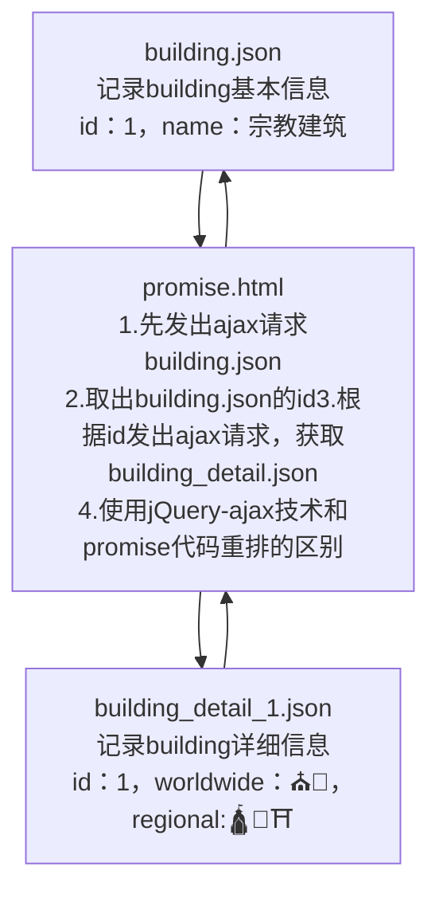

# Promise

异步编程的一种解决方案，用于解决传统Ajax回调函数嵌套问题

1. 传统的Ajax异步调用在需要多个操作的时候，会导致多个回调函数嵌套，导致代码不够直观，就是常说的
   Callback Hell
2. 为了解决上述的问题，Promise对象应运而生，在 EMCAScript 2015 当中已经成为标准
3. 从语法上说，Promise是一个对象，从它可以获取异步操作的消息
4. Promise也是ES6的新特性

## 应用实例

需求分析




```html
<!--引入jQuery-->
<script type="text/javascript" src="script/jquery-3.7.0.min.js"></script>
<script type="text/javascript">
	//需要引入的代码块
</script>
```

使用jQuery+Ajax方式进行数据请求

```javascript
$.ajax({
    url: "data/building.json",
    success(resultData) {
        console.log("第1次ajax请求返回值：",resultData);
        $.ajax({
            //使用ES6的方式
            url: `data/building_detail_${resultData.id}.json`,
            success(resultData) {
                console.log("第2次ajax请求返回值：", resultData);
            },
            error(err) {//出错的回调函数
                console.log("ajax请求出现异常：",err);
            }
        })
    }
})
```


创建promise对象，构造函数中传入箭头函数，箭头函数的形参 resolve 在请求成功时调用，reject 在请求失败时调用（其名字只是指定成功后执行的函数名）。箭头函数体仍然是 jQuery 发出 ajax ，但是可以通过类似 try-catch 的结构统一进行异常处理

```javascript
let p = new Promise((resolve, reject) => {
    //发出ajax请求
    $.ajax({
        url: "data/building.json",
        success(resultData) {
            console.log("promise 第1次ajax请求返回值：", resultData);
            resolve(resultData);
        },
        error(err) {
            reject(err);
        }
    })
})

//resolve(resultData);代码执行时，才会调用下面的代码块
p.then(resultData => {
    //如果不return，将无法捕获到异常
    return new Promise((resolve, reject) => {
        //发出ajax请求
        $.ajax({
            //使用ES6的方式
            url: `data/building_detail_${resultData.id}.json`,
            success(resultData) {
                //console.log("promise 第2次ajax请求返回值：", resultData);
                resolve(resultData)
            },
            error(err) {//出错的回调函数
                reject(err);
            }
        })
    })
}).then(resultData => {
    //此处位置是p.then().then()，可以继续发出新的请求
    console.log("promise 第2次ajax请求返回值：", resultData);
}).catch((err) => {
    console.log("promise异步请求异常：", err);
})
```

利用函数简化重复代码，实现重排

```javascript
/**
 * 抽取重复的代码，编写一个方法
 * @param url Ajax请求的资源
 * @param data Ajax请求携带的数据（可以不传值）
 */
function get(url,data) {
    return new Promise((resolve, reject) => {
        $.ajax({
            url: url,
            data: data,
            success(resultData) {
                resolve (resultData);
            },
            error(err) {
                reject(err);
            }
        })
    })
}
//需求：先获取building.json，再获取building_detail_1.json
get("data/building.json").then(resultData => {
    //第一次Ajax请求成功后的处理代码
    console.log("promise 第1次ajax请求返回值：", resultData);
    //如果不写return，无法实现链式调用
    return get(`data/building_detail_${resultData.id}.json`).then(resultData => {
        console.log("promise 第2次ajax请求返回值：", resultData);
        //此处位置是get().then().then()，可以继续发出新的请求
    })
}).catch(err =>{
    console.log("promise异步请求异常：", err);
})
```
