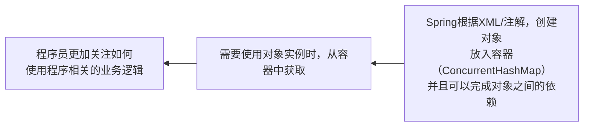

# Spring框架

官网：[Spring | Home](https://spring.io/)，文档可在官网、下载的压缩包内查看

参考学习：[Spring框架和JavaWeb技术的沿革](https://www.zhihu.com/question/509707651/answer/2512335914)

### 学习的核心内容

IOC（反转控制），管理java对象

AOP（切面编程）

JdbcTemplate，Spring访问数据库的技术

声明式事务，基于IOC/AOP实现事务管理

### 重要概念

* Spring可以整合其他的框架（Spring是管理框架的框架）
* Spring有两个核心的概念：[IOC](https://www.chanmufeng.com/posts/basic/design-principle/依赖倒置原则.html) 和 AOP
* DI [Dependency Injection依赖注入]，IOC [Inversion Of Control反转控制] 的另外叫法

传统的开发模式[JdbcUtils/反射]


IOC开发模式[EmpAction EmpService EmpDao Emp]



Spring最大的价值：通过配置，给程序提供需要使用的 web层（Servlet/Action/Controller），Service，DAO，JavaBean[entity] 的对象，实现解耦

## Spring配置演示

开发流程：

1. 引入jar包：commons-logging-1.1.3，spring-beans-5.3.8，spring-context-5.3.8，spring-core-5.3.8，spring-expression-5.3.8
2. 创建JavaBean类：设置属性、有参构造器、无参构造器、Getter和Setter、toString方法
3. 在src目录下新建文件
   * 通过XML Configuration File -> Spring Config创建
   * 创建后点击右上角 Configure application context -> Create new application context ->点击OK
4. 在 &lt;beans> 下新建 &lt;bean> 标签
   * class属性指定类的全路径，以便反射调用
   * id属性表示该对象在Spring容器中的id
5. 在 &lt;bean> 下，以  &lt;property name="属性名" value="属性值">形式 配置属性的值

案例演示：

src目录下新建com/exercise/spring/bean/Monster.java，配置momsterId，name，skill属性

src目录下新建beans.xml文件，配置Configure application context 后，在  &lt;beans> 标签中配置如下

```xml
<bean class="com.exercise.spring.bean.Monster" id="monster01">
    <property name="momsterId" value="4"/>
    <property name="name" value="公孙胜"/>
    <property name="skill" value="入云龙"/>
</bean>
```

测试代码

```java
public void getBeanById() {
    //创建容器 ApplicationContext，该容器和配置文件关联
    ApplicationContext ioc = new ClassPathXmlApplicationContext("beans.xml");

    //方法一：通过 getBean(String s) 方法获取编译类型是 Object 类的对象
    Object monster1 = ioc.getBean("monster01");
    System.out.println(monster1.getClass());//运行类型是 Monster

    //方法二：通过 getBean(String s, Class<T> aClass) 方法获取实际类型
    Monster monster2 = ioc.getBean("monster01", Monster.class);
    System.out.println(monster1 == monster2);//两个方法得到的对象相同
}
```

注意事项和细节

* ```java
  //容器的类加载路径：执行代码
  File file = new File(this.getClass().getResource("/").getPath());
  System.out.println(file);//得到Spring框架的实际工作路径在out文件夹中
  ```

* ```markdown
  * 通过断点调试，查看Spring容器的结构，其中重要的组成部分有：
  * ioc 是 ClassPathXmlApplicationContext 对象，属于重量级对象，创建时消耗资源，因此一般只有一个
  * └─beanFactory 属性，类型是DefaultListableBeanFactory
  * ​      ├─ beanDefinitionNames，以 ArrayList 记录了 beans.xml 配置的 `bean名称`，方便查找
  * ​      ├─ beanDefinitionMap，以 ConcurrentHashMap 集合保存 beans.xml 配置的 bean 对象信息
  * ​      │    └─table数组， ConcurrentHashMap$Node[512] 存放bean对象信息，超过512时自动扩容
  * ​      │         ├─next: null
  * ​      │         ├─hash：属性的hash值
  * ​      │         ├─key：配置的 `beans对象id`
  * ​      │         └─val：GenericBeanDefinition 信息
  * ​      │             ├─ beanClass：记录 `全路径`
  * ​      │             ├─ lazyInit：配置 `懒加载`
  * ​      │             └─ propertyValues：记录 `属性名和属性值`
  * ​      └─ singletonObjects，以 ConcurrentHashMap 集合保存对象
  * ​            └─table数组， ConcurrentHashMap$Node[512] ，存放单例对象和默认初始化的对象
  * ​                ├─next: null
  * ​                ├─hash：对象的hash值
  * ​                ├─key：配置的 `beans对象id`
  * ​                └─val：`JavaBean对象`
  ```
  
* 执行 ioc.getBean("monster01"); 时，程序先到 `beanDefinitionMap ` 查询，如果是单例对象，就到 `singletonObjects ` 获取。如果不是单例对象，会通过反射动态创建后保存

* 如果配置 bean.xml 时，注入了多个 Monster 对象，但是没有指定  &lt;beans> 标签的 id，那么运行时不会报错，系统会按 `全类名#0` ，`全类名#1` ，……的方式分配id

